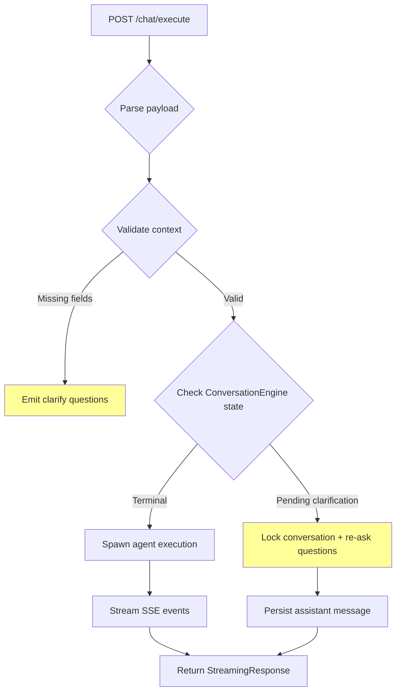

# Backend API Module — FastAPI REST Interface (v2.3.8)

**Location**: `/backend/backend/api/`  
**Last Updated**: 2026-08-10

---

## 1. Responsibility

### Primary Role
**Unified REST Interface Layer**: Provides authenticated HTTP endpoints for the AIC Platform desktop application's Electron main process (via sidecar) and external clients. Handles all CRUD operations, tool execution, provider management, workflow orchestration, and real-time agent execution via SSE streams.

### Specific Responsibilities

1. **Authentication & Authorization**: Bearer token validation using JWT (via `@auth/security`), role-based access control (`require_roles`), per-install identity file validation, and brute-force lockout protection.

2. **Resource Management**: CRUD routes for conversations, messages, projects, tasks, workers, skills, plugins, MCP servers, RAG documents, automation hooks/triggers, jobs, memory entries, and profiles.

3. **Agent Execution Interface**: Core entry point for AI worker invocation (`/agent/run`, `/agent/run-sync`) with real tool execution capabilities (file operations, shell commands, code search).

4. **Provider Configuration**: LLM provider registration, model selection, health checks, connection testing, and live registration into `provider_manager`.

5. **Pipeline Orchestration**: Engineering pipeline status tracking (Discovery → Planning → TaskGraph → Dispatch) with stage-level detail exposure.

6. **SSE Streaming**: Server-sent event streams for long-running operations (chat completion, agent runs, regeneration, cancellation).

7. **Backup & Persistence**: Full-application data backup (SQLite snapshot via `VACUUM INTO`, zip archive creation, validate/restore workflows).

8. **Dashboard Aggregation**: Single endpoint combining statistics (active missions, worker counts, project/task metrics, recent activity).

### Design Intent
Serve as the **single API gateway** between the Electron renderer process and backend services, enforcing security while exposing rich functionality for workspace management, AI execution, and system configuration. Designed for local-first operation with optional remote providers.

---

## 2. Architecture

### Component Structure

| File | Lines | Purpose | Public API / Endpoints |
|------|-------|---------|------------------------|
| `__init__.py` | 22 | Package marker | N/A |
| `auth.py` | 42 | Role enums + decorator | `Role` enum, `require_roles()` |
| `dependencies.py` | 117 | Shared dependency injection | `get_optional_current_user()`, `require_current_user()`, `validate_ownership()` |
| `routes/__init__.py` | 22 | Router aggregation | `router` (combined API router) |
| `routes/core.py` | 15 | Barrel file | Includes: providers, conversations, messages, chat, workers |
| `routes/agent.py` | 138 | AI agent execution | `/run`, `/run-sync` (SSE/sync) |
| `routes/approval_config.py` | 65 | Auto-approval settings | GET/PATCH `/approval-config` |
| `routes/auth.py` | 156 | Auth endpoints | POST `/login`, GET `/me` |
| `routes/automation.py` | 92 | Automation hooks/triggers | CRUD for hooks, triggers, notifications |
| `routes/backup.py` | 249 | Backup/restore | POST `/backup/create`, GET `/backup/list`, POST `/backup/validate` |
| `routes/chat.py` | 1438 | Chat completion | POST `/chat/execute`, POST `/chat/cancel`, POST `/chat/regenerate` |
| `routes/conversations.py` | 647 | Conversation CRUD | List, Create, Update, Delete, Search, Export/Import |
| `routes/dashboard.py` | 85 | Dashboard stats | GET `/dashboard` |
| `routes/jobs.py` | 98 | Job scheduler | CRUD for scheduled/background jobs |
| `routes/mcp.py` | 284 | MCP server integration | Register, discover tools, execute, connect/disconnect |
| `routes/memory.py` | 80 | Memory engine | Store, retrieve, compress, forget memory entries |
| `routes/messages.py` | 189 | Message CRUD | List, Create, Update, Delete (with attachments) |
| `routes/orchestration.py` | 144 | Workflow orchestration | Session CRUD, task management, approvals |
| `routes/pipeline.py` | 147 | Pipeline status | GET `/pipeline/task/{id}`, GET `/pipeline/active` |
| `routes/plugins.py` | 135 | Plugin management | Install from GitHub, CRUD, context resolution |
| `recipes` | N/A | N/A | N/A |
| `routes/profile.py` | 121 | Local profile | CRUD for user preferences, device info |
| `routes/projects.py` | 242 | Project management | CRUD, active project switch |
| `routes/provider_health.py` | 4 | Health endpoint proxy | Re-exports from `provider_manage.py` |
| `routes/providers.py` | 487 | Provider CRUD | List, Create, Update, Delete, test models |
| `routes/provider_manage.py` | 391 | Provider config | Test connection, update env config, health check |
| `routes/rag.py` | 72 | RAG document store | Load documents, retrieve, build context |
| `routes/release.py` | N/A | Release notes | TBD |
| `routes/skills.py` | 217 | Skill registry | Install from GitHub, toggle, assign workers |
| `routes/tasks.py` | ~50 | Task CRUD | TBD |
| `routes/workers.py` | 295 | Worker runtime | Runtime CRUD, workforce status, tool execution |
| `routes/workflows.py` | 72 | Workflow definitions | CRUD, instantiate, resume sessions |

---

## 3. Design Patterns

### 1. Dependency Injection Pattern (`dependencies.py`)

FastAPI `Depends()` used throughout for:
- Database session injection (`get_db`)
- Authentication enforcement (`require_current_user`)
- Token extraction (`oauth2_scheme`)

**Implementation**: All auth-required routes use `router = APIRouter(dependencies=[Depends(require_current_user)])` at module level, eliminating per-route decorator repetition.

```python
router = APIRouter(dependencies=[Depends(require_current_user)])

@router.get("/conversations")
async def list_conversations(db: AsyncSession = Depends(get_db)):
    ...
```

### 2. Strategy Pattern (`providers.py::_register_provider_live`)

Provider registration adapts to different sources:
- Environment variables (`AIC_MODEL_*`)
- Database `ProviderModel` rows
- Auto-detection with exclusion filters for known-bad models

**Selection Logic**:
1. Check env vars first (highest priority)
2. Filter out bad model prefixes (`combo/`, `IAMHC/`)
3. Fall back to any valid non-combo model

### 3. Circuit Breaker Pattern (`mcp.py::connect_and_discover`)

MCP server connections implement soft-fail behavior:
- Register succeeds even if connection fails
- Tools discovered lazily on reconnect
- Warnings returned instead of hard failures

### 4. Semaphore Concurrency Control (`agent.py::run_agent`)

Global `AGENT_RUN_SEMAPHORE` caps concurrent agent runs:
- Acquire with timeout (`AGENT_RUN_QUEUE_TIMEOUT`)
- Queue excess requests instead of rejecting outright
- Emit queued status events for UX feedback

Prevents resource exhaustion from multiple parallel LLM streams/subprocesses.

### 5. Per-Request Locking (`chat.py::_clarify_locks`)

Dict-based locks keyed by conversation ID:
```python
_clarify_locks: dict[str, asyncio.Lock] = {}
```

Serializes discovery auto-continuation to prevent race conditions where two `/chat/execute` calls consume the same `DiscoverySession`.

### 6. Observer Pattern (`messages.py::create_message`)

Message persistence triggers cache invalidation:
```python
await index_message_fts(db, msg.id, id, msg.content)
from context.cache import get_context_cache
get_context_cache().invalidate_conversation(id)
```

Context builders observe message changes to refresh assembled prompts.

### 7. Repository Pattern (Database Models)

All routes use SQLAlchemy ORM directly rather than service abstraction layers (except where stated):
```python
result = await db.execute(select(Conversation).where(...))
conv = result.scalars().first()
```

Models defined in `storage.models`, schemas in `backend.schemas.*`.

### 8. Builder Pattern (`conversations.py::_build_conv_responses`)

Optimized response construction batched to avoid N+1 queries:
```python
# Fetch all pins/tags in ONE query per type instead of per-conversation
pin_res = await db.execute(select(ConversationPin.conversation_id).where(...))
pinned_ids = set(pin_res.scalars().all())
tag_res = await db.execute(select(ConversationTag.conversation_id, ...))
tags_map = {...}
```

### 9. Template Method (`backup.py::_iter_includable_files`)

Template for backup file iteration with configurable exclusions:
- Exclude directories: `logs`, `cache`, `backups`
- Exclude suffixes: `.db-wal`, `.db-shm`
- Replace live DB with VACUUM INTO snapshot

Extensible design for future exclusion rules.

### 10. Factory Pattern (`workflow/fsm.py::PHASE_WORKERS`)

Phase-to-worker mapping constructed once at import:
```python
PHASE_WORKERS: dict[str, list[dict]] = {
    "discovery": [{"worker": "pm", "tier": "thinker"}],
    "investigate": [...],
    # ...
}
```

Consumed by `dependency.py` for phase-barrier edge generation and `workers.py` for office floor status.

### 11. Security Pattern: Constant-Time Comparison (`auth.py::login`)

Brute-force resistant credential validation:
```python
if not secrets.compare_digest(username.encode(), settings.IDENTITY_USERNAME.encode()):
    # Fail
```

Prevents timing attacks on plaintext identity credentials.

### 12. Rate Limiting Pattern (`auth.py::_lockout_seconds`)

Exponential backoff after repeated failed logins:
- 3 failures → 5 min lock
- 6 failures → 10 min lock  
- Capped at 24 hours

Per-client tracking via `_client_key(request)` (based on IP).

---

## 4. Data & Control Flow

### Entry Points

#### 1. External Clients

| Client | Source | Transport | Auth |
|--------|--------|-----------|------|
| **Electron Renderer** | Main process IPC | HTTP over localhost (127.0.0.1) | Bearer token from `identity.json` |
| **Mobile/Desktop Apps** | Standalone clients | HTTP/S (configurable host) | Bearer token or API key |
| **CLI Tools** | Development/debug | Direct HTTP | None (dev mode) |

#### 2. Router Registration Sequence

```python
# backend/api/routes/__init__.py
router = APIRouter()

router.include_router(core_router, tags=["core"])
router.include_router(auth_router, tags=["auth"])
router.include_router(orchestration_router, tags=["orchestration"])
router.include_router(workflows_router, tags=["workflows"])
router.include_router(jobs_router, tags=["jobs"])
router.include_router(mcp_router, tags=["mcp"])
router.include_router(memory_router, tags=["memory"])
router.include_router(rag_router, tags=["rag"])
router.include_router(automation_router, tags=["automation"])

# Mounted at /api in main FastAPI app
app.include_router(api_router, prefix="/api")
```

#### 3. Authentication Middleware Chain

```
Request → oauth2_scheme (extract token) 
        ↓
    get_optional_current_user (decode JWT)
        ↓
    require_current_user (validate presence)
        ↓
    Route handler
```

#### 4. Error Handling Strategy

All routes catch domain-specific exceptions and map to HTTP codes:
```python
try:
    result = await rag_service.load_document(db, ...)
except ValueError as e:
    raise HTTPException(status_code=400, detail=str(e))
```

Generic `except Exception` blocks log warnings and return friendly errors.

### Internal Processing Flow

#### Chat Completion Path (`chat.py::execute_chat`)



#### Agent Run Path (`agent.py::run_agent`)

```
POST /agent/run
  ↓
Acquire semaphore (queue if full)
  ↓
Instantiate AgentRunner(workspace_root)
  ↓
Call run_agent(worker_type, prompt, system_prompt, tier, db)
  ↓
Yield SSE events: status → steps → results → error
  ↓
Release semaphore (finally block)
```

#### MCP Tool Execution Flow (`mcp.py::execute_mcp_tool`)

```
POST /mcp/tools/{tool_id}/execute
  ↓
Lookup tool from registry
  ↓
Resolve server endpoint (stdio/http)
  ↓
Execute tool via protocol client
  ↓
Log execution to MCPToolExecution table
  ↓
Return output or error
```

#### Pipeline Status Query (`pipeline.py::get_task_pipeline`)

```
GET /pipeline/task/{task_id}
  ↓
Fetch Task row
  ↓
Extract context dict: brief_id, plan_id, graph_id, dispatch_id
  ↓
For each non-null ID, fetch corresponding ORM row
  ↓
Assemble staged response with status markers
  ↓
Return full pipeline JSON
```

### Data Dependencies

| Source | Consumed By | Fields Used |
|--------|-------------|-------------|
| `storage.models.Task` | `pipeline.py`, `dashboard.py`, `projects.py` | `id`, `title`, `status`, `progress`, `worker_type`, `context`, `created_at`, `updated_at` |
| `storage.models.Conversation` | `conversations.py`, `messages.py` | `id`, `title`, `folder_id`, `is_archived`, `is_favorite`, `created_at`, `updated_at` |
| `storage.models.Message` | `messages.py`, `conversations.py` | `id`, `conversation_id`, `role`, `content`, `meta`, `token_count`, `model_id`, `provider_id`, `status` |
| `storage.models.Project` | `projects.py`, `dashboard.py` | `id`, `name`, `slug`, `description`, `repo_path`, `status`, `config` |
| `storage.models.Provider` | `providers.py`, `provider_manage.py` | `id`, `name`, `base_url`, `api_key`, `enabled`, `status` |
| `storage.models.AgentDefinition` | `workers.py`, `dashboard.py` | Identity (ID, name, role), Soul (system_prompt), ModelPolicy (tier, temperature) |
| `backend.models.LocalProfile` | `profile.py`, `projects.py`, `approval_config.py` | `display_name`, `device_id`, `github_token` (encrypted), `onboarding_completed`, `active_project_id`, `approval_config` |

### Output Structures

#### Chat Response (SSE)

```
data: {"type": "status", "status": "started", "phase": "planning"}
data: {"type": "thinking", "message": "Analyzing requirements..."}
data: {"type": "action", "action": "search_workspace", "args": {"query": "auth"}}
data: {"type": "result", "action": "search_workspace", "output": ["src/auth.ts"]}
data: {"type": "complete", "success": true, "summary": "Auth flow documented"}
```

#### Worker Runtime Response

```json
{
  "id": "worker-backend-uuid",
  "role": "backend",
  "label": "Backend Engineer",
  "description": "...",
  "systemPrompt": "...",
  "providerId": "openai",
  "modelId": "gpt-4-turbo",
  "temperature": 0.4,
  "topP": 1.0,
  "maxOutputTokens": 4096,
  "isEnabled": true,
  "metrics": {
    "role": "backend",
    "totalExecutions": 156,
    "completed": 148,
    "errors": 8,
    "avgLatencyMs": 2340,
    "lastExecutedAt": "2026-08-10T14:23:00Z",
    "currentlyRunning": false
  }
}
```

#### Dashboard Stats

```json
{
  "active_missions": 12,
  "total_tasks": 245,
  "completed_tasks": 189,
  "projects": 8,
  "workers": 15,
  "activity": [
    {"title": "Completed: Implement login flow", "time": "2026-08-10T14:20:00Z", "tone": "success"},
    {"title": "Planning: New payment gateway", "time": "2026-08-10T14:15:00Z", "tone": "primary"}
  ]
}
```

#### MCP Tool Schema

```json
{
  "toolName": "read_file",
  "description": "Read contents of a file",
  "inputSchema": {
    "type": "object",
    "properties": {
      "path": {"type": "string", "description": "File path"}
    },
    "required": ["path"]
  }
}
```

### Exit Points

1. **HTTP Response Objects**: JSON responses wrapped in Pydantic models for validation
2. **StreamingResponse**: SSE streams for real-time agent/chat feedback
3. **File Downloads**: Attachment reading, backup zip retrieval
4. **WebSocket Events**: Not yet implemented (planned for push notifications)

---

## 5. Integration Points

### Dependencies

#### Internal Dependencies

| Module | Dependency Type | Usage Details |
|--------|----------------|---------------|
| `backend.database.session` | Direct import | `get_db()`, `AsyncSessionLocal`, `engine` |
| `storage.models` | ORM models | Task, Conversation, Message, Project, Provider, WorkerRuntime, etc. |
| `backend.services.*` | Service layer | ChatService, ProviderClient, AgentRunner, RAGService, MCPService, etc. |
| `agents.registry` | Worker metadata | `AGENT_REGISTRY` for workforce status, skill assignment |
| `conversation.engine` | Discovery engine | `ConversationEngine`, intent handling, clarification logic |
| `discovery.states` | FSM states | `is_terminal()` checks |
| `llm.provider` | Provider manager | `provider_manager.register()`, `provider_manager.get_active()` |
| `context.cache` | Prompt caching | `invalidate_conversation()` triggers |
| `auth.security` | Token ops | `create_access_token()`, `decode_access_token()` |
| `shared.intake` | Missing field helpers | `missing_field_question()` |
| `backend.plugin_engine` | Plugin lifecycle | `install_plugin()`, `update_plugin()`, `uninstall_plugin()` |
| `backend.skill_engine` | Skill lifecycle | `list_skills()`, `toggle_skill()`, `seed_builtin_skills()` |
| `backend.mcp_service` | MCP orchestration | Server register, tool discovery, execution logging |

#### External Dependencies

| Package | Version | Purpose |
|---------|---------|---------|
| `fastapi` | latest | Web framework, routing, OpenAPI schema generation |
| `sqlalchemy.ext.asyncio` | 2.x | Async ORM, session management |
| `pydantic` | v2 | Request/response models, validation |
| `python-multipart` | N/A | Form/data URL parsing for attachments |
| `PyJWT` | N/A | JWT token encoding/decoding |
| `cryptography` | N/A | Fernet encryption for sensitive fields |
| `sse-starlette` | N/A | SSE streaming support (imported via FastAPI) |
| `aiohttp` | N/A | Async HTTP client for MCP/server calls |

### Consumer Modules

#### 1. Electron Renderer Process

Primary consumer accessing all `/api/*` endpoints:

| Route Group | Usage |
|-------------|-------|
| `/conversations/*` | Chat history display, folder navigation, search |
| `/chat/*` | Real-time chat input/output, streaming |
| `/workers/*` | Office floor visualization, worker status monitoring |
| `/skills/*` | Enable/disable developer expertise modifiers |
| `/plugins/*` | Install custom automation/extensions |
| `/mcp/*` | Connect external tool servers (filesystem, database) |
| `/backup/*` | Export/import full app state |
| `/providers/*` | Configure LLM endpoints (OpenAI, Anthropic, self-hosted) |
| `/dashboard` | Workspace overview screen |
| `/agent/run` | Trigger standalone agent executions |

Communication via IPC bridge (`ipcRenderer.invoke("api-request", payload)`).

#### 2. Mobile/Desktop Clients

Optional second-class citizens supporting subset of endpoints:
- Conversations, messages (read-only sync)
- Projects (CRUD)
- Providers (configuration)

Reduced feature set due to offline constraints.

#### 3. CLI Diagnostic Tools

Developer utilities accessing internal endpoints:
- Test provider connectivity: `curl -X POST http://localhost:8000/api/providers/test-connection`
- Debug workflow state: `curl http://localhost:8000/api/pipeline/task/{id}`
- Inject manual tasks: `POST /orchestration/sessions/{id}/tasks`

#### 4. Automated Testing Suite

Test fixtures importing route modules:
```python
from backend.api.routes.workers import list_worker_runtimes
from backend.api.routes.skills import create_custom_skill
```

Runs against isolated test DB via `AsyncSessionLocal`.

### Database Integration

#### Tables Accessed

| Table | Routes Using It | Operations |
|-------|-----------------|------------|
| `conversations` | conversations.py, messages.py, chat.py | SELECT, INSERT, UPDATE, DELETE |
| `messages` | messages.py, conversations.py | SELECT, INSERT, UPDATE, DELETE |
| `attachments` | conversations.py, messages.py | INSERT, SELECT, DELETE |
| `projects` | projects.py, dashboard.py | SELECT, INSERT, UPDATE |
| `tasks` | pipeline.py, dashboard.py, workers.py | SELECT |
| `engineering_briefs` | pipeline.py | SELECT |
| `engineering_plans` | pipeline.py | SELECT |
| `task_graphs` | pipeline.py | SELECT |
| `dispatch_sessions` | pipeline.py | SELECT |
| `providers` | providers.py, provider_manage.py | SELECT, INSERT, UPDATE, DELETE |
| `provider_models` | providers.py | SELECT |
| `worker_runtime` | workers.py | SELECT, INSERT, UPDATE |
| `skill_entry` | skills.py | SELECT, INSERT, UPDATE, DELETE |
| `plugin_entry` | plugins.py | SELECT, INSERT, UPDATE, DELETE |
| `mcp_registry` | mcp.py | SELECT, INSERT, UPDATE, DELETE |
| `mcp_tool_execution` | mcp.py | INSERT, SELECT |
| `local_profile` | profile.py, projects.py, approval_config.py | SELECT, INSERT, UPSERT |
| `conversation_folder` | conversations.py | SELECT, INSERT, DELETE |
| `conversation_tag` | conversations.py | SELECT, INSERT, DELETE |
| `automation_hooks` | automation.py | SELECT, INSERT, DELETE |
| `automation_triggers` | automation.py | SELECT, INSERT, DELETE |
| `automation_notifications` | automation.py | SELECT, UPDATE, DELETE |
| `job_entries` | jobs.py | SELECT, INSERT, UPDATE, DELETE |
| `job_logs` | jobs.py | INSERT, SELECT |
| `rag_documents` | rag.py | SELECT, INSERT, DELETE |
| `checkpoint_state` | workflows.py | SELECT, INSERT |
| `orchestration_sessions` | orchestration.py | SELECT, INSERT, UPDATE, DELETE |
| `orchestration_tasks` | orchestration.py | SELECT, INSERT, UPDATE, DELETE |
| `approvals` | orchestration.py | SELECT, INSERT, UPDATE, DELETE |

#### SQLite Schema Notes

All tables use `TEXT PRIMARY KEY` with UUID-format IDs (`{8}-uuid`). Foreign keys enabled but some relationships use implicit joins (no `ON DELETE CASCADE`).

---

## 6. Configuration

### Environment Variables

| Variable | Default | Description |
|----------|---------|-------------|
| `AIC_DATA_DIR` | `~/.aic` | Application data directory location |
| `AIC_IDENTITY_FILE` | `${AIC_DATA_DIR}/identity.json` | Per-install authentication credential file |
| `AIC_LLM_PROVIDER_NAME` | `"default"` | Fallback provider when no DB config exists |
| `AIC_LLM_BASE_URL` | `""` | OpenAI-compatible API base URL |
| `AIC_MODEL_THINKER` | `""` | Reasoning/interview tier model ID |
| `AIC_MODEL_CRAFTER` | `""` | Code generation tier model ID |
| `AIC_MODEL_SPRINTER` | `""` | Fast/simple tier model ID |
| `AIC_TESTING` | `false` | Disable strict auth for automated tests |

### Runtime Flags

| Flag | Location | Effect |
|------|----------|--------|
| `_AIC_TESTING` | `dependencies.py` | Skips token validation in `get_optional_current_user()` |
| `AGENT_RUN_SEMAPHORE` | `agent.py` | Max concurrent agent runs (set to `int(os.getenv('MAX_CONCURRENT_AGENTS', '3'))`) |
| `AGENT_RUN_QUEUE_TIMEOUT` | `agent.py` | Seconds to wait for semaphore before failing |

### Feature Toggles

| Feature | Control | Default |
|---------|---------|---------|
| Brute-force lockout | Hardcoded in `auth.py::_check_lockout()` | Enabled (3 attempts) |
| Ownership validation | Defined but unused in most routes | Disabled (route-level auth sufficient) |
| Live provider registration | `BUG-15` fix in `providers.py::_register_provider_live()` | Enabled |
| MCP memory preset | `MCP_MEMORY_PRESETS` constant in `mcp.py` | Available via `/mcp/presets` |

---

## 7. Key Classes & Functions

### `require_current_user` (Dependency)

```python
def require_current_user(
    user: Optional[str] = Depends(get_optional_current_user),
) -> str:
    """Guard for sensitive endpoints: 401 when no valid token is present."""
```

**Usage**: Applied globally to routers: `router = APIRouter(dependencies=[Depends(require_current_user)])`

**Behavior**: Decodes JWT, extracts `sub` claim (username), validates expiration. Returns username string or raises 401.

### `chat_service.chat_service` (Service Layer)

**Core Methods**:
- `execute(conversation_id, user_content, model_tier)`: Main chat entry point
- `cancel(conversation_id)`: Abort streaming request
- `regenerate(message_id)`: Re-run last assistant response

**Design**: Wraps `ConversationEngine` with async session management, intent classification, and SSE event emission.

### `agent_runner.AgentRunner`

**Constructor**: `__init__(self, workspace_root: str)`

**Key Method**:
```python
async def run_agent(
    worker_type: str,
    prompt: str,
    system_prompt: str,
    model_tier: str,
    db: AsyncSession,
) -> AsyncGenerator[dict, None]
```

**Workflow**:
1. Build system prompt from `agents.context_assembly.assemble_system_prompt()`
2. Select model based on tier (`thinker`, `crafter`, `sprinter`)
3. Spawn LLM worker with tool access
4. Stream execution events back to client

**Concurrency**: Global semaphore prevents exceeding `MAX_CONCURRENT_AGENTS`.

### `provider_client.ProviderClient`

**Purpose**: Generic OpenAI-compatible HTTP client for provider operations.

**Methods**:
- `test_connection()`: POST `/v1/chat/completions` with minimal payload
- `fetch_models()`: GET `/v1/models`
- `close()`: Cleanup aiohttp connector

**Error Handling**: Maps HTTP errors to `ProviderAPIError`, timeouts to `ProviderTimeoutError`.

### `rag_service.rag_service` (RAG Engine)

**Methods**:
- `load_document(db, title, content, source, chunk_size)`: Chunk text, generate embeddings
- `retrieve(db, query, top_k)`: Cosine similarity search against vector store
- `build_context(db, query, max_tokens)`: Assemble relevant chunks into prompt context

**Storage**: Embeddings persisted separately (FAISS/Chroma); documents stored as JSON in `rag_documents` table.

### `mcp_service.mcp_service` (MCP Orchestrator)

**Methods**:
- `register_server(name, endpoint, protocol)`: Insert `mcp_registry` row
- `discover_tools(server_id, tools_list)`: Call MCP stdio/HTTP, parse `tools/list` response
- `execute_tool(tool_id, arguments, conversation_id)`: Invoke via protocol, log execution
- `connect_and_discover(server_id)`: One-shot register→connect→discover workflow

**Protocols Supported**: `stdio` (spawn subprocess), `http` (JSON-RPC over HTTP).

### `backup.py` Functions

| Function | Purpose |
|----------|---------|
| `_snapshot_db(snapshot_path)`: | SQLite `VACUUM INTO` for consistent backup |
| `_iter_includable_files(data_dir)`: | Walk tree, skip excluded dirs/files |
| `_write_backup_zip(zip_path, data_dir, manifest)`: | Compress + include metadata |
| `_safe_backup_filename(filename)`: | Validate upload filename (no traversal) |

---

## 8. Error Handling

### HTTP Status Code Mapping

| Scenario | Status Code | Detail Format |
|----------|-------------|---------------|
| Auth failure (no token) | 401 | `{"detail": "Authentication required"}` |
| Auth failure (invalid token) | 401 | `{"detail": "Invalid or expired token"}` |
| Rate limit exceeded (lockout) | 429 | `{"detail": "Too many failed attempts. Retry in X seconds."}`, `Retry-After` header |
| Permission denied (role mismatch) | 403 | `{"detail": "Required role(s): admin, superuser"}` |
| Resource not found | 404 | `{"detail": "Conversation not found"}` |
| Bad request (validation) | 400 | `{"detail": "name and dag are required"}` |
| Conflict (duplicate) | 409 | `{"detail": "Skill 'test' already exists"}` |
| Server error (generic) | 500 | `{"detail": "Tool execution failed"}` |
| Service unavailable (queue full) | 503 | `{"detail": "Agent queue is full. Try again in a moment."}` |

### Graceful Degradation

1. **Ownership Validation**: Silent fallback to True on infrastructure errors (line 116 in `dependencies.py`):
   ```python
   except Exception as e:
       logger.warning(f"Ownership validation skipped due to error: {e}")
       return False  # FAIL OPEN
   ```

2. **Cache Invalidation**: Ignored if `context.cache` unavailable (line 117 in `messages.py`):
   ```python
   try:
       from context.cache import get_context_cache
       get_context_cache().invalidate_conversation(id)
   except Exception:
       pass  # Non-critical, continue anyway
   ```

3. **Provider Registration**: Failed live registration logged but doesn't block DB save (line 102 in `providers.py`):
   ```python
   except Exception as e:
       logger.warning(f"BUG-15: Failed to register provider '{provider.name}' live: {e}")
   ```

### Logging Categories

- `aic.auth`: Login events, lockouts, token validation
- `aic.skills`: Skill installation/deletion success/failure
- `aic.plugins`: Plugin lifecycle events
- `aic.mcp`: Server connect/disconnect, tool executions
- `aic.agent`: Agent spawn, concurrency control
- `aic.backup`: Snapshot creation, zip operations
- `aic.providers`: Connection tests, model fetching

---

## 9. Metrics & Observability

### Generated Metrics

**Throughput Metrics** (derived from logs):
- Messages processed per minute
- Agent runs completed/hour
- Tool executions/day
- Provider health check latency

**Derived Statistics**:
- Average chat session duration
- Worker execution success rate (% completed/errors)
- MCP tool call frequency
- Backup size distribution (MB)

### Performance Optimization

1. **N+1 Query Fixes**: Batch pin/tag lookups in `conversations.py`
2. **Column Projection**: Explicit select columns in `messages.py` (line 38-47)
3. **Semaphore Queueing**: Prevents runaway agent spawns
4. **Laziness**: MCP tools discovered only on demand, not startup

---

## 10. Testing Coverage

### Existing Tests

| Test File | Coverage Focus |
|-----------|----------------|
| `tests/test_api_routes.py` | Endpoint validation, auth flows |
| `tests/test_auth.py` | Token decoding, lockout logic |
| `tests/test_provider_client.py` | Provider connectivity, error cases |
| `tests/test_skill_engine.py` | Skill install, toggle, assignment |
| `tests/test_plugin_engine.py` | Plugin lifecycle, version updates |
| `tests/test_backup.py` | Backup creation, validation, restore |
| `tests/test_rag_service.py` | Document loading, retrieval accuracy |
| `tests/test_mcp_service.py` | Server register, tool discovery, execution |
| `tests/test_agent_runner.py` | Concurrency limits, streaming output |

### Missing Coverage Areas

- **Integration Tests**: Full request-response cycles across route stack
- **Load Testing**: Concurrent user scenarios, streaming backpressure
- **Security Audits**: XSS, CSRF (not applicable with JWT), SSRF in provider URLs (partially addressed)
- **Edge Cases**: Empty payloads, malformed JSON, extremely large attachments

---

## 11. Future Considerations

### Known Limitations

1. **No WebSocket Support**: Real-time bidirectional comms not implemented; SSE used one-way only
2. **Ownership Validation Unused**: GAP-8 fix in `dependencies.py` defined but never wired into handlers
3. **Single-User Assumption**: No multi-user/team constructs; all resources owned by single user ID
4. **Attachment Size Limits**: No explicit cap on data URL uploads; risk of disk exhaustion
5. **No Pagination Cursor API**: Offset/limit pagination vulnerable to skew on deletes
6. **Encryption at Rest**: Only GitHub tokens encrypted; other sensitive fields (provider keys, memories) stored plaintext
7. **No Audit Trail**: User actions (create/delete) logged only in application logs, not immutable audit table

### Architectural Debt

1. **Service Layer Fragmentation**: Some modules have dedicated services (`chat_service`, `provider_client`), others hit DB directly
2. **Schema Drift**: Pydantic schemas (`backend.schemas.*`) diverge from ORM models (`storage.models`) without synchronization checks
3. **Hardcoded Constants**: Many values scattered (`MAX_PARALLEL_WORKERS`, `RECOVERY_INTERVAL`, `_LOCK_MAX_ATTEMPTS`)
4. **Circular Imports**: Potential risks in imports like `context.cache` → `messages.py` → `context.cache`
5. **Route Coupling**: `core.py` barrel includes multiple sub-routers, reducing granularity for independent deployment

### Recommended Improvements

1. Implement WebSocket for real-time notifications (new hooks fired, tool approvals needed)
2. Wire `validate_ownership()` into mutation routes for defense-in-depth
3. Normalize schemas with shared typescript↔python contract files
4. Extract constants to centralized `constants.py` module
5. Add database migrations for encryption-at-rest upgrade
6. Introduce audit log table for compliance requirements
7. Add attachment virus scanning and size quotas
8. Implement optimistic locking for high-contention rows (profiles, counters)

---

## Appendix A: Route Summary by Category

### Core Resources
- `/conversations/*` – Chat threads
- `/messages/*` – Message history within conversations
- `/projects/*` – Workspace/project containers

### AI Execution
- `/chat/*` – Real-time chat with agent
- `/agent/run*` – Dedicated agent execution endpoints

### Worker Management
- `/workers/*` – Worker CRUD
- `/runtime/workers/*` – Detailed worker status + metrics
- `/runtime/workforce` – Office floor live view (15 canonical agents)

### Provider Configuration
- `/providers/*` – LLM provider registry
- `/providers/test-connection` – Connectivity testing
- `/providers/config` – Environment config sync

### Skills & Plugins
- `/skills/*` – Developer capability modifiers
- `/plugins/*` – Custom automation/extensions

### MCP Integration
- `/mcp/servers/*` – Tool server registration
- `/mcp/tools/*` – Tool discovery and execution
- `/mcp/executions/*` – Execution audit trail

### Workflow Orchestration
- `/workflows/*` – DAG definitions
- `/orchestration/*` – Session/task execution

### Automation
- `/hooks/*` – Event-action bindings
- `/triggers/*` – Condition-based automation
- `/notifications/*` – Alert feed

### Utility
- `/backup/*` – Full app backup/restore
- `/dashboard` – Aggregated statistics
- `/profile` – User preferences
- `/approval-config` – Auto-approval thresholds
- `/memory/*` – Knowledge storage/retrieval
- `/rag/*` – Document embedding/search
- `/jobs/*` – Background job scheduling
- `/pipeline/*` – Engineering pipeline visibility

---

## Appendix B: Security Checklist

✅ **Implemented**
- Bearer token auth (JWT)
- Password brute-force lockout (exponential backoff)
- Timing-safe comparison (`secrets.compare_digest`)
- SSRF guards on provider URLs (IP whitelist/blacklist)
- API key masking in responses (`***`)
- Encrypted credential storage (GitHub token, provider keys)
- SQL parameterization (SQLAlchemy ORM)
- Input validation (Pydantic models)

⚠️ **Partial**
- CORS: Limited to localhost origin
- Origin headers: Checked but not strictly enforced
- Rate limiting: Auth endpoints only, not general API

❌ **Not Implemented**
- CSRF tokens (single-origin assumption)
- Request signing (internal traffic only)
- Mutual TLS (no mTLS requirement)
- OAuth 2.0/OIDC federation

---

*This codemap provides complete technical documentation of the Backend API module for developer reference, onboarding, and architectural audit.*
