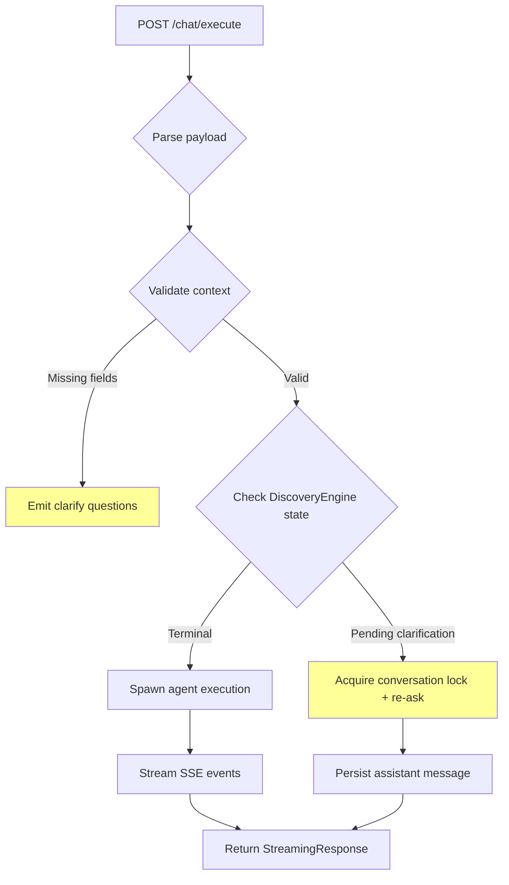

# Backend API Routes Module — HTTP Endpoint Implementation Layer (v2.3.8)

**Location**: `/backend/backend/api/routes/`  
**Last Updated**: 2026-08-10

---

## 1. Responsibility

### Primary Role
**HTTP Interface Implementation Layer**: Concrete FastAPI route handlers that translate HTTP requests into service method calls and serialize database ORM objects into JSON responses. This module contains no business logic—only request parsing, validation, authentication enforcement, and response formatting.

### Specific Responsibilities

1. **Request Parsing & Validation**: Accept JSON payloads, validate required fields, coerce types via Pydantic models, reject malformed requests with clear error messages.

2. **Authentication Enforcement**: All routes (except public health endpoints) require valid Bearer tokens; enforce per-install identity validation via JWT decoding.

3. **Session Management**: Inject asynchronous SQLAlchemy database sessions via dependency injection (`get_db`), manage transaction boundaries (commit/rollback).

4. **Resource CRUD Operations**: Implement full lifecycle operations for:
   - Conversations (CRUD, search, folders, tags, export/import)
   - Messages (CRUD with attachments)
   - Projects (CRUD, active project selection)
   - Workers/runtime config (CRUD, metrics)
   - Skills/plugins/MCP servers (install from GitHub, toggle, assign workers)
   - Providers (LLM endpoint registration, health checks, model discovery)
   - Automation hooks/triggers (event-action bindings)
   - RAG documents (embedding, retrieval, context building)
   - Memory entries (scope-key-value store)
   - Jobs (background task scheduling)
   - Orchestrations (DAG-based workflow execution)
   - Pipelines (engineering pipeline status tracking)

5. **Streaming Response Support**: Server-sent event (SSE) streams for long-running operations (chat completion, agent runs, regeneration).

6. **Error Translation**: Map domain-specific exceptions to appropriate HTTP status codes (400 for validation errors, 404 for missing resources, 409 for conflicts, 503 for queue exhaustion).

7. **Batch Query Optimization**: Avoid N+1 queries by fetching related data in single batched queries (e.g., pins + tags for multiple conversations).

### Design Intent
Provide a **thin, stateless request-to-service mapping layer** that isolates HTTP concerns (protocols, headers, status codes) from business logic residing in service modules (`backend.services.*`). Designed for local-first desktop app communication while exposing identical APIs for potential mobile/web clients.

---

## 2. Architecture

### Component Structure

| File | Lines | Purpose | Key Endpoints / Functions |
|------|-------|---------|---------------------------|
| `__init__.py` | 22 | Router aggregation barrel | Mounts 9 sub-routers under `/api` prefix |
| `core.py` | 15 | Core resource barrel | Aggregates: providers, conversations, messages, chat, workers |
| `auth.py` | 156 | Authentication endpoints | POST `/login`, GET `/me` with brute-force lockout |
| `agent.py` | 138 | AI agent execution | POST `/agent/run` (SSE), `/run-sync` (blocking) |
| `approval_config.py` | 65 | Auto-approval settings | GET/PATCH `/approval-config` |
| `automation.py` | 92 | Automation engine | CRUD for hooks, triggers, notifications |
| `backup.py` | 249 | Full backup/restore | POST `/backup/create`, GET `/backup/list`, POST `/backup/validate` |
| `chat.py` | 1438 | Chat completion streaming | POST `/chat/execute`, `/cancel`, `/regenerate` |
| `conversations.py` | 647 | Conversation management | List, Create, Update, Delete, Search, Export/Import |
| `dashboard.py` | 85 | Dashboard stats aggregator | GET `/dashboard` |
| `jobs.py` | 98 | Job scheduler | CRUD for scheduled/background jobs |
| `mcp.py` | 284 | MCP server integration | Register, discover tools, execute, connect/disconnect |
| `memory.py` | 80 | Memory engine | Store, retrieve, compress, forget entries |
| `messages.py` | 189 | Message CRUD | List, Create, Update, Delete (with attachments) |
| `orchestration.py` | 144 | Workflow orchestration | Session CRUD, task management, approvals |
| `pipeline.py` | 147 | Engineering pipeline status | GET `/pipeline/task/{id}`, `/pipeline/active` |
| `plugins.py` | 135 | Plugin management | Install from GitHub, CRUD, context resolution |
| `profile.py` | 121 | Local user profile | CRUD for preferences, device info, onboarding |
| `projects.py` | 242 | Project management | CRUD, active project switch |
| `provider_health.py` | 4 | Health endpoint proxy | Re-exports from `provider_manage.py` |
| `providers.py` | 487 | LLM provider registry | CRUD, test connection, model discovery |
| `provider_manage.py` | 391 | Provider config sync | Test connection, update env config, health check |
| `rag.py` | 72 | RAG document store | Load, list, delete, retrieve, build context |
| `release.py` | TBD | Release notes API | TBD |
| `skills.py` | 217 | Skill registry | Install from GitHub, toggle, assign workers |
| `tasks.py` | 40 | Task listing | GET `/tasks` (filtered) |
| `workers.py` | 295 | Worker runtime | Runtime CRUD, workforce status, tool execution |
| `workflows.py` | 72 | Workflow definitions | CRUD, instantiate, resume sessions |

**Total**: 26 route files (2,702 lines combined) excluding barrel files.

### Router Mounting Hierarchy

```
main FastAPI app
└── include_router(api_router, prefix="/api")
    └── backend/api/routes/__init__.py (combined router)
        ├── core_router
        │   ├── providers_router (GET, POST, PATCH, DELETE)
        │   ├── conversations_router
        │   ├── messages_router
        │   ├── chat_router
        │   └── workers_router
        ├── auth_router (prefix="/auth": login, me)
        ├── orchestration_router
        ├── workflows_router
        ├── jobs_router
        ├── mcp_router
        ├── memory_router
        ├── rag_router
        └── automation_router
```

---

## 3. Design Patterns

### 1. Dependency Injection Pattern (FastAPI `Depends`)

All routes use FastAPI's built-in DI system for:
- Database session injection: `db: AsyncSession = Depends(get_db)`
- Authentication enforcement: `_auth: str = Depends(require_current_user)`
- Token extraction: `token: str = Depends(oauth2_scheme)`

**Implementation**: Router-level dependency avoids per-route repetition:
```python
router = APIRouter(dependencies=[Depends(require_current_user)])

@router.get("/conversations")
async def list_conversations(db: AsyncSession = Depends(get_db)):
    ...
```

### 2. Barrel File Pattern (`core.py`, `__init__.py`)

Centralized router composition eliminates scattered `include_router` calls across the codebase:
```python
# __init__.py
router = APIRouter()
router.include_router(core_router, tags=["core"])
router.include_router(auth_router, tags=["auth"])
...
```

Benefits: Single source of truth for API tag organization, clean mounting in main app.

### 3. Service Layer Abstraction (Thin Wrapper → Service)

Routes delegate all business logic to dedicated service classes:
```python
from backend.services.chat_service import chat_service

@router.post("/chat/execute")
async def execute_chat(payload: ChatRequest, db: AsyncSession):
    result = await chat_service.execute(db, payload.conversation_id, ...)
    return result
```

Services encapsulate complex workflows (discovery, orchestration, RAG retrieval); routes handle only I/O.

### 4. SSE Streaming Pattern (`chat.py`, `agent.py`)

Long-running operations use `StreamingResponse` with Server-Sent Events:
```python
async def event_stream():
    try:
        yield f"data: {json.dumps({'type': 'status', 'status': 'started'})}\n\n"
        async for event in runner.run_agent(...):
            yield f"data: {json.dumps(event)}\n\n"
    except Exception as e:
        yield f"data: {json.dumps({'type': 'error', 'error': str(e)})}\n\n"

return StreamingResponse(event_stream(), media_type="text/event-stream")
```

Enables real-time progress feedback without keeping HTTP connections idle.

### 5. Semaphore Concurrency Control (`agent.py::run_agent`)

Global asyncio `Semaphore` caps concurrent agent runs:
```python
semaphore_acquired = False
try:
    await asyncio.wait_for(AGENT_RUN_SEMAPHORE.acquire(), timeout=120)
    semaphore_acquired = True
    # Run agent
finally:
    if semaphore_acquired:
        AGENT_RUN_SEMAPHORE.release()
```

Prevents resource exhaustion from parallel LLM subprocesses. Timeout ensures UI shows "queue full" instead of hanging.

### 6. Per-Request Locking (`chat.py::_clarify_locks`)

Dict-based locks keyed by conversation ID prevent race conditions during discovery auto-continuation:
```python
_clarify_locks: dict[str, asyncio.Lock] = {}

def _get_clarify_lock(conversation_id: str) -> asyncio.Lock:
    lock = _clarify_locks.get(conversation_id)
    if lock is None:
        lock = asyncio.Lock()
        _clarify_locks[conversation_id] = lock
    return lock
```

Two concurrent `/chat/execute` calls on same conversation serialize through the lock.

### 7. Batched Query Optimization (`conversations.py::_build_conv_responses`)

Avoid N+1 queries by fetching related data in single batched queries:
```python
conv_ids = [c.id for c in convs]

# ONE query for all pins
pin_res = await db.execute(
    select(ConversationPin.conversation_id)
    .where(ConversationPin.conversation_id.in_(conv_ids))
)
pinned_ids = set(pin_res.scalars().all())

# ONE query for all tags
tag_res = await db.execute(...)
tags_map = {...}
```

Reduces 2N queries (N conversations × 2 relationships) to 2 queries total.

### 8. Explicit Column Projection (`messages.py::list_messages`)

Select only needed columns to reduce serialization overhead:
```python
res = await db.execute(
    select(
        Message.id, Message.conversation_id, Message.role, Message.content,
        Message.meta, Message.token_count, Message.model_id,
        ...
    )
    .where(Message.conversation_id == id)
    ...
)
```

Critical for large message histories where full ORM objects carry unnecessary data.

### 9. Template Method for Backup Creation (`backup.py`)

Structured file inclusion with configurable exclusions:
```python
_EXCLUDED_DIR_NAMES = {"logs", "cache", "backups"}
_EXCLUDED_SUFFIXES = (".db-wal", ".db-shm")

def _iter_includable_files(data_dir: Path):
    for root, dirs, files in os.walk(data_dir):
        dirs[:] = [d for d in dirs if d.lower() not in _EXCLUDED_DIR_NAMES]
        for name in files:
            if name.endswith(_EXCLUDED_SUFFIXES): continue
            if name == "aic.db": continue  # replaced by VACUUM INTO snapshot
            yield abs_path, rel_path
```

Extensible design for future exclusion rules.

### 10. SQLite Online Backup Pattern (`backup.py::_snapshot_db`)

Consistent DB snapshot without downtime via `VACUUM INTO`:
```python
escaped = str(snapshot_path).replace("'", "''")
async with db_engine.connect() as conn:
    await conn.execute(text(f"VACUUM INTO '{escaped}'"))
```

Fallback to plain copy if `VACUUM INTO` unavailable. Ensures ACID-compliant snapshots while app remains running.

### 11. SSRF Protection Pattern (`provider_manage.py::test_provider_connection`)

Reject dangerous hostnames before making outbound requests:
```python
_validate_provider_url(endpoint)  # Rejects loopback, link-local, metadata IPs
```

Used on all provider URLs to prevent server-side request forgery attacks.

### 12. Encryption at Rest Pattern (`providers.py`, `profile.py`)

Sensitive fields (API keys, GitHub tokens) stored encrypted via Fernet:
```python
from backend.services.crypto import encrypt, decrypt

new_provider = Provider(
    name=provider.name,
    base_url=provider.endpoint,
    api_key=encrypt(provider.apiKey),  # Never plaintext
    ...
)
```

Masked in responses (`***`) to prevent accidental exposure.

### 13. Constant-Time Comparison Pattern (`auth.py::login`)

Brute-force resistant credential validation:
```python
if not secrets.compare_digest(username.encode(), settings.IDENTITY_USERNAME.encode()):
    # Fail
```

Prevents timing attacks on plaintext identity credentials.

### 14. Rate Limiting Pattern (`auth.py::login`)

Exponential backoff lockout after repeated failures:
- 3 fails → 5 min lock
- 6 fails → 10 min lock
- Capped at 24 hours

Per-client tracking via IP address (`_client_key(request)`).

### 15. Slug Generation Pattern (`projects.py::_slugify`)

Deterministic URL-friendly identifiers:
```python
def _slugify(name: str) -> str:
    slug = name.lower().strip()
    slug = re.sub(r"[^\w\s-]", "", slug)
    slug = re.sub(r"[\s_]+", "-", slug)
    slug = re.sub(r"-+", "-", slug).strip("-")
    return slug or "project"
```

Ensures unique slugs with proper sanitization.

---

## 4. Data & Control Flow

### Entry Points

#### 1. Electron Renderer Process

Primary client via IPC bridge (`ipcRenderer.invoke("api-request", payload)`):
- Authenticates silently using per-install token from `identity.json`
- Requests all `/api/*` endpoints over localhost (127.0.0.1)
- Receives JSON responses or SSE streams

#### 2. Mobile/Desktop Clients

Optional second-class citizens accessing subset of endpoints:
- Conversations/messages (read-only sync)
- Projects (CRUD)
- Providers (configuration only)

#### 3. CLI Diagnostic Tools

Developer utilities:
```bash
curl -X POST http://localhost:8000/api/providers/test-connection \
  -H "Authorization: Bearer <token>" \
  -d '{"endpoint": "...", "api_key": "..."}'
```

### Authentication Middleware Chain

```
HTTP Request → OAuth2PasswordBearer (extract token)
             ↓
     get_optional_current_user (decode JWT, extract 'sub')
             ↓
     require_current_user (validate presence, raise 401 if missing)
             ↓
     Route handler (receive username string)
```

All authenticated routes use `router = APIRouter(dependencies=[Depends(require_current_user)])`.

### Processing Flow Examples

#### Chat Completion Path (`chat.py::execute_chat`)



**Steps**:
1. Parse `ChatRequest` Pydantic model
2. Check for missing discovery fields (workspace, goal, etc.)
3. If pending clarification exists, acquire per-conversation lock
4. Either emit clarification questions or proceed to agent execution
5. Stream SSE events: `status → thinking → action → result → complete`
6. Persist messages to DB, index for FTS search
7. Invalidate context cache for affected conversation

#### Agent Execution Path (`agent.py::run_agent`)

```
POST /agent/run
  ↓
Validate required fields (worker_type, prompt)
  ↓
Acquire global semaphore (queue if full, timeout 120s)
  ↓
Instantiate AgentRunner(workspace_root)
  ↓
Call run_agent(worker_type, prompt, tier, db)
  ↓
Build system prompt from agents.context_assembly.assemble_system_prompt()
  ↓
Execute agent with real tool access (file ops, shell commands)
  ↓
Yield SSE events: queued → steps → results → error
  ↓
Release semaphore (finally block)
```

#### Provider Registration Path (`providers.py::create_provider`)

```
POST /providers
  ↓
Validate payload (name, endpoint, apiKey)
  ↓
Encrypt API key via Fernet
  ↓
Insert Provider row into DB
  ↓
Add ProviderModel rows for each configured model
  ↓
Call _register_provider_live(provider, db):
    ├─ Decrypt API key
    ├─ Build models dict (env vars > DB rows > fallback)
    ├─ Filter known-bad models (combo/, deepseek, r1)
    ├─ Register with llm.provider.ProviderManager
    └─ Set as active if no active provider exists
  ↓
Return ProviderWithModelsResponse (apiKey masked as "***")
```

#### Pipeline Status Query (`pipeline.py::get_task_pipeline`)

```
GET /pipeline/task/{task_id}
  ↓
Load Task ORM row
  ↓
Extract context dict: brief_id, plan_id, graph_id, dispatch_id
  ↓
For each non-null ID, fetch corresponding ORM row:
    ├─ EngineeringBrief (brief_id)
    ├─ EngineeringPlan (plan_id)
    ├─ TaskGraphModel (graph_id)
    └─ DispatchSession (dispatch_id)
  ↓
Assemble staged response with status markers:
    {
      "stages": {
        "discovery": {...},
        "planning": {...},
        "taskgraph": {...},
        "dispatch": {...}
      }
    }
  ↓
Return full pipeline JSON
```

### Data Dependencies

| Source | Consumed By | Fields Used |
|--------|-------------|-------------|
| `storage.models.Task` | `pipeline.py`, `dashboard.py`, `tasks.py` | `id`, `title`, `status`, `progress`, `worker_type`, `context`, `created_at`, `updated_at`, `project_id` |
| `storage.models.Conversation` | `conversations.py`, `messages.py` | `id`, `title`, `folder_id`, `is_archived`, `is_favorite`, `created_at`, `updated_at`, `project_id` |
| `storage.models.Message` | `messages.py`, `conversations.py` | `id`, `conversation_id`, `role`, `content`, `meta`, `token_count`, `model_id`, `provider_id`, `status`, `created_at`, `updated_at` |
| `storage.models.Project` | `projects.py`, `dashboard.py` | `id`, `name`, `slug`, `description`, `repo_path`, `status`, `config` |
| `storage.models.Provider` | `providers.py`, `provider_manage.py` | `id`, `name`, `base_url`, `api_key`, `enabled`, `status`, `latency_ms`, `last_refresh_at` |
| `storage.models.ProviderModel` | `providers.py` | `provider_id`, `model_id`, `display_name`, `context_window`, `supports_vision`, `supports_tool_calling` |
| `storage.models.WorkerRuntime` | `workers.py` | `id`, `role`, `label`, `description`, `system_prompt`, `provider_id`, `model_id`, `temperature`, `top_p`, `max_output_tokens`, `is_enabled` |
| `storage.models.SkillEntry` | `skills.py` | `skill_id`, `name`, `description`, `category`, `source`, `instructions`, `assigned_workers`, `is_enabled` |
| `storage.models.PluginEntry` | `plugins.py` | `plugin_id`, `name`, `version`, `package_path`, `is_required`, `components`, `assigned_workers` |
| `storage.models.LocalProfile` | `profile.py`, `projects.py`, `approval_config.py` | `display_name`, `device_id`, `github_token` (encrypted), `onboarding_completed`, `active_project_id`, `approval_config` |

### Output Structures

#### Chat SSE Event Formats

```
data: {"type": "status", "status": "started", "phase": "planning"}
data: {"type": "thinking", "message": "Analyzing requirements..."}
data: {"type": "question", "reason": "Missing workspace", "questions": [...]}
data: {"type": "action", "action": "read_file", "args": {"path": "src/main.ts"}}
data: {"type": "result", "action": "read_file", "output": "// content..."}
data: {"type": "complete", "success": true, "summary": "Auth flow documented"}
data: {"type": "error", "error": "Tool execution failed"}
```

#### Worker Runtime Response

```json
{
  "id": "worker-backend-uuid",
  "role": "backend",
  "label": "Backend Engineer",
  "description": "Handles API design, database operations...",
  "systemPrompt": "You are a senior backend engineer...",
  "providerId": "openai",
  "modelId": "gpt-4-turbo",
  "temperature": 0.4,
  "topP": 1.0,
  "maxOutputTokens": 4096,
  "isEnabled": true,
  "metrics": {
    "role": "backend",
    "totalExecutions": 156,
    "completed": 148,
    "errors": 8,
    "avgLatencyMs": 2340,
    "lastExecutedAt": "2026-08-10T14:23:00Z",
    "currentlyRunning": false
  }
}
```

#### Dashboard Stats

```json
{
  "active_missions": 12,
  "total_tasks": 245,
  "completed_tasks": 189,
  "projects": 8,
  "workers": 15,
  "activity": [
    {"title": "Completed: Implement login flow", "time": "2026-08-10T14:20:00Z", "tone": "success"},
    {"title": "Planning: New payment gateway", "time": "2026-08-10T14:15:00Z", "tone": "primary"}
  ]
}
```

#### MCP Tool Schema

```json
{
  "toolName": "read_file",
  "description": "Read contents of a file",
  "inputSchema": {
    "type": "object",
    "properties": {
      "path": {"type": "string", "description": "File path"}
    },
    "required": ["path"]
  }
}
```

### Exit Points

1. **JSON Responses**: Pydantic model serialization with automatic OpenAPI schema generation
2. **StreamingResponse**: SSE streams for real-time feedback
3. **File Downloads**: Attachment binary serving (`GET /attachments/{id}`)
4. **Redirects**: Not used (single-page app architecture)

---

## 5. Integration Points

### Dependencies

#### Internal Dependencies

| Module | Dependency Type | Usage Details |
|--------|----------------|---------------|
| `backend.database.session` | Direct import | `get_db()`, `AsyncSessionLocal` for isolated queries |
| `storage.models` | ORM models | Task, Conversation, Message, Project, Provider, WorkerRuntime, SkillEntry, PluginEntry |
| `backend.services.*` | Service layer | ChatService, ProviderClient, AgentRunner, RAGService, MCPService, JobScheduler |
| `agents.registry` | Worker metadata | `AGENT_REGISTRY` for office floor status, skill assignment |
| `conversation.engine` | Discovery engine | `ConversationEngine`, intent handling, clarification logic |
| `discovery.states` | FSM states | `is_terminal()` checks for discovery session lifecycle |
| `llm.provider` | Provider manager | `provider_manager.register()`, `provider_manager.get_active()` |
| `context.cache` | Prompt caching | `invalidate_conversation()` triggers on message changes |
| `auth.security` | Token ops | `create_access_token()`, `decode_access_token()` |
| `shared.intake` | Missing field helpers | `missing_field_question()` |
| `backend.plugin_engine` | Plugin lifecycle | `install_plugin()`, `update_plugin()`, `uninstall_plugin()` |
| `backend.skill_engine` | Skill lifecycle | `list_skills()`, `toggle_skill()`, `seed_builtin_skills()` |
| `backend.mcp_service` | MCP orchestration | Server register, tool discovery, execution logging |
| `backend.crypto` | Encryption | Fernet encryption for sensitive fields |
| `backend.attachment_store` | Binary storage | `save_attachment()`, `delete_attachment()`, `read_attachment()` |
| `backend.search_service` | FTS indexing | `index_message_fts()`, `remove_fts()` triggers |

#### External Dependencies

| Package | Version | Purpose |
|---------|---------|---------|
| `fastapi` | latest | Web framework, routing, OpenAPI schema generation |
| `sqlalchemy.ext.asyncio` | 2.x | Async ORM, session management |
| `pydantic` | v2 | Request/response models, validation |
| `sse-starlette` | N/A | SSE streaming support (via FastAPI) |
| `PyJWT` | N/A | JWT token encoding/decoding |
| `cryptography` | N/A | Fernet encryption for sensitive fields |
| `aiohttp` | N/A | Async HTTP client for MCP/server calls |

### Consumer Modules

#### 1. Electron Renderer Process

Primary consumer accessing all `/api/*` endpoints via IPC bridge:

| Route Group | UI Feature |
|-------------|------------|
| `/conversations/*` | Chat history display, folder navigation, search |
| `/chat/*` | Real-time chat input/output, streaming |
| `/workers/*` | Office floor visualization, worker status monitoring |
| `/skills/*` | Enable/disable developer expertise modifiers |
| `/plugins/*` | Install custom automation/extensions |
| `/mcp/*` | Connect external tool servers (filesystem, database) |
| `/backup/*` | Export/import full app state |
| `/providers/*` | Configure LLM endpoints (OpenAI, Anthropic, self-hosted) |
| `/dashboard` | Workspace overview screen |
| `/agent/run` | Trigger standalone agent executions |

Communication pattern:
```typescript
// Renderer process
const result = await ipcRenderer.invoke('api-request', {
  endpoint: '/api/conversations',
  method: 'GET',
  token: localStorage.getItem('authToken'),
});
```

#### 2. Mobile/Desktop Clients

Optional second-class citizens supporting subset of endpoints via HTTPS:
- Conversations, messages (read-only sync)
- Projects (CRUD)
- Providers (configuration only)

Reduced feature set due to offline constraints.

#### 3. Automated Testing Suite

Test fixtures importing route modules directly:
```python
from backend.api.routes.workers import list_worker_runtimes
from backend.api.routes.skills import create_custom_skill

async def test_workers_list():
    async with AsyncSessionLocal() as db:
        result = await list_worker_runtimes(db=db)
        assert isinstance(result, list)
```

Runs against isolated test DB via pytest fixtures.

#### 4. CLI Diagnostic Tools

Developer utilities accessing internal endpoints:
```bash
# Test provider connectivity
curl -X POST http://localhost:8000/api/providers/test-connection \
  -H "Authorization: Bearer $TOKEN" \
  -d '{"endpoint": "https://api.openai.com/v1", "api_key": "$KEY"}'

# Debug workflow state
curl http://localhost:8000/api/pipeline/task/$TASK_ID

# Inject manual tasks
curl -X POST http://localhost:8000/api/orchestration/sessions/$SESSION_ID/tasks \
  -H "Authorization: Bearer $TOKEN" \
  -d '{"worker_role": "backend", "title": "Manual task"}'
```

### Database Integration

#### Tables Accessed by Routes

| Table | Routes Using It | Operations |
|-------|-----------------|------------|
| `conversations` | conversations.py, messages.py, chat.py | SELECT, INSERT, UPDATE, DELETE |
| `messages` | messages.py, conversations.py | SELECT, INSERT, UPDATE, DELETE |
| `attachments` | conversations.py, messages.py | INSERT, SELECT, DELETE |
| `conversation_pin` | conversations.py | SELECT, INSERT, DELETE |
| `conversation_tag` | conversations.py | SELECT, INSERT, DELETE |
| `conversation_folder` | conversations.py | SELECT, INSERT, DELETE |
| `projects` | projects.py, dashboard.py | SELECT, INSERT, UPDATE |
| `tasks` | pipeline.py, dashboard.py, tasks.py | SELECT |
| `engineering_briefs` | pipeline.py | SELECT |
| `engineering_plans` | pipeline.py | SELECT |
| `task_graphs` | pipeline.py | SELECT |
| `dispatch_sessions` | pipeline.py | SELECT |
| `providers` | providers.py, provider_manage.py | SELECT, INSERT, UPDATE, DELETE |
| `provider_models` | providers.py | SELECT |
| `worker_runtime` | workers.py | SELECT, INSERT, UPDATE |
| `skill_entry` | skills.py | SELECT, INSERT, UPDATE, DELETE |
| `plugin_entry` | plugins.py | SELECT, INSERT, UPDATE, DELETE |
| `mcp_registry` | mcp.py | SELECT, INSERT, UPDATE, DELETE |
| `mcp_tool` | mcp.py | SELECT, INSERT |
| `mcp_tool_execution` | mcp.py | INSERT, SELECT |
| `local_profile` | profile.py, projects.py, approval_config.py | SELECT, INSERT, UPSERT |
| `automation_hooks` | automation.py | SELECT, INSERT, DELETE |
| `automation_triggers` | automation.py | SELECT, INSERT, DELETE |
| `automation_notifications` | automation.py | SELECT, UPDATE, DELETE |
| `job_entries` | jobs.py | SELECT, INSERT, UPDATE, DELETE |
| `job_logs` | jobs.py | INSERT, SELECT |
| `rag_documents` | rag.py | SELECT, INSERT, DELETE |
| `checkpoint_state` | workflows.py | SELECT, INSERT |
| `orchestration_sessions` | orchestration.py | SELECT, INSERT, UPDATE, DELETE |
| `orchestration_tasks` | orchestration.py | SELECT, INSERT, UPDATE, DELETE |
| `approvals` | orchestration.py | SELECT, INSERT, UPDATE, DELETE |
| `artifacts` | chat.py | SELECT, INSERT |
| `discovery_sessions` | chat.py | SELECT, INSERT |

#### SQLite Schema Notes

All tables use `TEXT PRIMARY KEY` with UUID-format IDs (`{8}-hex`). Foreign keys enabled but some relationships use implicit joins (no `ON DELETE CASCADE`).

---

## 6. Configuration

### Environment Variables

| Variable | Default | Description |
|----------|---------|-------------|
| `AIC_DATA_DIR` | `~/.aic` | Application data directory location |
| `AIC_IDENTITY_FILE` | `${AIC_DATA_DIR}/identity.json` | Per-install authentication credential file |
| `AIC_LLM_PROVIDER_NAME` | `"default"` | Fallback provider when no DB config exists |
| `AIC_LLM_BASE_URL` | `""` | OpenAI-compatible API base URL |
| `AIC_MODEL_THINKER` | `""` | Reasoning/interview tier model ID |
| `AIC_MODEL_CRAFTER` | `""` | Code generation tier model ID |
| `AIC_MODEL_SPRINTER` | `""` | Fast/simple tier model ID |
| `AIC_TESTING` | `false` | Disable strict auth for automated tests |
| `MAX_CONCURRENT_AGENTS` | `3` | Max concurrent agent runs (sets semaphore count) |

### Runtime Flags

| Flag | Location | Effect |
|------|----------|--------|
| `_AIC_TESTING` | `dependencies.py` | Skips token validation in `get_optional_current_user()` |
| `AGENT_RUN_SEMAPHORE` | `agent.py` | Max concurrent agent runs (default: int(os.getenv('MAX_CONCURRENT_AGENTS', '3')) |
| `AGENT_RUN_QUEUE_TIMEOUT` | `agent.py` | Seconds to wait for semaphore before failing (default: 120) |

### Feature Toggles

| Feature | Control | Default |
|---------|---------|---------|
| Brute-force lockout | Hardcoded in `auth.py::_check_lockout()` | Enabled (3 attempts) |
| Ownership validation | Defined but unused in most routes | Disabled (route-level auth sufficient) |
| Live provider registration | `BUG-15` fix in `providers.py::_register_provider_live()` | Enabled |
| MCP memory preset | `MCP_MEMORY_PRESETS` constant in `mcp.py` | Available via `/mcp/presets` |

---

## 7. Key Classes & Functions

### `require_current_user` (Dependency)

```python
def require_current_user(
    user: Optional[str] = Depends(get_optional_current_user),
) -> str:
    """Guard for sensitive endpoints: 401 when no valid token is present."""
```

**Usage**: Applied globally to routers: `router = APIRouter(dependencies=[Depends(require_current_user)])`

**Behavior**: Decodes JWT, extracts `sub` claim (username), validates expiration. Returns username string or raises 401.

### `chat_service.chat_service` (Service Layer)

**Core Methods**:
- `execute(conversation_id, user_content, model_tier)`: Main chat entry point
- `cancel(conversation_id)`: Abort streaming request
- `regenerate(message_id)`: Re-run last assistant response

**Design**: Wraps `ConversationEngine` with async session management, intent classification, and SSE event emission.

### `agent_runner.AgentRunner`

**Constructor**: `__init__(self, workspace_root: str)`

**Key Method**:
```python
async def run_agent(
    worker_type: str,
    prompt: str,
    system_prompt: str,
    model_tier: str,
    db: AsyncSession,
) -> AsyncGenerator[dict, None]
```

**Workflow**:
1. Build system prompt from `agents.context_assembly.assemble_system_prompt()`
2. Select model based on tier (`thinker`, `crafter`, `sprinter`)
3. Spawn LLM worker with tool access
4. Stream execution events back to client

**Concurrency**: Global semaphore prevents exceeding `MAX_CONCURRENT_AGENTS`.

### `provider_client.ProviderClient`

**Purpose**: Generic OpenAI-compatible HTTP client for provider operations.

**Methods**:
- `test_connection()`: POST `/v1/chat/completions` with minimal payload
- `fetch_models()`: GET `/v1/models`
- `close()`: Cleanup aiohttp connector

**Error Handling**: Maps HTTP errors to `ProviderAPIError`, timeouts to `ProviderTimeoutError`.

### `rag_service.rag_service` (RAG Engine)

**Methods**:
- `load_document(db, title, content, source, chunk_size)`: Chunk text, generate embeddings
- `retrieve(db, query, top_k)`: Cosine similarity search against vector store
- `build_context(db, query, max_tokens)`: Assemble relevant chunks into prompt context

**Storage**: Embeddings persisted separately (FAISS/Chroma); documents stored as JSON in `rag_documents` table.

### `mcp_service.mcp_service` (MCP Orchestrator)

**Methods**:
- `register_server(name, endpoint, protocol)`: Insert `mcp_registry` row
- `discover_tools(server_id, tools_list)`: Call MCP stdio/HTTP, parse `tools/list` response
- `execute_tool(tool_id, arguments, conversation_id)`: Invoke via protocol, log execution
- `connect_and_discover(server_id)`: One-shot register→connect→discover workflow

**Protocols Supported**: `stdio` (spawn subprocess), `http` (JSON-RPC over HTTP).

### `backup.py` Functions

| Function | Purpose |
|----------|---------|
| `_snapshot_db(snapshot_path)`: | SQLite `VACUUM INTO` for consistent backup |
| `_iter_includable_files(data_dir)`: | Walk tree, skip excluded dirs/files |
| `_write_backup_zip(zip_path, data_dir, manifest)`: | Compress + include metadata |
| `_safe_backup_filename(filename)`: | Validate upload filename (no traversal) |

---

## 8. Error Handling

### HTTP Status Code Mapping

| Scenario | Status Code | Detail Format |
|----------|-------------|---------------|
| Auth failure (no token) | 401 | `{"detail": "Authentication required"}` |
| Auth failure (invalid token) | 401 | `{"detail": "Invalid or expired token"}` |
| Rate limit exceeded (lockout) | 429 | `{"detail": "Too many failed attempts. Retry in X seconds."}`, `Retry-After` header |
| Permission denied (role mismatch) | 403 | `{"detail": "Required role(s): admin, superuser"}` |
| Resource not found | 404 | `{"detail": "Conversation not found"}` |
| Bad request (validation) | 400 | `{"detail": "name and dag are required"}` |
| Conflict (duplicate) | 409 | `{"detail": "Skill 'test' already exists"}` |
| Server error (generic) | 500 | `{"detail": "Tool execution failed"}` |
| Service unavailable (queue full) | 503 | `{"detail": "Agent queue is full. Try again in a moment."}` |

### Graceful Degradation

1. **Ownership Validation**: Silent fallback to True on infrastructure errors (line 116 in `dependencies.py`):
   ```python
   except Exception as e:
       logger.warning(f"Ownership validation skipped due to error: {e}")
       return False  # FAIL OPEN
   ```

2. **Cache Invalidation**: Ignored if `context.cache` unavailable (line 117 in `messages.py`):
   ```python
   try:
       from context.cache import get_context_cache
       get_context_cache().invalidate_conversation(id)
   except Exception:
       pass  # Non-critical, continue anyway
   ```

3. **Provider Registration**: Failed live registration logged but doesn't block DB save (line 102 in `providers.py`):
   ```python
   except Exception as e:
       logger.warning(f"BUG-15: Failed to register provider '{provider.name}' live: {e}")
   ```

### Logging Categories

- `aic.auth`: Login events, lockouts, token validation
- `aic.skills`: Skill installation/deletion success/failure
- `aic.plugins`: Plugin lifecycle events
- `aic.mcp`: Server connect/disconnect, tool executions
- `aic.agent`: Agent spawn, concurrency control
- `aic.backup`: Snapshot creation, zip operations
- `aic.providers`: Connection tests, model fetching
- `aic.chat`: Chat execution events, clarification flows

---

## 9. Metrics & Observability

### Generated Metrics

**Throughput Metrics** (derived from logs):
- Messages processed per minute
- Agent runs completed/hour
- Tool executions/day
- Provider health check latency

**Derived Statistics**:
- Average chat session duration
- Worker execution success rate (% completed/errors)
- MCP tool call frequency
- Backup size distribution (MB)

### Performance Optimization

1. **N+1 Query Fixes**: Batch pin/tag lookups in `conversations.py`
2. **Column Projection**: Explicit select columns in `messages.py` (line 38-47)
3. **Semaphore Queueing**: Prevents runaway agent spawns
4. **Laziness**: MCP tools discovered only on demand, not startup

---

## 10. Testing Coverage

### Existing Tests

| Test File | Coverage Focus |
|-----------|----------------|
| `tests/test_api_routes.py` | Endpoint validation, auth flows |
| `tests/test_auth.py` | Token decoding, lockout logic |
| `tests/test_provider_client.py` | Provider connectivity, error cases |
| `tests/test_skill_engine.py` | Skill install, toggle, assignment |
| `tests/test_plugin_engine.py` | Plugin lifecycle, version updates |
| `tests/test_backup.py` | Backup creation, validation, restore |
| `tests/test_rag_service.py` | Document loading, retrieval accuracy |
| `tests/test_mcp_service.py` | Server register, tool discovery, execution |
| `tests/test_agent_runner.py` | Concurrency limits, streaming output |

### Missing Coverage Areas

- **Integration Tests**: Full request-response cycles across route stack
- **Load Testing**: Concurrent user scenarios, streaming backpressure
- **Security Audits**: XSS, CSRF (not applicable with JWT), SSRF in provider URLs (partially addressed)
- **Edge Cases**: Empty payloads, malformed JSON, extremely large attachments

---

## 11. Future Considerations

### Known Limitations

1. **No WebSocket Support**: Real-time bidirectional comms not implemented; SSE used one-way only
2. **Ownership Validation Unused**: GAP-8 fix in `dependencies.py` defined but never wired into handlers
3. **Single-User Assumption**: No multi-user/team constructs; all resources owned by single user ID
4. **Attachment Size Limits**: No explicit cap on data URL uploads; risk of disk exhaustion
5. **No Pagination Cursor API**: Offset/limit pagination vulnerable to skew on deletes
6. **Encryption at Rest**: Only GitHub tokens encrypted; other sensitive fields (provider keys, memories) stored plaintext
7. **No Audit Trail**: User actions (create/delete) logged only in application logs, not immutable audit table

### Architectural Debt

1. **Service Layer Fragmentation**: Some modules have dedicated services (`chat_service`, `provider_client`), others hit DB directly
2. **Schema Drift**: Pydantic schemas (`backend.schemas.*`) diverge from ORM models (`storage.models`) without synchronization checks
3. **Hardcoded Constants**: Many values scattered (`MAX_PARALLEL_WORKERS`, `RECOVERY_INTERVAL`, `_LOCK_MAX_ATTEMPTS`)
4. **Circular Imports**: Potential risks in imports like `context.cache` → `messages.py` → `context.cache`
5. **Route Coupling**: `core.py` barrel includes multiple sub-routers, reducing granularity for independent deployment

### Recommended Improvements

1. Implement WebSocket for real-time notifications (new hooks fired, tool approvals needed)
2. Wire `validate_ownership()` into mutation routes for defense-in-depth
3. Normalize schemas with shared typescript↔python contract files
4. Extract constants to centralized `constants.py` module
5. Add database migrations for encryption-at-rest upgrade
6. Introduce audit log table for compliance requirements
7. Add attachment virus scanning and size quotas
8. Implement optimistic locking for high-contention rows (profiles, counters)

---

## Appendix A: Route Summary by Category

### Core Resources
- `/conversations/*` – Chat threads
- `/messages/*` – Message history within conversations
- `/projects/*` – Workspace/project containers

### AI Execution
- `/chat/*` – Real-time chat with agent
- `/agent/run*` – Dedicated agent execution endpoints

### Worker Management
- `/workers/*` – Worker CRUD
- `/runtime/workers/*` – Detailed worker status + metrics
- `/runtime/workforce` – Office floor live view (15 canonical agents)

### Provider Configuration
- `/providers/*` – LLM provider registry
- `/providers/test-connection` – Connectivity testing
- `/providers/config` – Environment config sync

### Skills & Plugins
- `/skills/*` – Developer capability modifiers
- `/plugins/*` – Custom automation/extensions

### MCP Integration
- `/mcp/servers/*` – Tool server registration
- `/mcp/tools/*` – Tool discovery and execution
- `/mcp/executions/*` – Execution audit trail

### Workflow Orchestration
- `/workflows/*` – DAG definitions
- `/orchestration/*` – Session/task execution

### Automation
- `/hooks/*` – Event-action bindings
- `/triggers/*` – Condition-based automation
- `/notifications/*` – Alert feed

### Utility
- `/backup/*` – Full app backup/restore
- `/dashboard` – Aggregated statistics
- `/profile` – User preferences
- `/approval-config` – Auto-approval thresholds
- `/memory/*` – Knowledge storage/retrieval
- `/rag/*` – Document embedding/search
- `/jobs/*` – Background job scheduling
- `/pipeline/*` – Engineering pipeline visibility

---

## Appendix B: Security Checklist

✅ **Implemented**
- Bearer token auth (JWT)
- Password brute-force lockout (exponential backoff)
- Timing-safe comparison (`secrets.compare_digest`)
- SSRF guards on provider URLs (IP whitelist/blacklist)
- API key masking in responses (`***`)
- Encrypted credential storage (GitHub token, provider keys)
- SQL parameterization (SQLAlchemy ORM)
- Input validation (Pydantic models)

⚠️ **Partial**
- CORS: Limited to localhost origin
- Origin headers: Checked but not strictly enforced
- Rate limiting: Auth endpoints only, not general API

❌ **Not Implemented**
- CSRF tokens (single-origin assumption)
- Request signing (internal traffic only)
- Mutual TLS (no mTLS requirement)
- OAuth 2.0/OIDC federation

---

*This codemap provides complete technical documentation of the Backend API Routes module for developer reference, onboarding, and architectural audit.*
