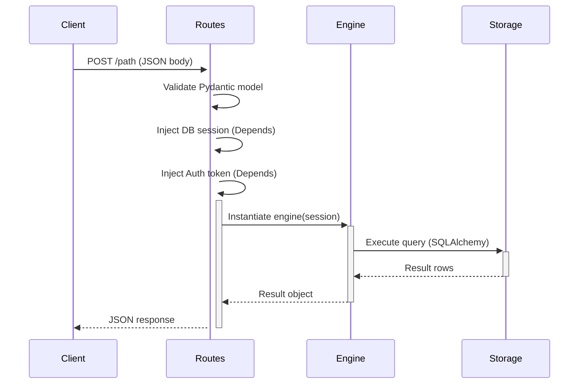
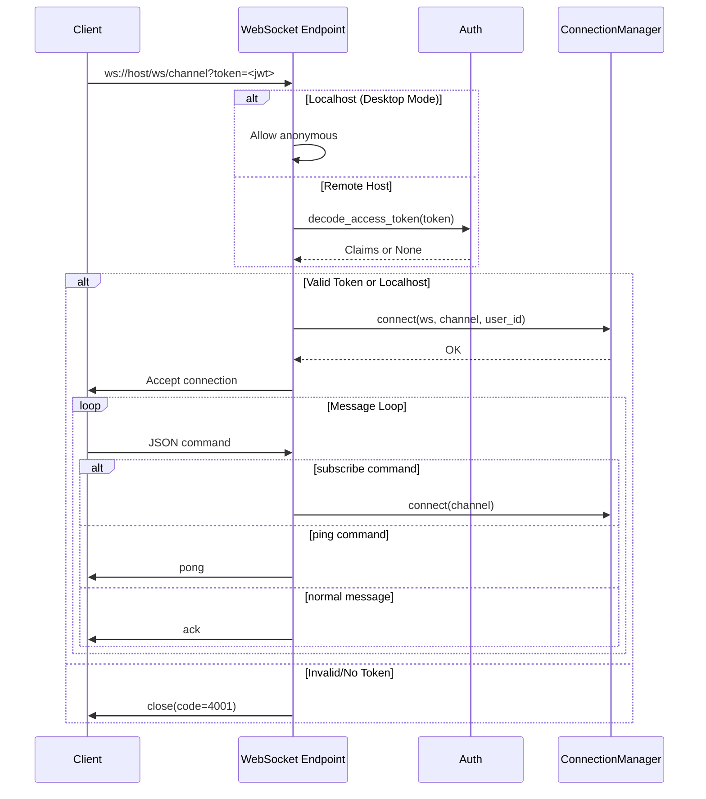

# Routes Module Codemap

**Location**: `/home/tvd/AI-Company/backend/backend/routes/`

## 1. Responsibility

This directory provides the **REST API and WebSocket endpoints layer** for the AIC Platform. It serves as the public interface between clients (web apps, desktop apps, external services) and the backend business logic engines. Each `.py` file implements a specific domain's API surface:

| File | Domain Responsibility | Primary Purpose |
|------|---------------------|-----------------|
| `websocket.py` | Real-time Communication | WebSocket pub/sub with JWT auth and channel management |
| `autonomy.py` | Autonomous Operations | Anomaly detection and recovery pipeline APIs |
| `usage.py` | Usage Analytics | Token usage statistics, pricing, and cost tracking |
| `context.py` | Knowledge Intelligence | Context assembly, knowledge base, and decision logging |
| `conversations.py` | Chat & Conversations | Conversation lifecycle and message streaming (DEPRECATED) |
| `planning.py` | Engineering Planning | Plan generation from engineering briefs |
| `verification.py` | Quality Verification | Output verification against acceptance criteria |
| `discovery.py` | Requirements Discovery | Engineering discovery sessions and brief creation |
| `taskgraph.py` | Task Orchestration | Task graph generation from engineering plans |
| `dispatcher.py` | Task Execution | Task dispatch and execution tracking |

### Key Characteristics

- **Domain-Separated Architecture**: Each route file corresponds to a distinct business domain with its own engine
- **FastAPI-Based**: All routes use FastAPI router pattern with dependency injection
- **Async-First**: Uses SQLAlchemy async sessions for database operations
- **Authentication Required**: Most endpoints require `require_current_user` auth
- **Engine Delegation**: Thin routing layer delegates to domain-specific engines

---

## 2. Design Patterns

### 2.1 Router Pattern (FastAPI)

All files follow the standard FastAPI router pattern:

```python
router = APIRouter()

@router.get("/path")
async def endpoint(...):
    engine = SomeEngine(session)
    result = await engine.do_something()
    return result.to_dict()
```

### 2.2 Engine Delegation Pattern

Each route imports and instantiates domain engines on demand:

```python
from planning.engine import PlanningEngine

engine = PlanningEngine(session)
result = await engine.plan(req.brief_id, req.project_context)
```

**Benefits**:
- Separation of concerns (routes = HTTP, engines = business logic)
- Lazy loading reduces memory footprint
- Easy testing with mock sessions

### 2.3 Request Model Validation (Pydantic)

All POST endpoints use Pydantic models for request validation:

```python
class PlanRequest(BaseModel):
    brief_id: str
    project_context: dict | None = None
```

### 2.4 Dependency Injection

Database sessions injected via FastAPI dependencies:

```python
session: AsyncSession = Depends(get_session)
```

Auth injected similarly:

```python
_auth: str = Depends(require_current_user)
```

### 2.5 Error Handling Pattern

Consistent error responses using FastAPI conventions:

```python
if result.state == "error":
    raise HTTPException(400, result.message)

# Or async session rollback
await session.rollback()
raise HTTPException(500, f"Error: {str(e)}")
```

### 2.6 WebSocket Channel Manager (Singleton Pattern)

`websocket.py` uses a singleton `ConnectionManager`:

```python
manager = ConnectionManager()

class ConnectionManager:
    self.connections: dict[str, list[WebSocket]] = defaultdict(list)
```

**Key Methods**:
- `connect()` - Register WebSocket to channel
- `disconnect_all()` - Clean up all subscriptions (P4 fix)
- `broadcast()` - Send to single channel
- `broadcast_all()` - Send to all channels

### 2.7 SSE Streaming Pattern

Conversations use Server-Sent Events for streaming responses:

```python
async def event_generator():
    for i in range(0, len(content), chunk_size):
        chunk = content[i:i + chunk_size]
        yield f"data: {json.dumps({'type': 'chunk', 'content': chunk})}\n\n"
    yield f"data: {json.dumps({'type': 'done', ...})}\n\n"

return StreamingResponse(event_generator(), media_type="text/event-stream")
```

### 2.8 Batch Operations Pattern

`conversations.py` implements efficient batch deletes with cascading FK cleanup:

```python
await _del("DELETE FROM lessons_learned WHERE report_id IN (...)")
```

Uses raw SQL with expanding bindparams for large delete sets.

---

## 3. Data & Control Flow

### 3.1 End-to-End Request Flow



### 3.2 WebSocket Connection Flow



### 3.3 Data Models Used

#### Core Database Models Referenced

| Model | Source File | Used In Routes |
|-------|-------------|----------------|
| `Conversation` | `storage.models` | conversations.py |
| `Message` | `storage.models` | conversations.py |
| `DiscoverySession` | `storage.models` | conversations.py, discovery.py |
| `EngineeringBrief` | `storage.models` | discovery.py |
| `EngineeringPlan` | `storage.models` | planning.py |
| `TaskGraphModel` | `storage.models` | taskgraph.py |
| `DispatchSession` | `storage.models` | dispatcher.py |
| `VerificationSession` | `storage.models` | verification.py |
| `LLMUsageLog` | `storage.models` | usage.py |
| `GenerationLog` | `backend.models.ai_runtime` | usage.py |
| `Attachment` | `backend.models.conversation` | conversations.py |

### 3.4 Control Flow Examples

#### Example: Plan Generation Flow (`planning.py`)

```python
POST /planning/generate
  └─> Validate PlanRequest (brief_id, project_context)
  └─> Require auth
  └─> Import PlanningEngine
  └─> Instantiate engine = PlanningEngine(session)
  └─> Call result = await engine.plan(brief_id, context)
  └─> If result.state == "error": raise HTTPException(400)
  └─> Return { state, plan, message, metadata }
```

#### Example: Discovery Session → Brief → Plan → Graph → Dispatch

```
User creates conversation
  └─> POST /conversations
  └─> Discovery phase starts
  └─> POST /discovery/{id}/respond (clarifications)
  └─> Creates EngineeringBrief
  └─> POST /planning/generate
  └─> Creates EngineeringPlan
  └─> POST /taskgraph/generate
  └─> Creates TaskGraph
  └─> POST /dispatcher/dispatch
  └─> Tasks dispatched to workers
  └─> POST /verification/verify
  └─> Results verified against criteria
```

### 3.5 WebSocket Event Types

| Event Type | Direction | Description |
|------------|-----------|-------------|
| `subscribe` | Client→Server | Subscribe to additional channel |
| `subscribed` | Server→Client | Confirmation of subscription |
| `ping` | Client→Server | Liveness check |
| `pong` | Server→Client | Ping response |
| `ack` | Server→Client | Acknowledgment of message |
| `event_*` | Server→Client | Broadcast events from dispatcher/workers |

### 3.6 Concurrency & Resource Management

- **WebSocket leak prevention**: P4 fix adds `disconnect_all()` to clean multi-channel subscriptions
- **SQLite WAL mode**: Optimized for concurrent reads, single writer
- **Background task dispatch**: `_dispatch_created_task()` retries SQLite lock errors (max 5 attempts, exponential backoff)

---

## 4. Integration Points

### 4.1 Dependencies

#### External Libraries

| Library | Version/Source | Usage |
|---------|----------------|-------|
| `fastapi` | Installed | Router, dependencies, streaming |
| `pydantic` | Installed | Request/response models |
| `sqlalchemy` | Installed | Async ORM, session management |
| `auth` package | `auth.security` | JWT token decoding |

#### Internal Modules

**From `backend/`**:
- `backend.api.dependencies` - `require_current_user` auth function
- `backend.database.session` - `get_db` session factory
- `backend.models.ai_runtime` - `GenerationLog` model
- `backend.models.conversation` - `Attachment` model
- `backend.services.attachment_store` - File deletion helper
- `backend.services.pricing_service` - Pricing lookup
- `backend.services.search_service` - FTS index sync

**From `storage/`**:
- `storage.database` - `get_session`, `async_session`
- `storage.models` - All ORM models (Conversation, Message, etc.)

**From domain engines**:
- `autonomy.engine` - Anomaly detection/recovery
- `context.engine` - Knowledge queries
- `context.builder` - Context assembly builder
- `context.pipeline` - Default pipeline creation
- `conversation.engine` - Chat processing
- `discovery.engine` - Clarification handling
- `planning.engine` - Plan generation
- `verification.engine` - Output verification
- `taskgraph.engine` - Task graph generation
- `dispatcher.engine` - Task dispatch
- `runtime.executor` - `execute_task` worker

### 4.2 Consumer Interfaces

#### REST API Endpoints by Domain

**Autonomy** (`autonomy.py`):
- `POST /detect` - Detect and record anomaly
- `POST /handle` - Handle anomaly with recovery
- `GET /stats` - Get autonomy statistics

**Usage** (`usage.py`):
- `GET /usage/stats` - Aggregated stats (period, provider, model breakdowns)
- `GET /usage/daily` - Daily time-series data
- `GET /usage/recent` - Recent entries (paginated)
- `GET /usage/pricing` - Provider pricing info
- `GET /usage/session/{id}` - Per-conversation costs

**Context** (`context.py`):
- `GET /{project_id}` - Project context
- `POST /knowledge` - Add knowledge entry
- `POST /decisions` - Record decision
- `POST /search` - Search knowledge
- `GET /stats` - Knowledge base stats
- `POST /assemble` - Assemble context for prompt
- `GET /sources` - Available sources

**Conversations** (`conversations.py`):
- `GET /` - List conversations
- `POST /batch` - Batch archive/delete
- `POST /` - Create conversation
- `PUT /{id}` - Update conversation
- `DELETE /{id}` - Delete conversation (cascades)
- `DELETE /{id}/messages` - Clear messages
- `GET /{id}` - Get conversation details
- `GET /{id}/messages` - Get message history
- `POST /{id}/messages` - Send message (sync)
- `POST /{id}/stream` - Send message (SSE stream)

**Planning** (`planning.py`):
- `POST /generate` - Generate plan from brief
- `GET /{plan_id}` - Get plan details
- `GET /brief/{brief_id}` - Get latest plan for brief

**Verification** (`verification.py`):
- `POST /verify` - Verify output
- `GET /{verification_id}` - Get verification report

**Discovery** (`discovery.py`):
- `GET /{session_id}` - Get discovery session
- `GET /{session_id}/brief` - Get engineering brief
- `POST /{session_id}/respond` - Answer clarification questions
- `GET /conversation/{conversation_id}` - List sessions for conversation

**Task Graph** (`taskgraph.py`):
- `POST /generate` - Generate graph from plan
- `GET /{graph_id}` - Get graph details
- `GET /plan/{plan_id}` - Get latest graph for plan

**Dispatcher** (`dispatcher.py`):
- `POST /dispatch` - Dispatch tasks from graph
- `GET /{execution_id}` - Get execution status

**WebSocket** (`websocket.py`):
- `GET /ws/{channel}` - Connect WebSocket to channel
  - Query param `token` for JWT auth
  - Commands: `subscribe`, `ping`, custom messages

### 4.3 Event Broadcasting System

```
Workers/Dispatchers → websocket.broadcast_event() → WebSocketManager
                                      ↓
                           All subscribed clients on channel
```

Event types broadcast:
- `task_event` - Task lifecycle updates
- `worker_event` - Worker status changes
- Generic `event_type` - Custom events

### 4.4 Authentication Flow

1. **WebSocket**: Token in query param `?token=<jwt>`
   - Localhost: token optional (desktop mode)
   - Remote: token required
2. **REST**: Bearer token via `require_current_user` dependency
   - Decoded via `auth.security.decode_access_token`
   - User ID extracted from claim `sub`

### 4.5 Cascading Delete Relationships

When deleting a conversation, `conversations.py` executes ordered SQL deletes to handle FK constraints:

```sql
lessons_learned → engineering_reports → engineering_briefs 
  → discovery_sessions → conversations

task_graphs ← engineering_plans ← engineering_briefs
dispatch_sessions ← task_graphs
planning_sessions ← engineering_briefs
verification_sessions ← engineering_briefs
attachments ← messages ← conversations
```

Deletions cascade bottom-up to avoid FK violations.

### 4.6 Search Index Synchronization

After conversation deletion, search index updated:

```python
from backend.services.search_service import remove_fts_by_conversation
await remove_fts_by_conversation(session, cid)
```

### 4.7 Price Estimation Formula

Used in `usage.py` for session cost estimation:

```python
estimated_cost = (total_prompt * 0.000003 + total_completion * 0.000015)
```

### 4.8 Known Issues & Fixes

| Issue | Fix Location | Description |
|-------|--------------|-------------|
| Host header bypass vulnerability | `websocket.py:_host_is_localhost` | Exact hostname comparison instead of `startswith` |
| Origin header bypass vulnerability | `websocket.py:_origin_is_localhost` | URL parse and exact comparison |
| Multi-channel WebSocket leak | `websocket.py:P4 fix` | `disconnect_all()` cleans ALL subscribed channels |
| SQLite write locked | `conversations.py:_dispatch_created_task` | Retry with exponential backoff (5 attempts) |
| Category mismatch in logs | `conversations.py` | Removed unused log field |

---

## 5. File Structure Summary

```
routes/
├── websocket.py       # WebSocket pub/sub (237 lines)
├── autonomy.py        # Anomaly detection/recovery (93 lines)
├── usage.py           # Usage analytics (214 lines)
├── context.py         # Knowledge & context assembly (174 lines)
├── conversations.py   # Legacy chat API (551 lines, DEPRECATED)
├── planning.py        # Engineering plans (109 lines)
├── verification.py    # Output verification (66 lines)
├── discovery.py       # Requirements discovery (146 lines)
├── taskgraph.py       # Task graph generation (96 lines)
├── dispatcher.py      # Task execution (65 lines)
└── codemap.md         # This file
```

**Total**: ~12+ files, ~1,700+ lines of API code

---

## 6. Future Considerations

1. **Deprecation Path**: `conversations.py` marked deprecated; new chat path is `/chat/stream` in `backend/api/routes/core.py`
2. **Performance**: SQLite WAL mode needs monitoring under high concurrency
3. **WebSocket Scaling**: Current implementation is single-process; consider Redis-backed pub/sub for horizontal scaling
4. **Search Service**: Full-text search integration point identified but requires separate codemap
5. **Attachment Storage**: External file storage pattern exists; consider cloud provider abstraction

---

*Generated automatically from AST analysis of `/home/tvd/AI-Company/backend/backend/routes/*.py*`
*Last updated: Analysis performed August 10, 2026*
