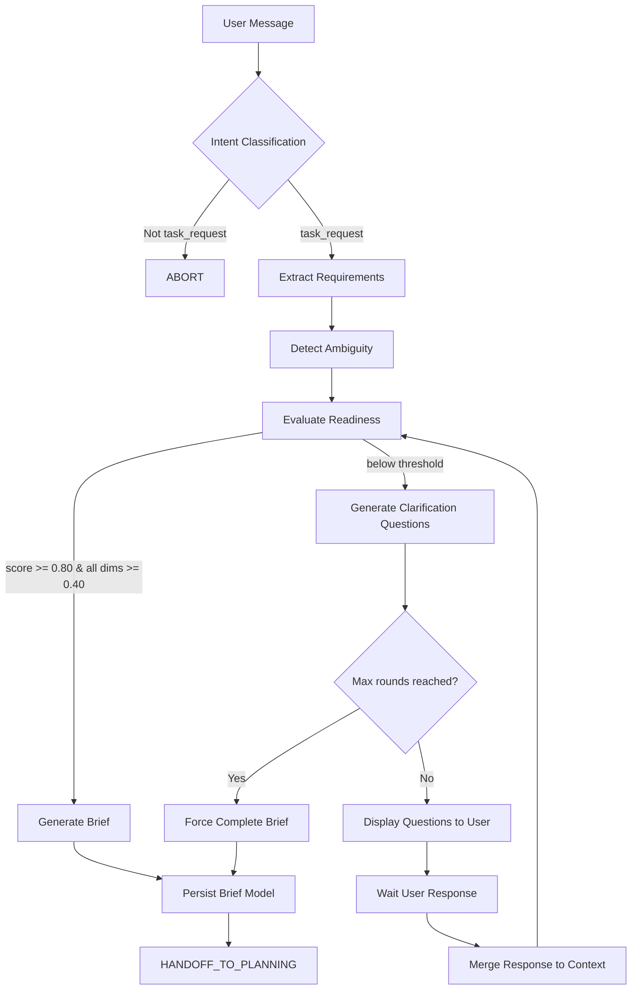

# Engineering Discovery Engine — Technical Codemap

**Location:** `/backend/discovery/`  
**Version:** 2.3.2  
**Status:** Production-ready  
**Last Updated:** 2026-08-10

---

## 1. Responsibility

The Engineering Discovery Engine (EDE) is a **mandatory pre-processing module** that transforms natural language engineering requests into structured **Engineering Briefs** before any planning or execution begins. It serves as the gating mechanism ensuring sufficient requirement clarity before handoff to the Planning Engine.

### Core Responsibilities

- **Intent Classification**: Determine whether an incoming message is an engineering task request vs. conversational/query input using regex-first pattern matching with LLM fallback
- **Domain Recognition**: Classify task requests into 15 engineering domains (feature, bugfix, refactor, docs, test, infra, architecture, security, performance, devops, database, ai_llm, ui, research, chat)
- **Requirement Extraction**: Parse user messages into structured requirement categories (functional, non-functional, constraints, assumptions, dependencies, acceptance criteria)
- **Ambiguity Detection**: Identify and score 7 ambiguity types (lexical, referential, scope, technical, missing context, conflicting, temporal) from unstructured input
- **Engineering Readiness Evaluation**: Apply weighted 5-axis scoring model to determine if a request meets readiness threshold for planning (intent_clarity: 30%, scope_definition: 25%, requirement_completeness: 25%, constraint_awareness: 10%, acceptance_criteria: 10%)
- **Clarification Management**: Orchestrate multi-round clarification dialogues when readiness falls below threshold, with configurable limits (default: 4 rounds, 5 questions/round)
- **Brief Assembly**: Generate validated Engineering Brief documents containing goal, scope, requirements, risks, and outstanding unknowns as the formal contract between Discovery and Planning

### State Machine Lifecycle

The module implements a finite state machine tracking discovery session progression:

```
new_request → discovery → engineering_analysis → [CLARIFICATION | ENGINEERING_BRIEF_COMPLETE]
CLARIFICATION → user_response → requirement_update → engineering_analysis (loop back)
ENGINEERING_BRIEF_COMPLETE → handoff_to_planning (terminal)
```

Terminal states (ABORTED, TIMEOUT, ERROR, HANDOFF_TO_PLANNING) represent irreversible endpoints.

---

## 2. Design Patterns

### 2.1 Pipeline Orchestrator Pattern
**File:** `engine.py`

The `DiscoveryEngine.discover()` method implements a sequential processing pipeline:

```python
# Step 1: Intent Classification → Step 2: Requirement Extraction → 
# Step 3: Ambiguity Detection → Step 4: Readiness Evaluation → 
# Step 5: Branching (Ready → Brief / Not Ready → Clarification)
```

Each stage consumes output from previous stages, enabling short-circuit evaluation (e.g., abort non-task requests early).

### 2.2 Strategy Pattern — Domain-Specific Evaluation
**Files:** `domains.py`, `readiness.py`

DomainRegistry acts as a strategy registry where each engineering domain defines mandatory fields with detection patterns. The `ReadinessEvaluator` selects evaluation criteria dynamically based on classified domain:

- `ui`: component, visual_behaviour, interaction, responsive, design_system
- `backend`: endpoint, schema, auth, error_handling, rate_limiting
- `bugfix`: reproduction, expected_behaviour, affected_component, severity, regression_risk
- 12 additional domain-specific strategies

### 2.3 Rule-Based Classifier with Fallback Strategy
**File:** `intent.py`

Primary classification uses regex pattern matching against DOMAIN_PATTERNS list for deterministic behavior. LLM fallback activates only when confidence < 0.80 for task_request intents, minimizing latency while preserving accuracy for ambiguous cases.

Pattern priority ordering ensures specific detections (bugfix > test > docs > feature) win over generic catch-alls.

### 2.4 Composite Question Generation
**File:** `clarifier.py`

The ClarificationEngine composes questions from multiple sources:
1. **Intent-first questions** (Round 0): Goal/audience/example targeting
2. **Dimension-gap questions**: Per low-scoring readiness dimension
3. **Missing-field questions**: Direct queries for uncovered domain mandatory fields
4. **Ambiguity-resolving questions**: Context-specific clarifications

Questions are prioritized by urgency (high > medium > low) and limited by configuration thresholds.

### 2.5 LLM-Assisted Generation with Static Fallback
**File:** `clarifier.py` (`generate_questions_async`)

LLM prompt template generates conversational, intent-driven questions with multiple-choice options. On failure (no provider, malformed JSON), seamlessly degrades to static rule-based generator ensuring availability even without AI infrastructure.

### 2.6 Data Transfer Object (DTO) Pattern
**Files:** Multiple dataclass definitions

Throughout the module, DTOs encapsulate structured data:
- `IntentResult`, `ExtractionResult`, `AmbiguityReport`, `ReadinessResult`
- `ClarificationQuestion`, `ClarificationResult`
- `EngineeringBriefData`, `BriefValidation`
- `DimensionScore`, `Ambiguity`, `Requirement`

Enforces type safety and decouples internal representations from persistence models.

### 2.7 Registry Pattern
**File:** `domains.py`

DomainRegistry singleton manages domain registration/lifecycle:
- Lazy initialization of default domains
- Runtime extensibility via `register()` method
- Thread-safe domain lookup via `_ensure_initialized()` guard

---

## 3. Data & Control Flow

### 3.1 Input/Output Contracts

#### DiscoveryEntry Point (`engine.py:discover()`)
**Input:**
```python
async def discover(
    conversation: Conversation,     # SQLAlchemy Conversation model
    content: str,                  # Raw user message
    history: list | None           # Previous conversation turns
) -> DiscoveryResult
```

**Output:** `DiscoveryResult` containing:
- `state`: Current discovery state string
- `is_ready`: Boolean readiness flag
- `brief`: EngineeringBriefData (if ready)
- `clarification`: ClarificationResult (if not ready)
- `metadata`: Session ID, brief ID, scores, counts

#### Clarification Response Entry Point (`engine.py:respond_to_clarification()`)
**Input:**
```python
async def respond_to_clarification(
    session_id: str,               # DiscoverySession primary key
    response: str,                 # User's clarification answer
    history: list | None           # Updated conversation history
) -> DiscoveryResult
```

Substantive responses (≥12 words OR ≥80 characters) trigger force-complete logic instead of additional interrogation rounds.

### 3.2 Processing Pipeline



### 3.3 Data Transformation Chain

#### Intent → Domain Field Mapping
`intent.py:classify()` calls `DomainRegistry.get_mandatory_fields(domain)` to retrieve required fields for the classified domain, returned in `IntentResult.domain_fields`.

#### Requirement Extraction → Domain Coverage
`requirements.py:RequirementExtractor.extract()` maps extracted requirements to domain mandatory fields via detection patterns in `DomainField.detection_pattern`. Returns `covered_fields` vs `missing_fields`.

#### Readiness Scoring Computation
`readiness.py:ReadinessEvaluator.evaluate()`:
1. Scores each dimension independently (0.0–1.0)
2. Applies weighted average: Σ(score × weight)
3. Enforces dimension floor constraint (minimum 0.40 per dimension)
4. Compares overall against threshold (default 0.80)

### 3.4 Persistence Schema

#### Tables Created (`migration.py`)

**discovery_sessions:**
```sql
id TEXT PK                     -- UUID hex
conversation_id TEXT FK        -- References conversations.id
user_id TEXT FK                -- References users.id
status TEXT                    -- DiscoveryState enum value
round_number INTEGER           -- Current clarification round
questions_asked INTEGER        -- Counter
questions_answered INTEGER     -- Counter
context TEXT                   -- JSON: original_content, intent, extraction, ambiguity, readiness snapshots
created_at TIMESTAMP
updated_at TIMESTAMP
```

**engineering_briefs:**
```sql
id TEXT PK                     -- BRIEF-{uuid12}
discovery_session_id TEXT FK   -- References discovery_sessions.id
version INTEGER                -- Incremental version number
engineering_goal TEXT          -- First sentence of request + domain prefix
user_intent TEXT               -- Truncated original content (max 500 chars)
request_category TEXT          -- Domain name
scope TEXT                     -- JSON: {in_scope: [], out_of_scope: []}
functional_requirements TEXT   -- JSON array of Requirement dicts
non_functional_requirements TEXT
constraints TEXT
assumptions TEXT
dependencies TEXT
risks TEXT                     -- JSON array with mitigation plans
acceptance_criteria TEXT
readiness_status TEXT          -- ready / not_ready
readiness_score REAL
readiness_dimensions TEXT      -- JSON: {dimension_name: score}
outstanding_unknowns TEXT      -- JSON array for unresolved gaps
discovery_metadata TEXT        -- Full metadata snapshot
status TEXT                    -- draft / ready / handed_off
```

### 3.5 Key Data Flows

#### Flow 1: Initial Request Processing
1. User submits message → `DiscoveryEngine.discover()`
2. Create `DiscoverySession` row with status=`NEW_REQUEST`
3. Run intent classification → abort if not task_request
4. Extract requirements → map to domain mandatory fields
5. Detect ambiguities → calculate score (0=no ambiguity, 1=max)
6. Evaluate readiness → 5-axis scoring
7. Branch:
   - **Ready**: Assemble brief → validate → persist → return ENGINEERING_BRIEF_COMPLETE
   - **Not Ready**: Generate questions → persist session with CLARIFICATION state → return clarification payload

#### Flow 2: Clarification Round
1. User responds → `DiscoveryEngine.respond_to_clarification()`
2. Load session by ID → update status to USER_RESPONSE
3. Merge response into `session.context.clarification_responses`
4. Combine original content with "Clarification: {response}" prefix
5. Substantive response check (words ≥12 OR chars ≥80) → force_if_substantive=True
6. Re-run pipeline with combined content
7. If max rounds reached or no questions generated → force complete
8. Else display remaining questions

---

## 4. Integration Points

### 4.1 Dependencies

#### Internal Module Dependencies

| Module | Dependency Type | Usage |
|--------|----------------|-------|
| `storage.models` | Import | `DiscoverySession`, `EngineeringBriefModel`, `Conversation` entities |
| `shared.intent_patterns` | Import | `classify_intent()` function for base intent detection |
| `llm.provider` | Async Import | `provider_manager.get_active_with_key()` for LLM-powered question generation |
| `backend.services.content_utils` | Import | `content_to_text()`, `truncate_content()` utilities |
| `discovery.config` | Import | `DiscoveryConfig`, `discovery_config` singleton |
| `discovery.states` | Import | `DiscoveryState` enum, transition validation helpers |
| `discovery.domains` | Import | `DomainRegistry`, `Domain` dataclasses |

#### External Dependencies
- `SQLAlchemy`: Async session management, ORM models
- `re` (stdlib): Regex pattern matching for intent/domain detection
- `dataclasses` (stdlib): DTO definitions
- `json` (stdlib): LLM response parsing
- `datetime`, `uuid4` (stdlib): Brief timestamping and ID generation

### 4.2 Consumer Modules

#### ConversationEngine (Upstream)
The Discovery Engine integrates with `ConversationEngine` as the mandatory first stage of every engineering workflow:

```python
# Typical integration flow
conversation = await get_or_create_conversation(...)
result = await discovery_engine.discover(conversation, user_message, history)

if result.state == "engineering_brief_complete":
    brief_id = result.metadata["brief_id"]
    # Pass to Planning Engine
elif result.state == "clarification":
    # Display questions to user, wait for response
    # On response: discovery_engine.respond_to_clarification(...)
```

#### Planning Engine (Downstream)
Receives Engineering Brief via `engineering_briefs` table relationship:
```python
# Planning Engine queries the latest brief
brief = await session.execute(
    select(EngineeringBriefModel)
    .where(EngineeringBriefModel.discovery_session_id == session_id)
    .order_by(EngineeringBriefModel.version.desc())
    .limit(1)
)
```

### 4.3 Environment Configuration

All configuration loaded from environment variables with `AIC_DISCOVERY_` prefix:

| Variable | Default | Description |
|----------|---------|-------------|
| `AIC_DISCOVERY_ENABLED` | `True` | Master feature flag |
| `AIC_DISCOVERY_MAX_ROUNDS` | `3` | Maximum clarification rounds |
| `AIC_DISCOVERY_MAX_QUESTIONS` | `10` | Max questions per round |
| `AIC_DISCOVERY_READINESS_THRESHOLD` | `0.80` | Overall readiness threshold |
| `AIC_DISCOVERY_DIMENSION_FLOOR` | `0.40` | Minimum per-dimension score |
| `AIC_DISCOVERY_TIMEOUT_MINUTES` | `30` | Clarification window timeout |
| `AIC_DISCOVERY_LLM_ENABLED` | `True` | Enable LLM-generated questions |
| `AIC_DISCOVERY_LLM_TEMPERATURE` | `0.3` | LLM generation temperature |
| `AIC_DISCOVERY_LLM_MAX_TOKENS` | `1000` | LLM max tokens |
| `AIC_DISCOVERY_MAX_LATENCY_MS` | `5000` | Performance SLA |

### 4.4 API Surface (Public Interface)

Exposed via `__init__.py`:

```python
__all__ = [
    "discovery_config",          # Singleton config instance
    "DiscoveryConfig",           # Config dataclass
    "DiscoveryState",            # State machine enum
    "can_transition",            # Transition validator
    "is_terminal",               # Terminal state checker
    "DomainRegistry",            # Domain registry singleton
    "Domain",                    # Domain dataclass
]
```

Core public methods:
- `DiscoveryEngine.discover(conversation, content, history)`
- `DiscoveryEngine.respond_to_clarification(session_id, response, history)`
- `DiscoveryEngine.get_session(session_id)`
- `DiscoveryEngine.get_brief(session_id)`

Static helper methods:
- `IntentClassifier.classify(content, history)`
- `IntentClassifier.classify_with_llm(content, history)` (async)
- `RequirementExtractor.extract(content, history, domain)`
- `AmbiguityDetector.detect(content, history)`
- `ReadinessEvaluator.evaluate(extraction, ambiguity, domain, content)`
- `ClarificationEngine.generate_questions(...)`
- `ClarificationEngine.generate_questions_async(...)` (async)
- `BriefGenerator.assemble(intent, extraction, readiness, content, round_number)`
- `BriefGenerator.validate(brief)`

---

## 5. Implementation Notes

### 5.1 Bug Fixes & Known Issues

- **BUG-3** (clarifier.py): Implemented context-rich multiple-choice options for all generated questions to prevent open-ended confusion; questions now include concrete options derived from classified domain/intent rather than generic prompts.
- **M4 FIX** (engine.py): Corrected brief_id assignment to use persisted `EngineeringBriefModel.id` (assigned on flush) instead of dataclass id.
- **Force-complete Logic** (engine.py): Added substantive response detection (≥12 words OR ≥80 chars) to prevent interrogative loops after user already engaged with discovery.

### 5.2 Performance Considerations

- Regex-first intent classification achieves deterministic O(n) complexity with minimal overhead
- LLM fallback only triggers for low-confidence task_requests (<0.80) to minimize latency
- Question generation caches parsed domain field mappings via lazy-initialized registry
- Session context stores JSON blobs (compressed) for historical snapshots across rounds

### 5.3 Extensibility

New domains can be registered at runtime:
```python
from discovery import DomainRegistry
custom_domain = Domain(name="custom", description="...", mandatory_fields=[...])
DomainRegistry.register(custom_domain)
```

Custom ambiguity patterns can be added via global pattern lists (requires code modification).

Configuration updates supported via `discovery_config.update(**kwargs)`.
