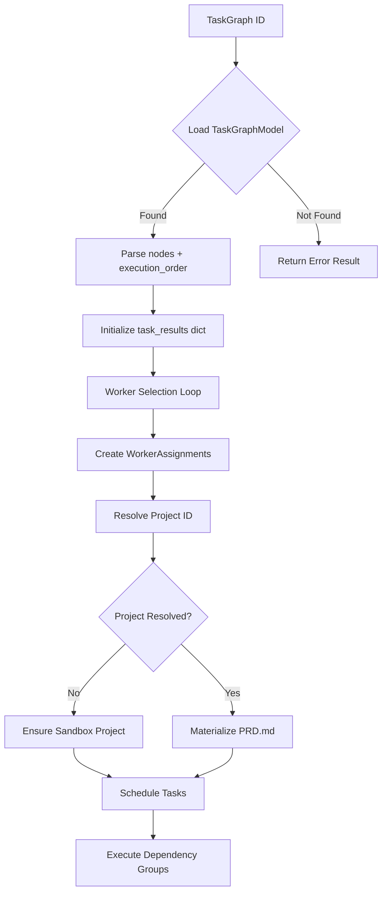

# Engineering Dispatcher Codemap

**Location**: `/home/tvd/AI-Company/backend/dispatcher/`  
**Module Version**: v2.3.5  
**Last Updated**: 2026-08-10

---

## Overview

The **Engineering Dispatcher** is the core execution orchestration layer that transforms Task Graphs into real, distributed worker task execution. It serves as the runtime bridge between declarative workflow specifications (nodes with dependencies) and concrete implementation by specialized AI workers through the platform's FSM-based executor.

---

## 1. Responsibility

The dispatcher fulfills the following specific responsibilities within the AIC Platform architecture:

### Primary Responsibilities

| Responsibility | Description |
|----------------|-------------|
| **Task Graph Orchestration** | Parses `TaskGraphModel` structures, extracts execution order groups, and coordinates parallel/concurrent node execution respecting dependency constraints |
| **Worker Assignment** | Implements capability-based worker selection using `WORKER_CAPABILITIES` and `WORKER_TIERS` mappings to assign optimal workers (`hermes`, `pm`, `research`, `architect`, `backend`, `frontend`, `coding`, etc.) to each graph node |
| **Concurrent Execution Management** | Executes dependency groups via `asyncio.gather()` with per-node `AsyncSession` isolation to prevent session contention during long-running LLM calls |
| **PRD Materialization** | Generates `docs/PRD.md` from `EngineeringBrief` before dispatch, serving as the requirements artifact delivered to executing workers |
| **Child Task Creation** | Creates child `Task` records in the database for each graph node, establishing parent-child linkage via context metadata (`graph_id`, `node_id`, `source: "dispatcher_dispatch"`) |
| **Real Worker Execution** | Delegates to `runtime.executor.execute_task()` — invoking the full discovery→investigate→planning→implementation→verification→closeout FSM pipeline |
| **Progress Tracking & Broadcasting** | Publishes lifecycle events (`pipeline.worker.started`, `pipeline.worker.completed`) to EventBus and WebSocket clients for real-time UI updates |
| **Failure Handling & Partial Progress** | Implements fail-fast-within-group semantics while preserving progress on independent dependency groups; persists failure states to database |
| **Dispatch Session Persistence** | Records execution traces in `dispatch_sessions` table with log entries, success rates, and terminal status |

### Architectural Role

The dispatcher sits at the intersection of three major subsystems:

```
┌─────────────┐         ┌──────────────┐         ┌─────────────┐
│ Task Graph  │ ──────▶ │ Dispatcher   │ ──────▶ │ Worker FSM  │
│ (Declarative│         │ Engine       │         │ (Executor)  │
│ Workflow)   │         │              │         │             │
└─────────────┘         └──────────────┘         └─────────────┘
                            │
                            ▼
                  ┌─────────────────┐
                  │ Real Database   │
                  │ (Task + PRD)    │
                  └─────────────────┘
```

---

## 2. Design Patterns

### Identified Patterns

#### 2.1 **Pipeline Pattern**
The dispatcher implements a multi-stage execution pipeline:

1. **GRAPH_RECEIVED** → Load and parse TaskGraphModel
2. **SELECTING_WORKERS** → Map nodes to worker assignments via `WorkerSelector`
3. **SCHEDULING** → Organize nodes into dependency-respecting groups via `TaskScheduler`
4. **DISPATCHING** → Create child tasks and materialize PRD
5. **MONITORING** → Execute nodes concurrently with async session isolation
6. **COLLECTING_RESULTS** → Aggregate completion/failure statuses
7. **COMPLETION/FAILURE** → Persist results and emit final state

This pattern enables clear separation of concerns and state-driven progression.

#### 2.2 **State Machine Pattern**
Defined in `states.py`, the dispatcher employs an explicit finite state machine:

- **Enum-Based States**: `DispatcherState` extends both `str` and `PyEnum` for string interop
- **Transition Map**: `TRANSITIONS` dict defines valid state transitions per current state
- **Terminal State Detection**: `TERMINAL_STATES` frozenset identifies completion/failure conditions
- **Validation Helpers**: `can_transition()`, `is_terminal()`, `next_states()`, `validate_state()`

```python
# Example transition validation
from dispatcher.states import can_transition, DispatcherState

if can_transition(DispatcherState.MONITORING, DispatcherState.RETRYING):
    # Retry logic executes
```

#### 2.3 **Dependency Injection** (via SQLAlchemy Session)
The `DispatcherEngine` constructor receives an `AsyncSession` instance, enabling:

- Testability: Mock sessions in unit tests
- Transaction Control: Explicit commit/rollback around child task creation
- Bind Reuse: Derived sessions inherit the same database bind

```python
def __init__(self, session: AsyncSession):
    self.session = session
```

#### 2.4 **Factory Method Pattern**
Worker selection uses a factory-style approach:

- **`WorkerSelector.select_worker()`**: Determines optimal worker type based on task capability matching
- **Capability Lookup**: `WORKER_CAPABILITIES` map provides fallback selection when primary worker lacks required capability
- **Tier Mapping**: `WORKER_TIERS` assigns priority tiers (`system`, `thinker`, `crafter`, `sprinter`)

#### 2.5 **Unit of Work Pattern**
Database operations follow Unit of Work principles:

- **Buffered Mutations**: Tasks are added to session, flushed, then committed
- **Explicit Flush Points**: Before long-running `execute_task()` calls to release SQLite locks
- **Transaction Isolation**: Per-node sessions created via `async_sessionmaker(bind=self.session.bind)` prevent concurrency conflicts

#### 2.6 **Observer Pattern** (Event Bus Integration)
Worker lifecycle events broadcast to subscribers:

```python
# EventBus publication
await bus.publish("pipeline.worker.started", {
    "node_id": node_id,
    "worker_type": worker_type,
    "title": title
})

# WebSocket broadcast
await broadcast_worker_event(
    f"worker.{worker_type}.started",
    node_id,
    {"phase": phase, "title": title}
)
```

Clients subscribe to receive real-time updates without polling.

#### 2.7 **Builder Pattern** (Result Construction)
`DispatchResult` class builds structured output with optional fields:

- Automatic `execution_id` generation via `uuid4`
- Aggregated `task_results` dictionary
- Calculated `success_rate` metric
- Serialized via `to_dict()` for JSON serialization

#### 2.8 **Circuit Breaker Pattern** (Implicit)
Failure handling includes circuit breaker-like behavior:

- Node failures trigger error logging but don't cascade to dependent groups
- Failed tasks persist `FAILED` status with error messages
- Retry path available via state transitions (`MONITORING` → `RETRYING`)

---

## 3. Data & Control Flow

### 3.1 Entry Points

**Primary Entry**: `DispatcherEngine.dispatch(graph_id, project_id=None)`

```
User/API Request
        ↓
WebSocket Route / Engine API Call
        ↓
DispatcherEngine.dispatch() [engine.py:51]
        ↓
[Execution Pipeline Begins]
```

### 3.2 Input Data Flow



**Input Sources**:
1. **`graph_id`**: External caller-provided Task Graph identifier
2. **`project_id`** (optional): Project context; resolved via graph chain if omitted
3. **`TaskGraphModel.nodes`**: Array of `{node_id, worker_type, task_type, title, description}` objects
4. **`TaskGraphModel.execution_order`**: Array of parallel groups (list of lists) or empty for legacy graphs

### 3.3 Output Data Flow

**Outputs Produced**:
1. **`DispatcherResult`**: Structured response containing:
   - `state`: Terminal state (`DISPATCHER_COMPLETE`, `DISPATCHER_FAILED`, `ERROR`)
   - `result`: `DispatchResult` with per-node execution details
   - `message`: Human-readable summary
   - `metadata`: Additional context (execution_id, prd_path, task counts)

2. **Database Persistence**:
   - `Task` records created for each node
   - `DispatchSession` row in `dispatch_sessions` table
   - PRD file materialized at workspace path

3. **WebSocket Events**:
   - `worker.{type}.started`
   - `worker.{type}.completed` / `worker.{type}.failed`

4. **EventBus Publications**:
   - `pipeline.worker.started`
   - `pipeline.worker.completed`

### 3.4 Internal Data Structures

#### `WorkerAssignment` (models.py:9)
```python
@dataclass
class WorkerAssignment:
    worker_id: str          # e.g., "worker-backend-abc123"
    worker_type: str        # e.g., "backend", "coding", "architect"
    node_id: str            # Original graph node identifier
    priority: int           # Scheduling priority (default: 1)
    estimated_effort: str   # Effort estimate ("low", "medium", "high")
```

#### `TaskExecution` (models.py:19)
```python
@dataclass
class TaskExecution:
    node_id: str
    worker_id: str | None
    status: str             # pending → running → completed/failed/retrying
    result: dict | None     # Execution return value
    error: str | None       # Exception message if failed
    attempts: int           # Retry count
    started_at: datetime
    completed_at: datetime
```

#### `DispatchResult` (models.py:33)
```python
@dataclass
class DispatchResult:
    execution_id: str       # Auto-generated UUID
    graph_id: str
    task_results: dict[str, TaskExecution]
    execution_log: list[dict]
    total_duration: str
    success_rate: float     # 0.0 - 1.0
    status: str             # running, completed, partial, failed
```

### 3.5 Control Flow Pathways

#### Happy Path (All Nodes Complete)
```
GRAPH_RECEIVED → SELECTING_WORKERS → SCHEDULING → DISPATCHING 
→ MONITORING (concurrent execution) → COLLECTING_RESULTS 
→ DISPATCHER_COMPLETE
```

#### Failure Path (Node Failure Detected)
```
MONITORING → FAILED NODE LOGGED → BREAK DEPENDENCY GROUP LOOP
→ CALCULATE SUCCESS_RATE → PERSIST PARTIAL RESULT → DISPATCHER_COMPLETE (partial status)
```

#### Retry Path (Retryable Errors)
```
MONITORING → RETRYING → DISPATCHING → MONITORING → ...
→ After max retries exceeded → ESCALATING → DISPATCHER_FAILED
```

#### Abort Path (External Interruption)
```
Any State → ABORTED (terminal)
```

### 3.6 Concurrency Model

**Per-Node Session Isolation**:
```python
# Critical design decision: Each node gets its own AsyncSession
async def _execute_node_in_new_session(node_data, execution_id_prefix, project_id):
    factory = async_sessionmaker(
        bind=self.session.bind, 
        class_=AsyncSession, 
        expire_on_commit=False
    )
    async with factory() as node_session:
        return await self._execute_node(node_data, ..., session=node_session)
```

**Rationale**: Prevents SQLite write lock contention during long-running LLM calls. The parent dispatcher session commits **before** `execute_task()` returns, ensuring transactions don't block concurrent requests.

**Concurrent Group Execution**:
```python
results = await asyncio.gather(
    *(_run_node(nid) for nid in pending_node_ids)
)
```

Nodes within the same dependency group execute in parallel (each on separate coroutine).

---

## 4. Integration Points

### 4.1 External Dependencies

| Module | Dependency Type | Usage |
|--------|-----------------|-------|
| `storage.models.TaskGraphModel` | ORM Import | Loads graph structure, execution order, plan reference |
| `storage.models.Task` | ORM Import | Creates child task records for execution |
| `storage.models.DispatchSession` | ORM Import | Persists dispatch session metadata |
| `storage.models.Project` | ORM Import | Resolves sandbox project if no parent project exists |
| `storage.models.EngineeringPlan` | ORM Import | Walks back graph → plan → brief for project resolution |
| `storage.models.EngineeringBrief` | ORM Import | Fetches brief for PRD materialization |
| `runtime.executor.execute_task` | Function Call | Invokes full worker FSM pipeline for real task execution |
| `events.bus` | EventBus Publisher | Publishes lifecycle events to subscribers |
| `shared.workspace.sandbox_workspace_dir` | Path Utility | Generates stable sandbox paths for PRD generation |
| `backend.services.prd_writer.materialize_prd` | Service Function | Materializes PRD.md from engineering brief |
| `backend.routes.websocket.broadcast_worker_event` | WebSocket RPC | Broadcasts worker status to connected clients |
| `backend.routes.websocket.broadcast_task_event` | WebSocket RPC | Alternative broadcast channel for task events |

### 4.2 Consumer Modules

| Consumer | Invocation Method | Purpose |
|----------|-------------------|---------|
| `backend/routes/websocket.py` | HTTP/WebSocket Handler | Receives graph dispatch requests from frontend |
| `backend/routes/engine.py` | Engine API Endpoint | Exposes `POST /api/engine/dispatch` to callers |
| `master_orchestrator.py` | Parent Orchestrator | May invoke dispatcher after master-level planning completes |
| `integration tests` | pytest fixtures | Tests dispatch execution flow and persistence |

### 4.3 Upstream Dependencies (Called By)

```
User Request → WebSocket/HTTP API → DispatcherEngine.dispatch()
                                              ↓
                    ┌─────────────────────────┼─────────────────────────┐
                    ↓                         ↓                         ↓
            TaskGraphLoader           WorkerSelector           PRD Generator
            (storage.models)          (worker_capabilities)   (services.prd_writer)
```

### 4.4 Downstream Consumers (Produces For)

```
DispatcherEngine.dispatch()
              ↓
    ┌───────┴───────┐
    ↓               ↓
Frontend UI    Database
(WSS Updates)  (Persisted Tasks)
```

### 4.5 Database Schema Integration

**Tables Modified**:
- `dispatch_sessions` (created by `migration.py`): Stores execution traces
- `tasks` (external): Child tasks created for each graph node
- `projects` (external): Sandbox project created if no parent found

**Schema Migration**:
```sql
CREATE TABLE IF NOT EXISTS dispatch_sessions (
    id TEXT PRIMARY KEY,
    graph_id TEXT NOT NULL,
    execution_log TEXT DEFAULT '[]',
    total_duration TEXT DEFAULT '',
    success_rate REAL DEFAULT 0.0,
    status TEXT DEFAULT 'pending',
    created_at TIMESTAMP DEFAULT CURRENT_TIMESTAMP,
    updated_at TIMESTAMP DEFAULT CURRENT_TIMESTAMP,
    FOREIGN KEY (graph_id) REFERENCES task_graphs(id)
);

CREATE INDEX idx_dispatch_sessions_graph ON dispatch_sessions(graph_id);
CREATE INDEX idx_dispatch_sessions_status ON dispatch_sessions(status);
```

### 4.6 Configuration Interface

Environment variables used (via `config.py:from_env()`):

| Variable | Default | Purpose |
|----------|---------|---------|
| `AIC_DISPATCHER_ENABLED` | `true` | Toggle dispatcher functionality |
| `AIC_DISPATCHER_MAX_CONCURRENT` | `5` | Max concurrent tasks per group |
| `AIC_DISPATCHER_MAX_RETRIES` | `2` | Maximum retry attempts per node |
| `AIC_DISPATCHER_TASK_TIMEOUT` | `300` | Per-task timeout in seconds |
| `AIC_DISPATCHER_HEARTBEAT_INTERVAL` | `30` | Worker heartbeat frequency |

Config object exposed via module import:
```python
from dispatcher.config import dispatcher_config  # Global DispatcherConfig instance
```

---

## Appendix: File Inventory

| File | Lines | Purpose |
|------|-------|---------|
| `__init__.py` | 20 | Package exports, public API surface |
| `config.py` | 49 | Environment-driven configuration |
| `models.py` | 66 | Dataclasses: `WorkerAssignment`, `TaskExecution`, `DispatchResult` |
| `states.py` | 98 | FSM enum `DispatcherState`, transition map, validation helpers |
| `engine.py` | 552 | Core `DispatcherEngine` orchestrator (main logic) |
| `scheduler.py` | 94 | `TaskScheduler` class for dependency ordering |
| `worker_selector.py` | 122 | `WorkerSelector` with capability/tier mappings |
| `progress.py` | 181 | `ProgressTracker` for execution telemetry |
| `migration.py` | 42 | SQL migration for `dispatch_sessions` table |

---

## Notes & Caveats

1. **Partial Progress Preservation**: As noted in `engine.py:277-284`, the dispatcher now continues processing independent groups after a failure rather than cascading skips—this ensures partial progress is preserved and visible.

2. **SQLite Lock Mitigation**: The explicit `await session.commit()` before `execute_task()` is critical to prevent SQLite write-lock blocking during long LLM calls.

3. **Subtask Awareness**: If a graph node contains `subtask_id`, the dispatcher reuses that existing `Task` record rather than creating a duplicate, maintaining parent-child linkage integrity.

4. **PRD Materialization Ownership**: While the dispatcher takes primary responsibility for PRD generation from `EngineeringBrief`, `executor-level` fallback remains for direct `execute_task` callers.

5. **WebSocket Event Duplication**: Both `broadcast_worker_event` (WS) and `_publish_worker_event` (EventBus + WS) are called—potential refactoring target to consolidate event emission.

---

*Generated by automated analysis of `backend/dispatcher/` Python source files.*
