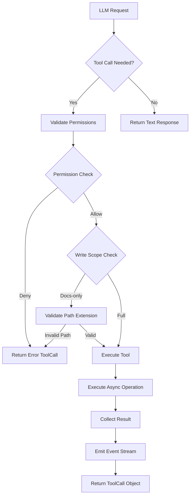

# Workers Module - Technical Codemap

## Directory Structure

```
backend/workers/
├── __init__.py       # Package marker (empty)
├── base.py           # Worker runtime & registry (1258 lines)
└── tools.py          # Tool executor system (944 lines)
```

---

## Responsibility

The `workers` module implements an **AI Agent Orchestration Platform** that provides multi-agent task execution capabilities. The module serves as the runtime backbone for specialized AI workers, each responsible for distinct development phases including planning, implementation, testing, and deployment.

### Core Responsibilities:

1. **Tool Execution System**: Provides a sandboxed tool execution environment for LLM-driven actions including file I/O, shell commands, directory exploration, web fetching, and git operations.

2. **Worker Runtime Framework**: Defines an abstract `BaseWorker` interface and concrete worker implementations representing a **multi-agent team pattern**.

3. **LLM Integration Layer**: Handles LLM provider communication with support for tool-calling, vision models, fallback mechanisms, and response parsing.

4. **Security Boundary Enforcement**: Implements permission checking, command validation, SSRF protection, and role-based write scopes to isolate worker capabilities.

5. **Event Streaming Infrastructure**: Facilitates real-time progress reporting via async event callbacks (`on_event`) for UI streaming and audit logging.

---

## Design Patterns

### Structural Patterns

| Pattern | Implementation | Location |
|---------|---------------|----------|
| **Abstract Factory** | `WORKER_REGISTRY` dictionary mapping worker types to classes | `base.py:1226` |
| **Strategy** | `_llm_or_fallback` / `_llm_with_tools` provide interchangeable LLM call strategies | `base.py:19`, `base.py:138` |
| **Template Method** | `BaseWorker.execute()` defines algorithm skeleton; subclasses implement specific steps | `base.py:430` |
| **Dependency Injection** | `ToolExecutor.__init__` accepts `permission_checker`, `allowed_tools`, `write_scope` | `tools.py:270` |
| **Facade** | `ToolExecutor` encapsulates complex file/shell/web operations behind simple interfaces | `tools.py:264` |

### Behavioral Patterns

| Pattern | Implementation | Location |
|---------|---------------|----------|
| **Chain of Responsibility** | Permission checks flow through `_permission_checker(tool_name)` callback chain | `tools.py:507-514` |
| **Observer** | `on_event` callback fires events for `tool_start`, `tool_result`, `shell_output`, `file_diff` | `tools.py:285` |
| **Command** | Each tool method (`read_file`, `shell`, `write_file`) encapsulates executable intent | `tools.py:295-662` |
| **State Machine** | ToolCall status transitions: `pending` → `running` → `completed/error` | `tools.py:204` |
| **Null Object** | Fallback responses when LLM fails or returns empty content | `base.py:19-129` |

### Architectural Patterns

- **Actor Model**: Workers execute asynchronously via `asyncio`, isolated state management
- **Circuit Breaker**: Timeout handling with graceful degradation (`run_with_timeout`)
- **Domain Specific Language (DSL)**: OpenAI-compatible tool schemas for function calling
- **Guard Clause**: Early rejection of dangerous patterns in shell/SSRF validation

---

## Data & Control Flow

### Entry Points

```python
# External trigger → Worker orchestration layer
get_worker(worker_type: str) → BaseWorker instance
worker.run_with_timeout(task_context: dict) → WorkerResult
```

### Tool Execution Flow



### Shell Command Safety Pipeline

```
User Prompt → LLM Generates Command
       ↓
_permission_checker('shell') → Permission Denied? → Abort
       ↓
check_dangerous_patterns(command) → Dangerous Pattern? → Abort
       ↓
_write_scope='docs'? → Block destructive commands? → Abort
       ↓
BG_TOKEN_RE.search() → Background process? → Detach
       ↓
asyncio.create_subprocess_shell(
    start_new_session=True  ← Process group isolation
)
       ↓
communicate(timeout=60s) → Timeout? → _kill_process_group(proc)
       ↓
_emit("shell_output", chunked stream)
       ↓
Exit code check → Surface port-in-use errors
```

### LLM Multi-Turn Loop

```
Initialize messages [system + user]
       ↓
For round_num in range(max_rounds=10):
   ↓
   Call LLM with tools schema
       ↓
   Parse response: tool_calls OR text?
       ↓
   IF tool_calls:
      For each tool_call:
         Validate args against method signature
         Execute tool_method(**filtered_args) timeout=120s
         Append tool result to messages
      END
      Check: round >= max_rounds-2 → Send finalization nudge
   ELSE:
      Return text response + metadata
END

Return: content, meta (used_fallback, model, provider), tool_calls_list
```

### Output Exit Points

```python
WorkerResult {
    success: bool,                    # Task completion status
    exit_code: int,                   # 0=success, non-zero=failure
    output: str,                      # Human-readable result text
    error: str | None,                # Failure reason (fallback details)
    used_fallback: bool,              # LLM provider fallback triggered
    llm_meta: dict,                   # {"model": "...", "provider": "..."}
    tool_calls: list[dict],           # Executed tool invocations
    todos: list[dict],                # TODO tracking items
    file_diffs: list[dict],           # File change records
}
```

---

## Integration Points

### Dependencies

#### Internal Dependencies

| Module | Dependency Type | Usage |
|--------|----------------|-------|
| `backend.services.path_utils.resolve_workspace_path` | Import | Resolve workspace-relative paths for file operations |
| `backend.services.content_utils.truncate_content` | Import | Truncate prompts for context assembly |
| `llm.provider.provider_manager` | Import | Get active LLM provider configuration |
| `llm.provider.ModelTier` | Import | Enum for model tier routing (THINKER/CRAFTER/SPRINTER/VISION) |
| `backend.services.tool_permissions.check_tool_permission` | Import | Permission checker factory for worker-specific tool access |
| `agents.context_assembly.assemble_system_prompt` | Optional | Dynamic system prompt generation based on agent context |
| `agents.registry.AGENT_REGISTRY` | Optional | Fetch agent-specific tool permissions from registry |
| `backend.services.mcp_service.get_all_mcp_tool_schemas` | Optional | Inject MCP (Model Context Protocol) tools dynamically |
| `backend.services.mcp_client.mcp_pool.call_tool` | Optional | Execute MCP tool calls when LLM requests mcp_* functions |
| `backend.workspace_manager.get_task_workspace_dir` | Import | Retrieve task-specific workspace directories |

#### External Dependencies (Standard Library)

- `asyncio`: Async subprocess execution, timeout handling, concurrent tool calls
- `socket`, `urllib.request`, `ipaddress`: SSRF prevention via DNS resolution and IP whitelisting
- `signal`: Process group termination for backgrounded commands
- `re`: Regex pattern matching for dangerous command detection
- `dataclasses`: Immutable data structures for ToolCall, TodoItem, FileDiff
- `json`: Tool argument serialization/deserialization
- `datetime.timezone`: ISO-8601 timestamps for audit trails

### Consumer Modules

| Consumer Module | Role | Interaction |
|-----------------|------|-------------|
| `agent_runner.py` | Orchestration controller | Calls `worker.execute()` → collects `WorkerResult` |
| `tool_chat_service.py` | Chat interface service | Uses `_make_permission_checker()` for session-bound permissions |
| `/chat/stream` endpoint | HTTP API handler | Passes no permission checker → security note requires explicit gate |

### Provider Interfaces

| Interface | Description | Implementation |
|-----------|-------------|----------------|
| `provider_manager.chat()` | Generic LLM chat endpoint | Returns `{content, raw, model, usage}` |
| `provider_manager.get_active_with_key()` | Preferred provider selection | Filters out providers with empty API keys |
| `mcp_pool.call_tool(name, args)` | MCP protocol integration | Exposes external tools to LLM as `mcp_*` functions |

### Security Boundaries

#### Permission Checker Architecture

```python
def _make_permission_checker(worker_type: str) -> Callable[[str], bool]:
    """Closure captures worker_type, returns checker callable."""
    return lambda tn: check_tool_permission(worker_type, tn)

# Usage in ToolExecutor methods:
if self._permission_checker and not self._permission_checker("shell"):
    raise PermissionError("Permission denied for tool: shell")
```

#### Write Scope Enforcement

- `"full"`: All file paths allowed (backend, frontend, coding workers)
- `"docs"`: Documentation paths only (`.md/.txt/rst/adoc`, docs/, documentation/, README/LICENSE/CHANGELOG etc.)

#### Dangerous Command Detection

```python
_DANGEROUS_COMMANDS = [
    r'\brm\s+-rf\s+/\s*$',     # rm -rf /
    r'\brm\s+-rf\s+~\s*$',     # rm -rf ~
    r'\bdd\s+(?:if=.+?|of=.+?)?',  # dd (raw disk access)
    r'>\s*/dev/sd',            # block device writes
    r'\b(eval|exec|system)\b', # dynamic execution
    r':\(\)\s*\{[^}]*\};:',   # fork bomb
]
```

#### SSRF Protection

Blocked networks include:
- Private ranges: `10/8`, `172.16/12`, `192.168/16`
- Loopback: `127/8`, `::1/128`
- Link-local: `169.254/16`, `fe80::/10`
- CGNAT: `100.64/10`
- Cloud metadata: `169.254.169.254`

---

## Worker Implementations Summary

### Registry Overview (16 Canonical Workers)

| Worker Type | Agent Name | Tier | Primary Tools | Output Artifact |
|------------|------------|------|---------------|-----------------|
| `hermes` | Hermes (Dispatcher) | SPRINTER | none | Task dispatch summary |
| `rex` | Governor | SPRINTER | explore, read, search, write (docs) | docs/COMPLIANCE.md |
| `pm` | Aria (Product Manager) | THINKER | read, explore, search, write (docs) | docs/PRD.md, PROJECT_PLAN.md |
| `research` | Sage | THINKER | explore, read, search, web_fetch, write (docs) | docs/RESEARCH.md |
| `designer` | Luna | CRAFTER | explore, read, search, write (docs) | docs/DESIGN.md |
| `documentation` | Echo | SPRINTER | read, write (docs), explore, search | docs/README.md |
| `architect` | Atlas | THINKER | explore, read, search, write (docs) | docs/ARCHITECTURE.md |
| `backend` | Hugo | CRAFTER | read, write, shell | Source code |
| `frontend` | Leo | CRAFTER | read, write, shell | React/TSX components |
| `qa` | Eve (QA Engineer) | CRAFTER | bughunt: read, search, shell, write (docs)<br>verification: shell (pytest/npm) | docs/QA_REPORT.md, docs/BUG_REPORT.md |
| `performance` | Pulse | SPRINTER | read, write (docs) | docs/PERFORMANCE_REPORT.md |
| `database` | Nova | CRAFTER | read, write, shell | SQL migrations |
| `nexus` | Integration Engineer | CRAFTER | read, write, shell | Integration specs |
| `flint` | Infrastructure Engineer | CRAFTER | read, write, shell | Deployment configs, CI/CD |
| `security` | Sentinel | CRAFTER | read, search, write (docs) | docs/SECURITY_AUDIT.md |
| `coding` | Senior Engineer | CRAFTER | read, write, shell | General source code |

### Alias Resolution

| Alias | Resolves To | Purpose |
|-------|-------------|---------|
| `devops` | DevOpsWorker (nexus) | Backward compatibility |
| `deployment` | DeploymentWorker (flint) | Backward compatibility |
| `testing` | TestingWorker (qa) | Unified QA interface |
| `debugger` | TestingWorker (eve) | Bug hunting tasks |
| `planner` | PMWorker (aria) | Planning-phase tasks |

---

## Technical Debt & Observations

1. **Missing Import**: Line 51 uses `unicodedata.normalize()` but module not imported
2. **Security Gap**: `/chat/stream` tool previously called shell without permission checker
3. **Hardcoded Defaults**: Many tool parameters use magic numbers (timeout=60, limit=2000)
4. **Test Coverage**: No test files present in `workers/` directory
5. **Documentation Gaps**: Only one inline docstring per class/method; no architecture diagrams
6. **Error Handling**: Broad `except Exception` clauses swallow stack traces (logger.warning)
7. **Type Coverage**: Missing type hints for config dicts, task_context, and return values

---

## Key Configuration Constants

```python
# Timeout thresholds
MAX_TOOL_ROUNDS = 10                    # Max LLM ↔ tool interaction rounds
TOOL_TIMEOUT_SECONDS = 120              # Per-tool-call timeout
WORKER_TIMEOUT_SECONDS = 600            # Overall worker execution timeout

# Streaming/chunking
CHUNK_SIZE_BYTES = 500                  # Shell output chunk size
OUTPUT_LIMIT_CHARS = 5000               # Tool output truncation threshold
FILE_READ_LIMIT_LINES = 2000            # Maximum lines per read_file

# Search limits
MAX_SEARCH_MATCHES = 100                # Limit grep/search results
MAX_TREE_ENTRIES = 200                  # Directory tree truncation point
```

---

## Audit Trail Mechanism

All tool invocations produce structured events streamed to consumers:

```python
# Event payloads
{
    "type": "tool_start" | "tool_result" | "shell_output" | "file_diff" | "todo_update",
    "tool_call": ToolCall.to_dict(),
    "chunk": str,               # For shell_output streaming
    "exit_code": int,           # For shell_output completion
    "status": "running" | "completed" | "error",
    "files_modified": [path],   # For file_diff collection
}
```

This enables real-time UI updates, long-running process monitoring, and post-hoc reconstruction of agent decision chains.
