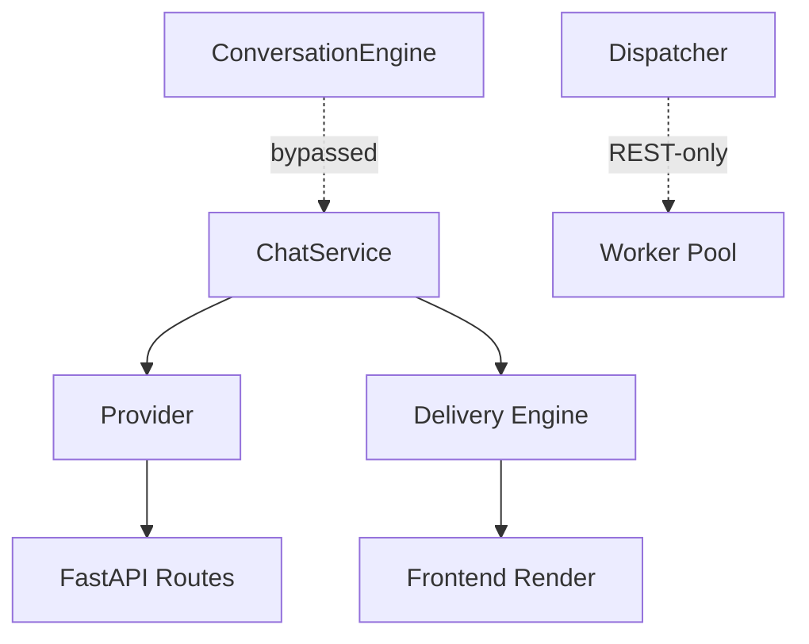

# AIC-ADE Component & Responsibility Analysis

## Core Components

### 1. ChatService (backend/services/chat_service.py)

**Purpose:** Execute chat messages, handle streaming responses  
**Responsibilities:**
- Validate incoming request
- Prepare context (messages, system prompt)
- Call LLM provider for completion
- Stream tokens back to client via SSE

**Inputs:**
- `prompt: str` — User message text
- `history: list[Message]` — Conversation history
- `model_id: str` — Model selection
- `stream: bool` — Enable/disable streaming

**Outputs:**
- `AsyncGenerator[str]` — Streaming token chunks
- OR `str` — Full response (non-streaming)

**Dependencies:**
- `backend/llm/provider.py` — LLM abstraction
- `backend/delivery/engine.py` — Stream delivery wrapper

**Status:** ✓ Executed from primary path

---

### 2. FastAPI Routes (backend/api/routes/)

**Purpose:** REST API endpoints for frontend/backend consumption  
**Key Routes:**
- `POST /api/v1/chat/execute` — Main chat endpoint
- `GET /api/v1/members` — Member list query
- `POST /api/v1/tasks` — Task creation
- `GET /health` — Health check

**Responsibilities:**
- Request validation
- Auth checking (JWT if enabled)
- Route to appropriate service layer
- Format response with headers/status code

**Dependencies:**
- `backend/services/*.py` — Service implementations
- `backend/auth/*.py` — Authentication utilities

**Status:** ✓ Executed from primary path

---

### 3. Provider Abstraction (backend/llm/provider.py)

**Purpose:** Unified LLM interface across multiple providers  
**Supported Providers:**
- OpenAI-compatible (custom AIC provider)
- Anthropic Claude
- Mistral
- Custom/internal models

**Responsibilities:**
- Normalize prompt format per provider
- Handle API key injection
- Manage rate limiting & retries
- Parse model-specific responses

**Inputs:**
- `messages: List[dict]` — Normalized conversation
- `model_config: ModelConfig` — Model parameters
- `provider: str` — Target provider identifier

**Outputs:**
- `LLMResponse` — Structured completion object
- `StreamingIterator` — Token stream if enabled

**Status:** ✓ Executed from primary path

---

### 4. Delivery Engine (backend/delivery/engine.py)

**Purpose:** Abstract response delivery mechanism  
**Modes:**
- `stream` — Server-Sent Events (SSE) for real-time
- `batch` — Single complete response
- `websocket` — Bidirectional communication

**Responsibilities:**
- Wrap LLM response in delivery format
- Handle chunking & buffering
- Manage connection lifecycle
- Error propagation to client

**Dependencies:**
- `backend/llm/provider.py` — Source of completion

**Status:** ⚠ Conditionally executed (stream mode dominant)

---

### 5. Worker Orchestrator (backend/dispatcher/engine.py)

**Purpose:** Manage task execution pool, schedule workers  
**Responsibilities:**
- Maintain worker registry
- Route tasks based on type/priority
- Handle worker lifecycle (spawn, terminate)
- Track task state & progress

**Inputs:**
- `task_definition: dict` — Task metadata + payload
- `priority: int` — Execution order
- `worker_type: str` — Worker capability requirements

**Outputs:**
- `TaskID` — Reference for status polling
- `WorkerState` — Real-time progress updates

**Dependencies:**
- `backend/runtime/executor.py` — Worker runtime environment
- `backend/events/bus.py` — Event broadcasting

**Status:** ✗ Isolated (REST-only, no caller from chat path)

---

### 6. Context Builder (backend/context/builder.py)

**Purpose:** Construct conversation context from multiple sources  
**Sources:**
- Current message history
- RAG retrieval results
- Memory cache
- External knowledge base

**Responsibilities:**
- Assemble multi-source context
- Apply policy filters
- Enforce length limits
- Inject system prompts

**Dependencies:**
- `backend/storage/memory.py` — Persistent memory
- `backend/services/rag.py` — RAG retrieval service

**Status:** ⚠ Partially wired (used only when intent = contextual query)

---

### 7. ConversationEngine (backend/conversation/engine.py)

**Purpose:** Full workflow orchestration for complex intents  
**Features:**
- Intent detection (chat/question/task_request)
- Auto-selection of execution strategy
- Worker assignment for long-running tasks
- Verification & compliance checks

**Responsibilities:**
- Detect intent from incoming request
- Route to appropriate handler (chat vs task)
- Manage multi-step workflows
- Return final response with audit trail

**Dependencies:**
- All services above (context, memory, RAG, verification)
- Dispatcher engine for task scheduling

**Status:** ⚠ Partially integrated (exists but bypassed by passthrough path)

---

## Dependency Graph

## Unreachable Components (Isolated)

| Component               | Location                      | Reason Not Called        | Access Method        |
|-------------------------|-------------------------------|--------------------------|----------------------|
| Autonomy Engine         | backend/autonomy/             | No intent trigger        | Direct REST call     |
| Discovery Pipeline      | backend/discovery/            | Not invoked in primary   | REST-only            |
| Legacy Conversation Flow| .archive/dead-routes/         | Replaced by passthrough  | Archived code        |

---

*Evidence: file inspection, grep analysis, runtime logs*  
*Date: 2026-08-11 11:21 WIB*
