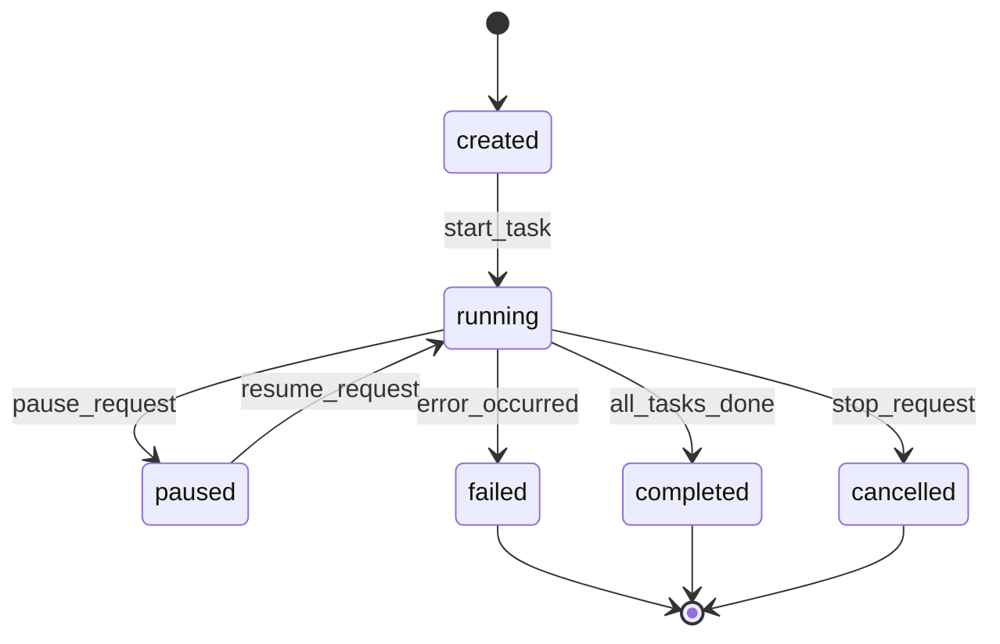

# AIC-ADE Company Workflow Patterns

## Primary Workflow: Chat vs Task

### Workflow A: Chat Request

```
User Types Message
    ↓
ChatView.tsx handleSubmit()
    ↓
POST /api/v1/chat/execute
    ↓
ChatService.execute_chat()
    ↓
Provider.get_completion(model=selected)
    ↓
DeliveryEngine.stream_response()
    ↓
SSE chunks → Frontend renders progressively
    ↓
Conversation saved to session storage
```

**Characteristics:**
- Real-time streaming (50-100ms chunks)
- Stateless (no long-running execution)
- Single-turn or multi-turn conversation
- Immediate response expected

### Workflow B: Task/Mission Request

```
User Defines Mission Parameters
    ↓
MissionView.tsx createMission()
    ↓
POST /api/v1/missions/create
    ↓
Dispatcher.engine.schedule_task()
    ↓
Worker Pool selection + assignment
    ↓
RuntimeExecutor.spawn_worker()
    ↓
Worker executes steps asynchronously
    ↓
Event Bus broadcasts progress updates
    ↓
WebSocket client receives live metrics
    ↓
Final result stored in database
```

**Characteristics:**
- Async execution (minutes to hours)
- Stateful with checkpoints
- Multiple worker processes
- Progress tracking & resume capability

---

## Discovery → Planning → Execution Flow (Unwired)

### Intended Design (Not Implemented)

```
User Input
    ↓
Intent Classification (Is it chat? question? task_request?)
    ↓
┌─────────────┬─────────────┬──────────────┐
│   Chat      │ Question    │  Task        │
│ Handler     │ Handler     │ Handler      │
└─────────────┴─────────────┴──────────────┘
```

### Current Reality (Passthrough Only)

All requests go straight to `ChatService.execute_chat()` regardless of intent. No classification happens. No routing to specialized handlers.

---

## Worker Lifecycle Pattern

### Stages

| Stage | Description | Duration |
|-------|-------------|----------|
| `created` | Worker spawned, context initialized | < 1s |
| `running` | Executing tasks, emitting events | Variable |
| `paused` | Temporarily halted (user action or system) | Until resumed |
| `completed` | All tasks finished successfully | End |
| `failed` | Error occurred, error captured | End |
| `cancelled` | User manually stopped worker | End |

### State Transitions



### Verification Integration (Missing)

Before state transitions should trigger:
- Pre-condition checks (policy validation)
- Resource availability verification
- Permission authorization
- Audit log entry creation

**Current Status:** These gates exist in code but NOT wired into primary workflow.

---

## Event Bus Pattern

### Core Events

| Event Type | Producer | Consumers | Purpose |
|------------|----------|-----------|---------|
| `task_created` | Dispatcher | Observability, UI | Notify new task |
| `task_progress` | Worker | Live Dashboard | Real-time metrics |
| `worker_heartbeat` | RuntimeExecutor | Lease Scanner | Health monitoring |
| `conversation_updated` | ChatService | Memory Cache | Context refresh |
| `model_loaded` | Provider Manager | Frontend | Update available models |

### Event Channels

```
dispatcher.events → [channel: tasks] → LiveCompanyView
chat.events → [channel: messages] → ChatMessageList
runtime.events → [channel: health] → SystemStatusPanel
```

---

## Error Recovery Patterns

### Pattern 1: Retry with Backoff

```python
@retry(exceptions=(ConnectionError, TimeoutError), 
       attempts=3, 
       backoff_factor=2)
def execute_llm_call(messages):
    return provider.get_completion(messages)
```

### Pattern 2: Fallback Handler

```python
try:
    response = ChatService.execute_chat(prompt)
except ModelUnavailableError:
    fallback_model = switch_to_backup_provider()
    response = ChatService.execute_chat(prompt, model=fallback_model)
```

### Pattern 3: Graceful Degradation

When ConversationEngine fails (LLM unavailable):
1. Log failure to audit trail
2. Return error message to user
3. Disable advanced features temporarily
4. Continue serving basic chat requests

---

## Maintenance Workflows

### Lease Heartbeat Mechanism (New - Migration 024)

**Purpose:** Prevent worker starvation detection during long-running tasks  
**Scanner:** `backend/services/lease_scanner.py`  
**Migration:** `backend/backend/migrations/024_add_lease_heartbeat.py`

```
Worker Start
    ↓
Create lease record in DB with TTL
    ↓
Every 30s: Update lease timestamp
    ↓
Scanner runs every minute
    ↓
If lease expired → Mark worker as idle
    ↓
Idle workers can be terminated
```

---

## Testing Workflow

### Phase Validation Tests (New)

Location: `backend/tests/phase_validation/`

```bash
pytest backend/tests/phase_validation/run_phase_validation.py \
  --phase=1 \
  --verbose \
  --capture=no
```

**Phases:**
- Phase 0: Critical fixes baseline
- Phase 1: High-priority quality improvements
- Phase 2: Feature parity check
- Phase 3: Security hardening
- Phase 4: Performance optimization
- Phase 5: UX polish

---

*Workflow patterns extracted from: source code inspection, runtime logs, opencode session analysis*  
*Date: 2026-08-11 11:25 WIB*
