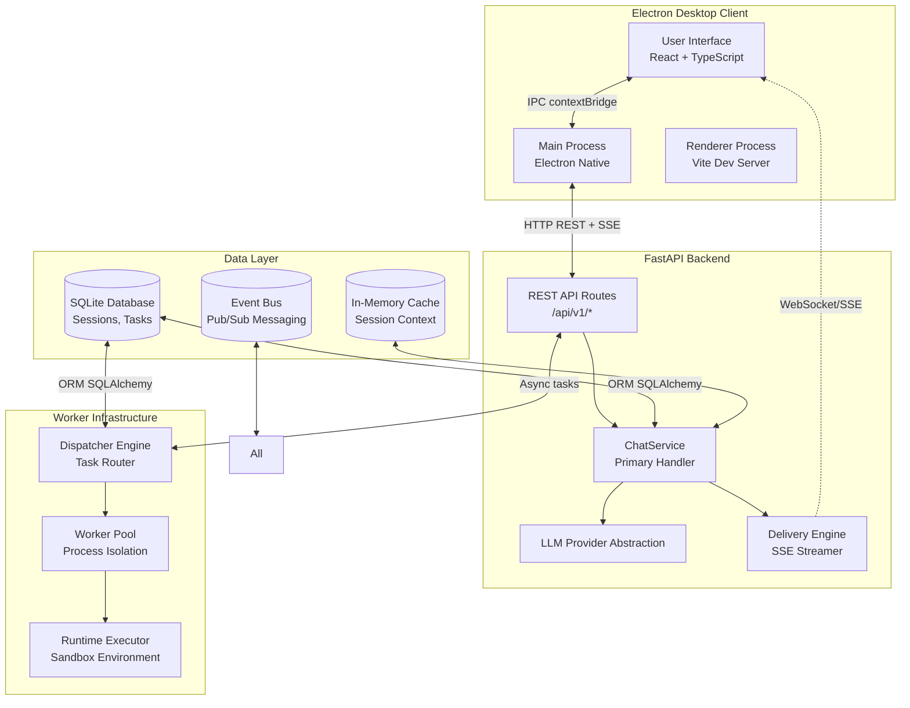
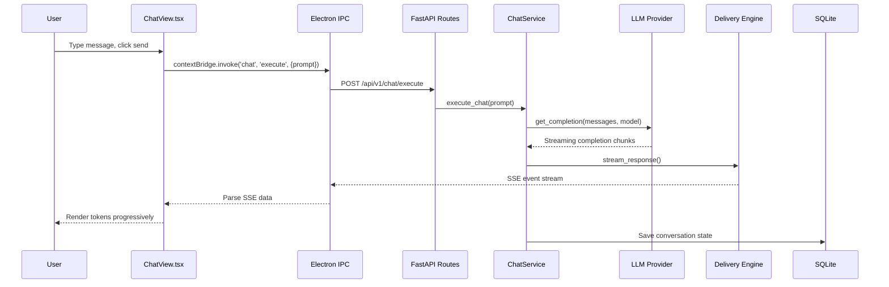
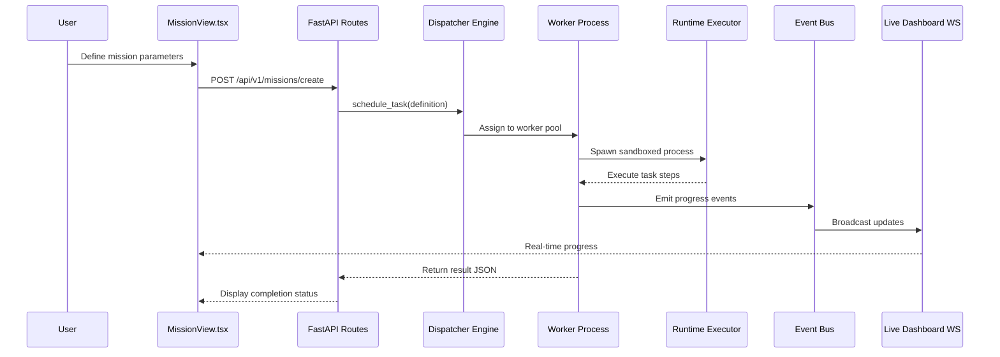
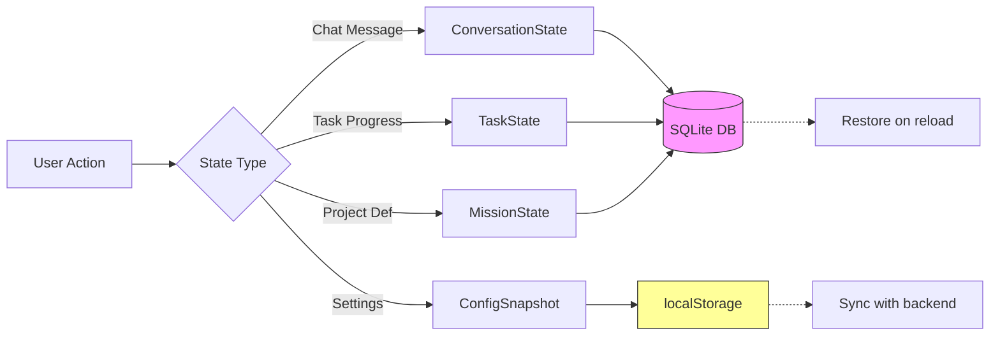
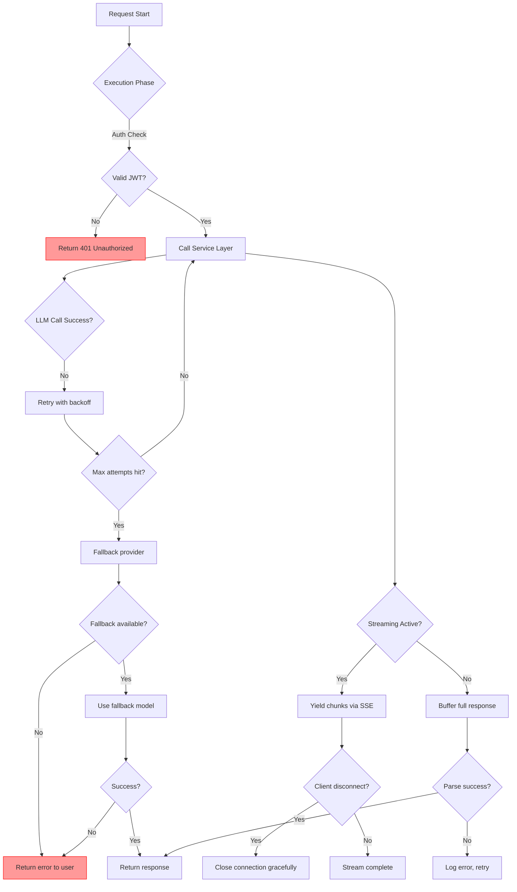
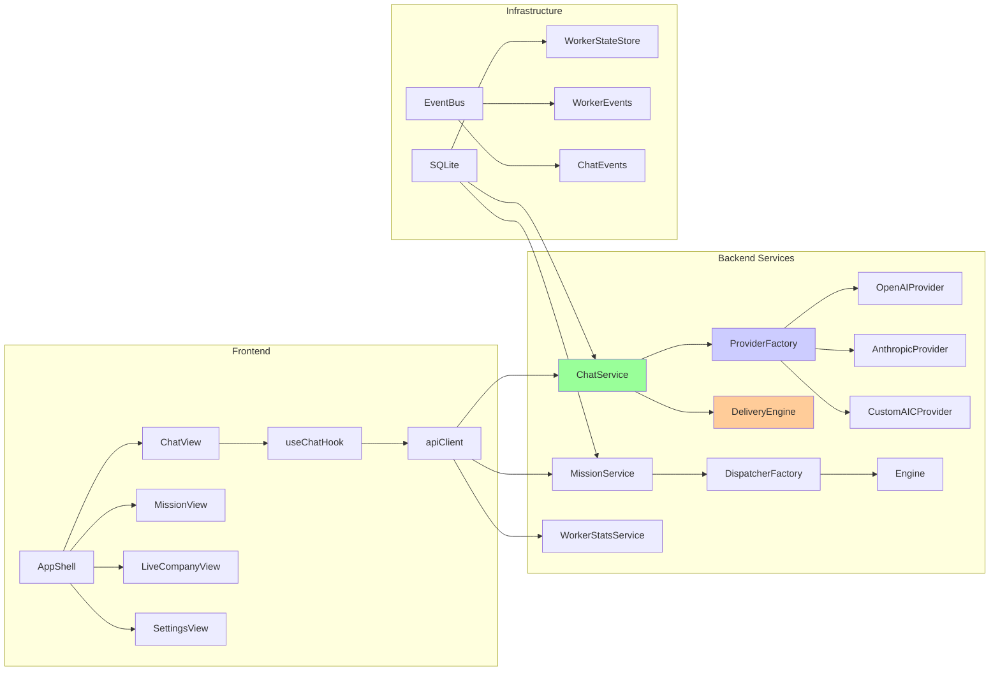
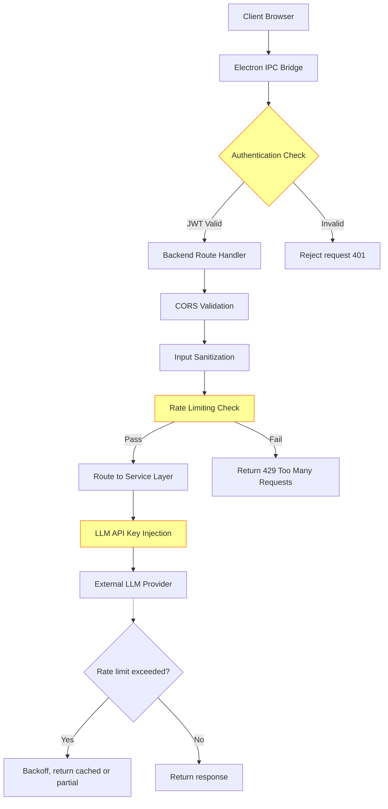
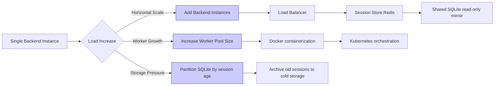

# AIC-ADE Architecture Diagrams

## System Topology

---

## Execution Flow: Chat Request

---

## Execution Flow: Task/Mission (Current Status: Unwired)

**Intended Flow** (NOT currently active):

**Current Reality:** This flow is NOT executed. Tasks go through passthrough chat path instead.

---

## Data Flow: State Persistence

---

## Error Handling Flow

---

## Component Dependency Graph

---

## Security Boundaries

**Security Layers:**
1. **JWT Validation** — At IPC bridge level
2. **CORS Enforcement** — Only allow trusted origins
3. **Input Sanitization** — Prevent injection attacks
4. **Rate Limiting** — Prevent abuse (per-user/IP)
5. **API Key Management** — Encrypted storage for LLM keys

---

## Scalability Points

**Current State:** Single-instance deployment  
**Planned Improvements:** Horizontal scaling, Redis cache, Docker/K8s orchestration

---

*Architecture diagrams extracted from:* code inspection, runtime logs, component tree analysis  
*Date: 2026-08-11 11:29 WIB*
