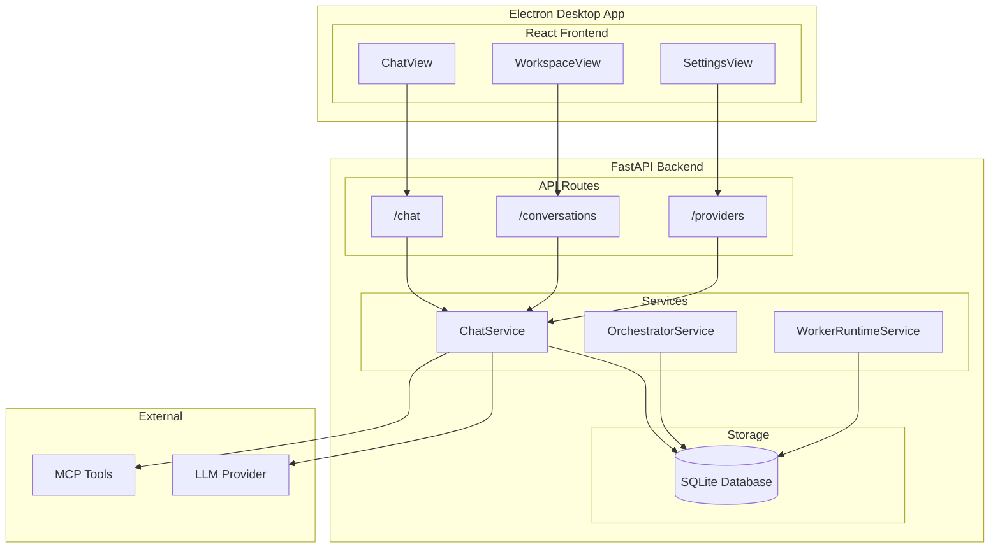
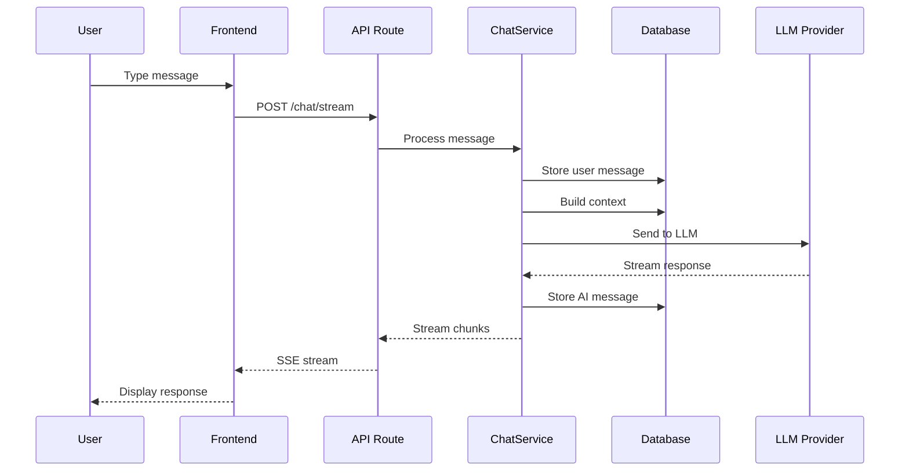

# 10 — ARCHITECTURE

==================================================
DATE: 2026-07-29
SOURCE: Repository reverse engineering
==================================================

==================================================
10.1 APPLICATION ARCHITECTURE
==================================================

The application follows a client-server architecture:

┌─────────────────────────────────────────────────────────────┐
│                    ELECTRON DESKTOP APP                      │
│  ┌──────────────────────────────────────────────────────┐   │
│  │                   REACT FRONTEND                      │   │
│  │  ┌─────────┐  ┌─────────┐  ┌─────────┐              │   │
│  │  │ ChatView │  │ Workspace│  │ Settings│              │   │
│  │  └─────────┘  └─────────┘  └─────────┘              │   │
│  └──────────────────────────────────────────────────────┘   │
└─────────────────────────────────────────────────────────────┘
                              │
                              ▼
┌─────────────────────────────────────────────────────────────┐
│                    FASTAPI BACKEND                           │
│  ┌──────────────────────────────────────────────────────┐   │
│  │                  API ROUTES                           │   │
│  │  ┌─────────┐  ┌─────────┐  ┌─────────┐              │   │
│  │  │ /chat   │  │/conversa│  │/provider│              │   │
│  │  └─────────┘  └─────────┘  └─────────┘              │   │
│  └──────────────────────────────────────────────────────┘   │
│  ┌──────────────────────────────────────────────────────┐   │
│  │                  SERVICES                             │   │
│  │  ┌─────────┐  ┌─────────┐  ┌─────────┐              │   │
│  │  │ Chat    │  │Orchestra│  │ Worker  │              │   │
│  │  └─────────┘  └─────────┘  └─────────┘              │   │
│  └──────────────────────────────────────────────────────┘   │
│  ┌──────────────────────────────────────────────────────┐   │
│  │                  STORAGE                              │   │
│  │  ┌─────────────────────────────────────────────┐     │   │
│  │  │            SQLite Database                   │     │   │
│  │  └─────────────────────────────────────────────┘     │   │
│  └──────────────────────────────────────────────────────┘   │
└─────────────────────────────────────────────────────────────┘

Repository evidence:
- aic-ide/src/main/main.ts — Electron main process
- aic-ide/src/renderer/src/App.tsx — React application
- aic-platform/backend/main.py — FastAPI application
- aic-platform/backend/database/session.py — SQLite database

==================================================
10.2 RUNTIME ARCHITECTURE
==================================================

RUNTIME COMPONENTS:

1. ELECTRON MAIN PROCESS
   - Window management
   - IPC communication
   - Backend lifecycle

2. ELECTRON RENDERER PROCESS
   - React UI
   - User interaction
   - API communication

3. FASTAPI BACKEND
   - API routes
   - Business logic
   - Database access

4. SQLITE DATABASE
   - Data persistence
   - State management

Repository evidence:
- aic-ide/src/main/main.ts
- aic-ide/src/renderer/src/main.tsx
- aic-platform/backend/main.py
- aic-platform/backend/database/session.py

==================================================
10.3 EXECUTION ARCHITECTURE
==================================================

EXECUTION FLOW:

1. USER INPUT
   → Frontend captures user input
   → Sends HTTP request to backend

2. API ROUTING
   → FastAPI routes request to appropriate handler
   → Validates request data

3. SERVICE LAYER
   → Business logic executes
   → Database operations performed

4. EXTERNAL SERVICES
   → LLM provider called (if needed)
   → External tools called (if needed)

5. RESPONSE
   → Results stored in database
   → Response sent to frontend

Repository evidence:
- aic-platform/backend/api/routes/core.py
- aic-platform/backend/services/chat_service.py
- aic-platform/backend/services/provider_client.py

==================================================
10.4 DATA FLOW
==================================================

DATA FLOW DIAGRAM:

User Input
    │
    ▼
┌─────────────┐
│  Frontend   │
└──────┬──────┘
       │ HTTP
       ▼
┌─────────────┐
│  API Route  │
└──────┬──────┘
       │
       ▼
┌─────────────┐
│  Service    │
└──────┬──────┘
       │
       ├──────────────────┐
       ▼                  ▼
┌─────────────┐    ┌─────────────┐
│  Database   │    │  LLM/Tools  │
└─────────────┘    └─────────────┘
       │                  │
       └──────────────────┘
              │
              ▼
       ┌─────────────┐
       │  Response   │
       └─────────────┘

Repository evidence:
- aic-platform/backend/services/chat_service.py
- aic-platform/backend/services/provider_client.py

==================================================
10.5 DEPENDENCY GRAPH
==================================================

FRONTEND DEPENDENCIES:
- React
- TypeScript
- Vite
- Tailwind CSS
- Lucide icons

Repository evidence: aic-ide/package.json

BACKEND DEPENDENCIES:
- FastAPI
- SQLAlchemy
- aiosqlite
- httpx
- pydantic

Repository evidence: aic-platform/requirements.txt

==================================================
10.6 COMPONENT INTERACTION
==================================================

COMPONENT INTERACTION DIAGRAM:

┌─────────────────────────────────────────────────────────────┐
│                     REACT FRONTEND                           │
│  ┌──────────────────────────────────────────────────────┐   │
│  │                  COMPONENTS                           │   │
│  │  ┌─────────┐  ┌─────────┐  ┌─────────┐              │   │
│  │  │ ChatView│  │Workspace│  │ Settings│              │   │
│  │  └────┬────┘  └────┬────┘  └────┬────┘              │   │
│  │       │            │            │                     │   │
│  │       └────────────┼────────────┘                     │   │
│  │                    │                                  │   │
│  │              ┌─────▼─────┐                           │   │
│  │              │ API Client │                           │   │
│  │              └─────┬─────┘                           │   │
│  └────────────────────┼──────────────────────────────┘   │
└────────────────────────┼────────────────────────────────┘
                         │ HTTP
                         ▼
┌─────────────────────────────────────────────────────────────┐
│                     FASTAPI BACKEND                          │
│  ┌──────────────────────────────────────────────────────┐   │
│  │                  API ROUTES                           │   │
│  │  ┌─────────────────────────────────────────────┐     │   │
│  │  │               /chat, /conversations          │     │   │
│  │  └─────────────────────┬───────────────────────┘     │   │
│  └────────────────────────┼──────────────────────────────┘   │
│                           │                                  │
│  ┌────────────────────────┼──────────────────────────────┐   │
│  │                  SERVICES                             │   │
│  │  ┌─────────┐  ┌─────────┐  ┌─────────┐              │   │
│  │  │ Chat    │  │Orchestra│  │ Worker  │              │   │
│  │  └────┬────┘  └────┬────┘  └────┬────┘              │   │
│  │       │            │            │                     │   │
│  │       └────────────┼────────────┘                     │   │
│  │                    │                                  │   │
│  │              ┌─────▼─────┐                           │   │
│  │              │  Storage   │                           │   │
│  │              └─────┬─────┘                           │   │
│  └────────────────────┼──────────────────────────────┘   │
└────────────────────────┼────────────────────────────────┘
                         │
                         ▼
                 ┌─────────────┐
                 │   SQLite    │
                 └─────────────┘

Repository evidence:
- aic-ide/src/renderer/src/components/*.tsx
- aic-ide/src/renderer/src/lib/api/*.ts
- aic-platform/backend/api/routes/*.py
- aic-platform/backend/services/*.py
- aic-platform/backend/database/session.py

==================================================
10.7 MERMAID DIAGRAMS
==================================================

==================================================
END OF DOCUMENT
==================================================
