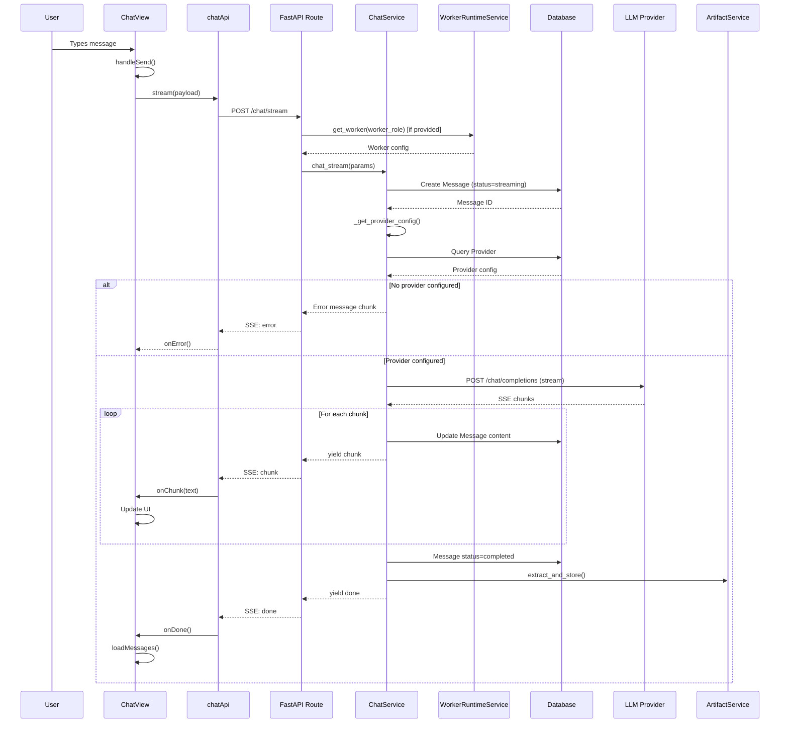

# 12 — CHAT EXECUTION PATH

==================================================
DATE: 2026-07-29
SOURCE: Repository reverse engineering
==================================================

==================================================
12.1 COMPLETE EXECUTION PATH
==================================================

STEP 1: USER INPUT
Component: ChatView.tsx
File: aic-ide/src/renderer/src/components/ChatView.tsx
Function: handleSend() (line 290)
Input: User text input
Output: HTTP POST request
Next: chatApi.stream()

Repository evidence:
- aic-ide/src/renderer/src/components/ChatView.tsx:290-337

==================================================
STEP 2: FRONTEND API CALL
Component: chatApi
File: aic-ide/src/renderer/src/lib/api/chat.ts
Function: stream() (line 18)
Input: conversation_id, messages, worker_role
Output: SSE stream
Next: fetch() to backend

Repository evidence:
- aic-ide/src/renderer/src/lib/api/chat.ts:18-79

DETAILS:
- Gets backend port from window.aic.getBackendStatus()
- Sends POST to http://127.0.0.1:{port}/chat/stream
- Body: { conversation_id, messages, worker_role, stream: true }
- Reads SSE stream (data: {...} format)
- Parses chunks: type "chunk", "done", "error"

==================================================
STEP 3: FASTAPI ROUTE HANDLER
Component: chat_stream_endpoint
File: aic-platform/backend/api/routes/core.py
Function: chat_stream_endpoint() (line 837)
Input: ChatRequest payload
Output: StreamingResponse
Next: chat_service.chat_stream()

Repository evidence:
- aic-platform/backend/api/routes/core.py:836-866

DETAILS:
- Extracts provider_id, model_id from payload
- If worker_role provided:
  - Loads worker from worker_runtime_service
  - Overrides provider_id, model_id, temperature, top_p, max_tokens
  - Gets system_prompt from worker
- Creates event_generator() async function
- Returns StreamingResponse with text/event-stream media type

==================================================
STEP 4: CHAT SERVICE - STREAM
Component: ChatService
File: aic-platform/backend/services/chat_service.py
Function: chat_stream() (line 302)
Input: db, conversation_id, messages, provider_id, model_id, temperature, top_p, max_tokens, system_prompt
Output: AsyncGenerator yielding SSE chunks
Next: _get_provider_config(), then LLM provider

Repository evidence:
- aic-platform/backend/services/chat_service.py:302-390

==================================================
STEP 5: PROVIDER CONFIG LOOKUP
Component: ChatService
File: aic-platform/backend/services/chat_service.py
Function: _get_provider_config() (line 67)
Input: db, provider_id
Output: (base_url, api_key) or None
Next: LLM request

Repository evidence:
- aic-platform/backend/services/chat_service.py:67-79

DETAILS:
- Queries Provider table by provider_id
- Checks if provider is enabled
- Decrypts API key
- Returns (base_url, api_key) tuple

==================================================
STEP 6: MESSAGE STORAGE
Component: ChatService
File: aic-platform/backend/services/chat_service.py
Function: chat_stream() (line 317-328)
Input: conversation_id, model_id, provider_id
Output: Message object in database
Next: LLM request

Repository evidence:
- aic-platform/backend/services/chat_service.py:317-328

DETAILS:
- Creates Message object with role="assistant", content="", status="streaming"
- Stores in database
- Yields "start" event with message_id

==================================================
STEP 7: PROVIDER CHECK
Component: ChatService
File: aic-platform/backend/services/chat_service.py
Function: chat_stream() (line 332-341)
Input: config, model_id
Output: Error message or continue
Next: LLM request or return

Repository evidence:
- aic-platform/backend/services/chat_service.py:332-341

DECISION POINT:
- If config is None OR model_id is None:
  - Sets error_msg = "No AI provider configured..."
  - Updates message content
  - Yields chunk with error message
  - Sets status to "completed"
  - Calls artifact_service.extract_and_store()
  - Returns (ends stream)

==================================================
STEP 8: LLM REQUEST
Component: ChatService
File: aic-platform/backend/services/chat_service.py
Function: chat_stream() (line 343-378)
Input: base_url, api_key, messages, model_id, temperature, top_p
Output: Streaming chunks from LLM
Next: Response processing

Repository evidence:
- aic-platform/backend/services/chat_service.py:343-378

DETAILS:
- Constructs URL: {base_url}/chat/completions
- Constructs headers: Authorization: Bearer {api_key}
- Constructs payload:
  - model: model_id
  - messages: messages
  - temperature: temperature
  - top_p: top_p
  - stream: True
- If system_prompt provided and no system message exists:
  - Prepends system message to messages array
- Uses httpx.AsyncClient with 120s timeout
- Streams response line by line
- Parses SSE format: "data: {json}"
- Extracts delta.content from each chunk
- Updates message.content in database
- Yields chunk to frontend

==================================================
STEP 9: RESPONSE COMPLETION
Component: ChatService
File: aic-platform/backend/services/chat_service.py
Function: chat_stream() (line 380-383)
Input: Final message content
Output: Done event
Next: Artifact extraction

Repository evidence:
- aic-platform/backend/services/chat_service.py:380-383

DETAILS:
- Sets message.status = "completed"
- Commits to database
- Calls artifact_service.extract_and_store()
- Yields "done" event

==================================================
STEP 10: ARTIFACT EXTRACTION
Component: ArtifactService
File: aic-platform/backend/services/artifact_service.py
Function: extract_and_store()
Input: db, conversation_id, message_id, content
Output: Artifacts stored in database
Next: Return to frontend

Repository evidence:
- aic-platform/backend/services/artifact_service.py

DETAILS:
- Extracts code blocks from message content
- Stores as Artifact objects in database

==================================================
STEP 11: FRONTEND DISPLAY
Component: ChatView.tsx
File: aic-ide/src/renderer/src/components/ChatView.tsx
Function: onChunk callback (line 327)
Input: Chunk text
Output: Updated message in UI
Next: User interaction

Repository evidence:
- aic-ide/src/renderer/src/components/ChatView.tsx:327

DETAILS:
- Updates temporary assistant message with chunk content
- On "done": reloads messages from database
- On "error": reloads messages from database

==================================================
12.2 COMPLETE CALL GRAPH
==================================================

User (types message)
    │
    ▼
ChatView.handleSend()
    │
    ▼
chatApi.stream()
    │
    ▼
fetch("http://127.0.0.1:{port}/chat/stream")
    │
    ▼
FastAPI: chat_stream_endpoint()
    │
    ├──► worker_runtime_service.get_worker()  [if worker_role]
    │
    ▼
chat_service.chat_stream()
    │
    ├──► _get_provider_config()
    │       │
    │       ▼
    │    Provider table query
    │       │
    │       ▼
    │    decrypt_api_key()
    │
    ├──► Message creation (status="streaming")
    │
    ├──► [DECISION: config or model_id missing?]
    │       │
    │       ├── YES → error message → artifact_service → return
    │       │
    │       └── NO → continue
    │
    ├──► httpx.stream("POST", "{base_url}/chat/completions")
    │       │
    │       ▼
    │    LLM Provider (external)
    │       │
    │       ▼
    │    SSE chunks
    │
    ├──► Message update (content += chunk)
    │
    ├──► yield chunk to frontend
    │
    ├──► [LOOP until [DONE]]
    │
    ├──► Message status = "completed"
    │
    ├──► artifact_service.extract_and_store()
    │
    └──► yield "done" event
            │
            ▼
        ChatView.onDone()
            │
            ▼
        loadMessages() (refresh from DB)

==================================================
12.3 MERMAID SEQUENCE DIAGRAM
==================================================

==================================================
12.4 ENGINE UTILIZATION MATRIX
==================================================

| Engine | Implemented | Connected | Used in Production | Status |
|--------|-------------|-----------|-------------------|--------|
| Context Builder | ✓ | ✓ | ✗ | UNUSED - build_chat_context() exists but never called in chat_stream |
| Memory | ✓ | ✓ | ✗ | UNUSED - MemoryService exists but not called in chat path |
| RAG | ✓ | ✓ | ✗ | UNUSED - RAGService exists but not called in chat path |
| Discovery | ✓ | ✓ | ✗ | UNUSED - DiscoveryEngine exists, route registered, not called in chat |
| Clarification | ✓ | ✓ | ✗ | UNUSED - Discovery engine has clarification, not called in chat |
| Planning | ✓ | ✓ | ✗ | UNUSED - PlanningEngine exists, route registered, not called in chat |
| Task Graph | ✓ | ✓ | ✗ | UNUSED - TaskGraphEngine exists, route registered, not called in chat |
| Dispatcher | ✓ | ✓ | ✗ | UNUSED - DispatcherEngine exists, route registered, not called in chat |
| Scheduler | ✓ | ✓ | ✗ | UNUSED - JobScheduler exists, not called in chat path |
| Worker Manager | ✓ | ✓ | ⚠ | CONDITIONAL - Only if worker_role provided in request |
| Worker Registry | ✓ | ✓ | ⚠ | CONDITIONAL - Only if worker_role provided in request |
| Worker Execution | ✓ | ✓ | ⚠ | CONDITIONAL - Only if worker_role provided in request |
| MCP | ✓ | ✓ | ✗ | UNUSED - MCPService exists, not called in chat path |
| Tool Calling | ✓ | ✓ | ✗ | UNUSED - ToolDispatcher exists, but NOT called in chat_stream (only in chat_completion) |
| Verification | ✓ | ✓ | ✗ | UNUSED - VerificationEngine exists, route registered, not called in chat |
| Review | ✓ | ✓ | ✗ | UNUSED - OrchestrationApproval exists, not called in chat |
| Delivery | ✓ | ✓ | ✗ | UNUSED - DeliveryEngine exists, route registered, not called in chat |
| Response Formatter | ✓ | ✓ | ✓ | USED - artifact_service.extract_and_store() called |
| Conversation Storage | ✓ | ✓ | ✓ | USED - Message creation and update |
| Timeline | ✓ | ✗ | ✗ | NOT IMPLEMENTED - No backend API |
| Evidence | ✓ | ✗ | ✗ | NOT IMPLEMENTED - No backend API |
| Project System | ✓ | ✗ | ✗ | NOT IMPLEMENTED - No backend API |
| Autonomy | ✓ | ✓ | ✗ | UNUSED - AutonomyEngine exists, route registered, not called in chat |

==================================================
12.5 UNREACHABLE COMPONENTS
==================================================

The following components exist but are NEVER reached from the primary chat execution path:

1. CONTEXT BUILDER
   - File: aic-platform/context/builder.py
   - Function: build_chat_context()
   - Evidence: Function exists at line 18 of chat_service.py but is NEVER called in chat_stream()

2. MEMORY SERVICE
   - File: aic-platform/backend/services/memory_service.py
   - Evidence: Service exists but not imported or called in chat_service.py

3. RAG SERVICE
   - File: aic-platform/backend/services/rag_service.py
   - Evidence: Service exists but not imported or called in chat_service.py

4. DISCOVERY ENGINE
   - File: aic-platform/discovery/engine.py
   - Evidence: Route exists at /api/discovery/* but not called in chat path

5. PLANNING ENGINE
   - File: aic-platform/planning/engine.py
   - Evidence: Route exists at /api/planning/* but not called in chat path

6. TASK GRAPH ENGINE
   - File: aic-platform/taskgraph/engine.py
   - Evidence: Route exists at /api/taskgraph/* but not called in chat path

7. DISPATCHER ENGINE
   - File: aic-platform/dispatcher/engine.py
   - Evidence: Route exists at /api/dispatcher/* but not called in chat path

8. VERIFICATION ENGINE
   - File: aic-platform/verification/engine.py
   - Evidence: Route exists at /api/verification/* but not called in chat path

9. DELIVERY ENGINE
   - File: aic-platform/delivery/engine.py
   - Evidence: Route exists at /api/delivery/* but not called in chat path

10. AUTONOMY ENGINE
    - File: aic-platform/autonomy/engine.py
    - Evidence: Route exists at /api/autonomy/* but not called in chat path

11. MCP SERVICE
    - File: aic-platform/backend/services/mcp_service.py
    - Evidence: Service exists but not called in chat path

12. TOOL DISPATCHER (in streaming)
    - File: aic-platform/backend/services/tool_dispatcher.py
    - Evidence: Used in chat_completion() but NOT in chat_stream()

13. JOB SCHEDULER
    - File: aic-platform/backend/services/job_scheduler.py
    - Evidence: Service exists but not called in chat path

14. ORCHESTRATOR SERVICE
    - File: aic-platform/backend/services/orchestrator_service.py
    - Evidence: Service exists but not called in chat path

==================================================
12.6 DECISION POINTS
==================================================

DECISION 1: Worker Role Selection
Location: chat_stream_endpoint() line 845
Condition: payload.worker_role is not None
Action: Load worker, override provider/model/temperature/top_p/max_tokens/system_prompt
Repository evidence: aic-platform/backend/api/routes/core.py:845-853

DECISION 2: Provider Configuration
Location: chat_stream() line 332
Condition: config is None OR model_id is None
Action: Return error message, end stream
Repository evidence: aic-platform/backend/services/chat_service.py:332-341

DECISION 3: System Prompt Injection
Location: chat_stream() line 357-360
Condition: system_prompt provided AND no system message in messages
Action: Prepend system message to messages array
Repository evidence: aic-platform/backend/services/chat_service.py:357-360

DECISION 4: Max Tokens
Location: chat_stream() line 353-354
Condition: max_tokens is not None
Action: Add max_tokens to payload
Repository evidence: aic-platform/backend/services/chat_service.py:353-354

DECISION 5: Stream Parsing
Location: chat_stream() line 366-378
Condition: line starts with "data: "
Action: Parse JSON, extract delta.content
Repository evidence: aic-platform/backend/services/chat_service.py:366-378

DECISION 6: Stream Completion
Location: chat_stream() line 368-369
Condition: data_str == "[DONE]"
Action: Break loop
Repository evidence: aic-platform/backend/services/chat_service.py:368-369

==================================================
12.7 EXECUTION SUMMARY
==================================================

ACTUAL EXECUTION PATH:
1. User types message in ChatView
2. handleSend() called
3. chatApi.stream() sends POST to /chat/stream
4. FastAPI route handler extracts parameters
5. If worker_role provided, loads worker configuration
6. ChatService.chat_stream() called
7. Provider configuration loaded from database
8. If no provider: error message returned
9. Message created in database (status=streaming)
10. HTTP request sent to LLM provider (streaming)
11. Chunks received and yielded to frontend
12. Message updated in database with each chunk
13. On completion: message status set to "completed"
14. Artifact extraction performed
15. "done" event sent to frontend
16. Frontend refreshes messages from database

WHAT IS NOT EXECUTED:
- Context Builder (never called)
- Memory Service (never called)
- RAG Service (never called)
- Discovery Engine (never called from chat)
- Planning Engine (never called from chat)
- Task Graph Engine (never called from chat)
- Dispatcher Engine (never called from chat)
- Verification Engine (never called from chat)
- Delivery Engine (never called from chat)
- Autonomy Engine (never called from chat)
- MCP Service (never called from chat)
- Tool Dispatcher (not called in streaming mode)
- Orchestrator Service (never called from chat)
- Job Scheduler (never called from chat)

CONCLUSION:
The chat execution path is a simple passthrough to the LLM provider.
None of the company workflow engines (Discovery, Planning, TaskGraph,
Dispatcher, Verification, Delivery) are invoked during normal chat.
The context builder, memory, and RAG systems exist but are unused.
Tool calling exists but only in non-streaming mode.

==================================================
END OF DOCUMENT
==================================================
