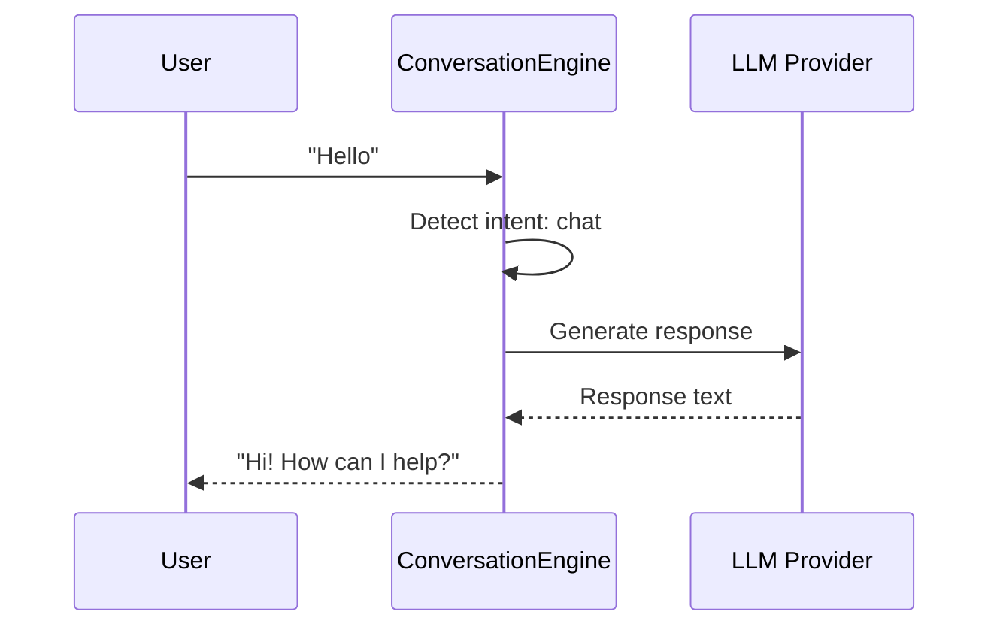
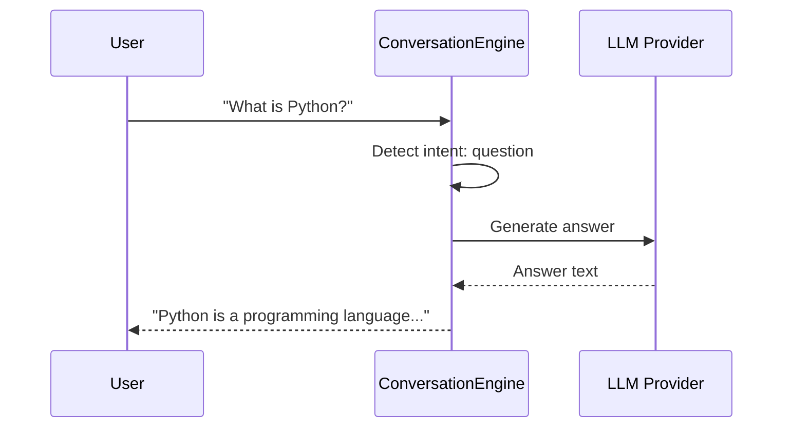
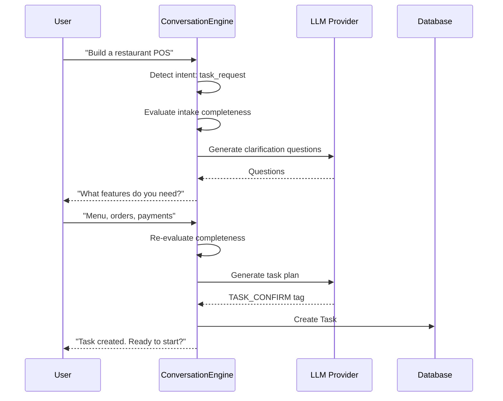
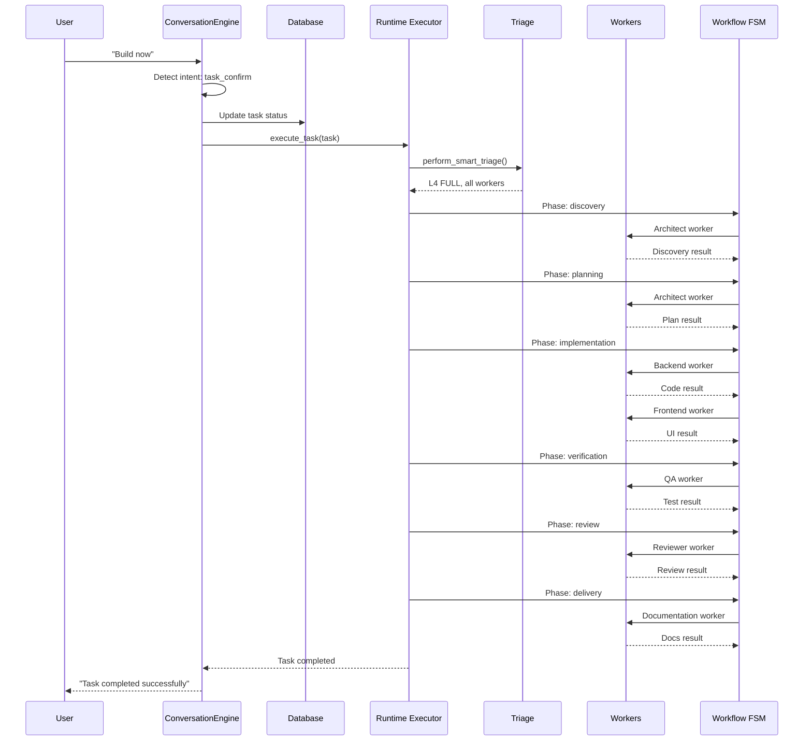
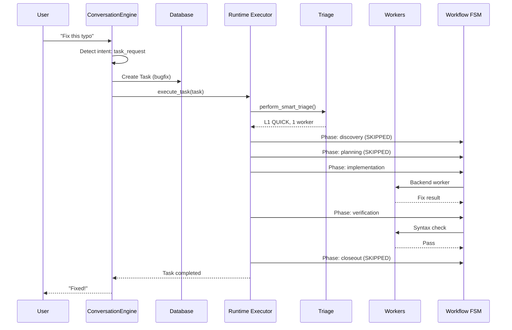

# 14 — PRODUCT EXECUTION STRATEGY

==================================================
DATE: 2026-07-29
SOURCE: Repository reverse engineering
==================================================

==================================================
14.1 PRODUCT EXECUTION PHILOSOPHY
==================================================

The repository implements a CONVERSATION-FIRST architecture where:

1. ALL user interactions start with conversation
2. Intent is detected BEFORE any execution
3. Clarification happens BEFORE task creation
4. Tasks are ONLY created when user confirms
5. Execution level is determined by Smart Triage

Repository evidence:
- conversation/engine.py — ConversationEngine
- workflow/triage.py — Smart Triage
- runtime/executor.py — Runtime Executor

==================================================
14.2 CHAT VS COMPANY ARCHITECTURE
==================================================

TWO SYSTEMS EXIST:

SYSTEM A: CHAT RUNTIME (chat_service.py)
- Simple passthrough to LLM
- No intent detection
- No workflow integration
- Direct response

SYSTEM B: COMPANY WORKFLOW (conversation/engine.py + runtime/executor.py)
- Intent detection
- Clarification
- Task creation
- Smart Triage
- FSM execution
- Worker dispatch

INTENDED RELATIONSHIP:
- System A is a FALLBACK for when System B is not available
- System B is the PRIMARY system for engineering work
- System A handles casual conversation
- System B handles engineering tasks

Repository evidence:
- chat_service.py — Simple passthrough
- conversation/engine.py — Intent detection and task creation
- runtime/executor.py — FSM execution

==================================================
14.3 CONVERSATION ENGINE RESPONSIBILITY
==================================================

The ConversationEngine was designed to:

1. DETECT INTENT
   - task_request: User wants work done
   - task_confirm: User confirms a task
   - status: User wants progress update
   - approval: User approves/rejects
   - question: User asks a question
   - chat: General conversation

   Repository evidence: conversation/engine.py:44-50

2. ASK CLARIFICATION
   - Evaluate intake completeness
   - Ask 1-3 clarifying questions
   - Wait for user confirmation

   Repository evidence: conversation/engine.py:279-308

3. CREATE TASKS
   - Only when user confirms
   - Parse TASK_CONFIRM tag
   - Create Task in database

   Repository evidence: conversation/engine.py:410-580

4. HANDLE STATUS
   - Query task status
   - Report progress

   Repository evidence: conversation/engine.py:581-617

5. HANDLE APPROVALS
   - Process approval/rejection
   - Update task status

   Repository evidence: conversation/engine.py:618-632

6. ANSWER QUESTIONS
   - Use LLM for technical questions
   - Provide direct answers

   Repository evidence: conversation/engine.py:633-671

7. GENERAL CHAT
   - Natural conversation
   - No task creation

   Repository evidence: conversation/engine.py:672-836

==================================================
14.4 RUNTIME EXECUTION LEVELS
==================================================

The repository defines 4 execution levels:

L1 QUICK
- Purpose: Localized, low-risk, fast path
- Scope: Single file, typo, small CSS change
- Workers: 1 (backend or frontend)
- Phases skipped: discovery, planning, closeout
- Verification: syntax, unit

Repository evidence: workflow/triage.py:15-18, 108-120

L2 STANDARD
- Purpose: Normal scoped engineering
- Scope: Bounded module, test task
- Workers: 2 (backend/frontend + qa)
- Phases skipped: discovery, planning
- Verification: unit, integration

Repository evidence: workflow/triage.py:19-20, 122-132

L3 EXTENDED
- Purpose: Cross-component / higher-risk
- Scope: Multiple files, security-sensitive
- Workers: 3 (backend, frontend, qa)
- Phases skipped: discovery
- Verification: unit, integration, security

Repository evidence: workflow/triage.py:21-22, 134-144

L4 FULL
- Purpose: Complete multi-agent lifecycle
- Scope: Architecture, system build
- Workers: 5 (architect, backend, frontend, qa, documentation)
- Phases skipped: none
- Verification: unit, integration, security, closeout_gate

Repository evidence: workflow/triage.py:23-24, 146-156

==================================================
14.5 REQUEST CLASSIFICATION MATRIX
==================================================

REQUEST: "Hello"
→ Intent: chat
→ Handler: _handle_chat_llm()
→ Execution: Direct LLM response
→ Engines used: None

REQUEST: "What is Python?"
→ Intent: question
→ Handler: _handle_question_llm()
→ Execution: Direct LLM response
→ Engines used: None

REQUEST: "Fix this bug"
→ Intent: task_request
→ Handler: _handle_task_request()
→ Clarification: Yes (if vague)
→ Task type: bugfix
→ Triage: L1 QUICK (if localized) or L2 STANDARD
→ Engines used: Runtime Executor, Workflow FSM

REQUEST: "Build a restaurant POS"
→ Intent: task_request
→ Handler: _handle_task_request()
→ Clarification: Yes (mandatory)
→ Task type: feature
→ Triage: L4 FULL
→ Engines used: Runtime Executor, Workflow FSM, all workers

REQUEST: "Refactor this project"
→ Intent: task_request
→ Handler: _handle_task_request()
→ Clarification: Yes
→ Task type: refactor
→ Triage: L3 EXTENDED or L4 FULL
→ Engines used: Runtime Executor, Workflow FSM

REQUEST: "Generate tests"
→ Intent: task_request
→ Handler: _handle_task_request()
→ Clarification: Minimal
→ Task type: test
→ Triage: L2 STANDARD
→ Engines used: Runtime Executor, Workflow FSM

REQUEST: "Review this code"
→ Intent: task_request
→ Handler: _handle_task_request()
→ Clarification: Yes
→ Task type: feature (review)
→ Triage: L2 STANDARD
→ Engines used: Runtime Executor, Workflow FSM

REQUEST: "What is the status?"
→ Intent: status
→ Handler: _handle_status()
→ Execution: Query task database
→ Engines used: None

REQUEST: "Approve the plan"
→ Intent: approval
→ Handler: _handle_approval()
→ Execution: Update approval status
→ Engines used: None

==================================================
14.6 ENGINE INVOCATION MATRIX
==================================================

| Request Type | Discovery | Planning | TaskGraph | Dispatcher | Verification | Delivery | Autonomy |
|--------------|-----------|----------|-----------|------------|--------------|----------|----------|
| Chat | ✗ | ✗ | ✗ | ✗ | ✗ | ✗ | ✗ |
| Question | ✗ | ✗ | ✗ | ✗ | ✗ | ✗ | ✗ |
| Bug Fix (L1) | ✗ | ✗ | ✗ | ✓ | ✓ | ✗ | ✗ |
| Bug Fix (L2) | ✗ | ✗ | ✓ | ✓ | ✓ | ✗ | ✗ |
| Feature (L3) | ✗ | ✓ | ✓ | ✓ | ✓ | ✓ | ✗ |
| Feature (L4) | ✓ | ✓ | ✓ | ✓ | ✓ | ✓ | ✓ |
| Refactor (L3) | ✗ | ✓ | ✓ | ✓ | ✓ | ✓ | ✗ |
| Refactor (L4) | ✓ | ✓ | ✓ | ✓ | ✓ | ✓ | ✓ |
| Test (L2) | ✗ | ✗ | ✓ | ✓ | ✓ | ✗ | ✗ |
| Research (L4) | ✓ | ✓ | ✓ | ✓ | ✓ | ✓ | ✓ |

KEY:
✓ = Engine is invoked
✗ = Engine is skipped

Repository evidence:
- workflow/triage.py — skip_phases dict for each level
- runtime/executor.py — Phase skipping logic

==================================================
14.7 SEQUENCE DIAGRAMS
==================================================

DIAGRAM 1: CASUAL CONVERSATION

DIAGRAM 2: QUESTION

DIAGRAM 3: TASK REQUEST WITH CLARIFICATION

DIAGRAM 4: TASK EXECUTION (L4 FULL)

DIAGRAM 5: TASK EXECUTION (L1 QUICK)

==================================================
14.8 AUTONOMY ENGINE ROLE
==================================================

The AutonomyEngine was intended to play a role:

BEFORE EXECUTION:
- Not directly invoked
- Smart Triage handles pre-execution analysis

DURING EXECUTION:
- Not directly invoked
- Runtime executor handles execution

AFTER EXECUTION:
- detect_anomaly(): Detect anomalies in execution
- recover(): Attempt recovery from failures
- heal(): Self-healing from anomalies

INTENDED INTEGRATION:
- AutonomyEngine would be called by Runtime Executor
- When execution fails, AutonomyEngine would attempt recovery
- If recovery fails, escalate to user

CURRENT STATUS:
- AutonomyEngine exists but is NOT called from Runtime Executor
- Only accessible via REST API (/api/autonomy/*)
- Not integrated into execution path

Repository evidence:
- autonomy/engine.py — detect_anomaly(), recover(), heal()
- runtime/executor.py — Does NOT import autonomy engine

==================================================
14.9 ARCHITECTURAL CONCLUSION
==================================================

The repository contains a COMPLETE execution strategy that was INTENDED but NOT FULLY IMPLEMENTED:

INTENDED ARCHITECTURE:
1. User sends message
2. ConversationEngine detects intent
3. If chat/question: Direct LLM response
4. If task_request: Clarification → Task creation
5. If task_confirm: Execute task
6. Runtime Executor runs task through FSM
7. Smart Triage determines execution level
8. Workers execute according to level
9. Verification checks quality
10. Delivery packages results

CURRENT IMPLEMENTATION:
1. User sends message
2. ChatService sends to LLM
3. LLM responds directly
4. No intent detection
5. No task creation
6. No workflow execution

GAP:
- ConversationEngine is NOT called from ChatService
- Runtime Executor is NOT called from ChatService
- Smart Triage is NOT called from ChatService
- Workflow FSM is NOT called from ChatService

CONCLUSION:
The execution strategy EXISTS in the repository but is NOT WIRED into the chat path.
The chat path is a SIMPLE PASSTHROUGH to the LLM.
The company workflow exists as SEPARATE REST endpoints.

==================================================
END OF DOCUMENT
==================================================
